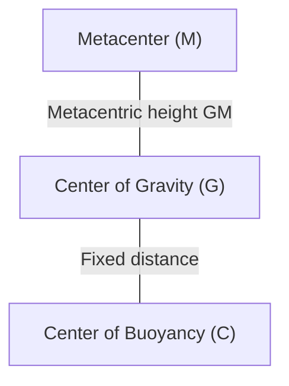

# 📖 Archimedes' Principle and Stability of Floating Bodies

> **Classical statement:** Any body totally or partially submerged in a fluid at rest experiences an upward vertical buoyant force equal to the weight of the volume of fluid displaced by the body.

---

## 🔍 1. Proof via Gauss's Theorem (Divergence)

Consider a submerged body occupying a volume $V$ bounded by a closed oriented surface $\partial V$. The net force exerted by the fluid pressure is:
$$ \vec{F}_B = -\oint_{\partial V} p \, d\vec{A} $$

Applying **Gauss's Divergence Theorem**:
$$ -\oint_{\partial V} p \, d\vec{A} = -\int_V \nabla p \, dV $$

Substituting the fundamental equation of hydrostatics $\nabla p = \rho \vec{g} = (0, 0, -\rho g)$:
$$ \vec{F}_B = -\int_V (-\rho g \vec{k}) \, dV = \left(\int_V \rho g \, dV\right) \vec{k} = \mathbf{m_f g \, \vec{k}} $$

* **Buoyant force:** $E = \rho_{\text{fluid}} \cdot g \cdot V_{\text{displaced}}$.
* **Point of application:** The **Center of Buoyancy ($C$ or $B$)**, which is the geometric centroid of the displaced fluid volume.

---

## ⚖️ 2. Stability of Fully Submerged Bodies (Submarines, Airships)

It depends exclusively on the relative vertical position between the Center of Gravity of the body ($G$) and the Center of Buoyancy ($C$):

* **Positive Stability / Stable ($G$ below $C$):** A rotation generates a restoring couple that returns the body to the vertical.
* **Neutral Equilibrium ($G$ coincides with $C$):** It remains in any orientation.
* **Unstable ($G$ above $C$):** Any angular perturbation generates an overturning couple.

---

## 🚢 3. Stability of Floating Bodies (Ships, Platforms, Seaplanes)

In a body floating partially submerged, **$G$ is usually located above $C$**. Despite this, the equilibrium can be perfectly **stable** because when heeling by an angle $\theta$, the geometric shape of the submerged hull changes, shifting the center of buoyancy $C$ towards the submerged side ($C'$).

### 3.1 Definition of the Metacenter ($M$)
It is the point of intersection of the vertical line of action of the buoyant force in the inclined position with the original axis of symmetry of the body.

### 3.2 Metacentric Radius ($\overline{CM}$)
Demonstrated by Bouguer:
$$ \overline{CM} = \frac{I_{0}}{V_{\text{submerged}}} $$
* $ I_{0} $: Second moment of area of the **waterplane area** (the section of the body at the water surface) about the longitudinal axis of rotation.
* $ V_{\text{submerged}} $: Volume of the hull (displaced volume).

### 3.3 Metacentric Height ($\overline{GM}$)
It determines the stability of the system:
$$ \mathbf{\overline{GM} = \overline{CM} \pm \overline{CG} = \frac{I_{0}}{V_{\text{sum}}} - \overline{CG}} $$

| Condition | Type of Equilibrium | Behaviour |
| :--- | :--- | :--- |
| **$\mathbf{\overline{GM} > 0}$ ($M$ above $G$)** | **Stable** | The couple $(W, E)$ is **restoring**: it returns the vessel to the upright position. |
| **$\overline{GM} = 0$ ($M$ coincides with $G$)** | Neutral | There is no couple; it remains heeled. |
| **$\mathbf{\overline{GM} < 0}$ ($M$ below $G$)** | **Unstable** | The couple is **capsizing**: overturning or catastrophic capsize. |

---

## 🔗 Related Concepts
* [[01 - Fluid Mechanics/Topic 1 - Introductory Remarks and Starting Assumptions|Back to Topic 1]]
* [[01 - Fluid Mechanics/Formula Sheet - Topic 1 Statics and Properties|See the Complete Formula Sheet]]
