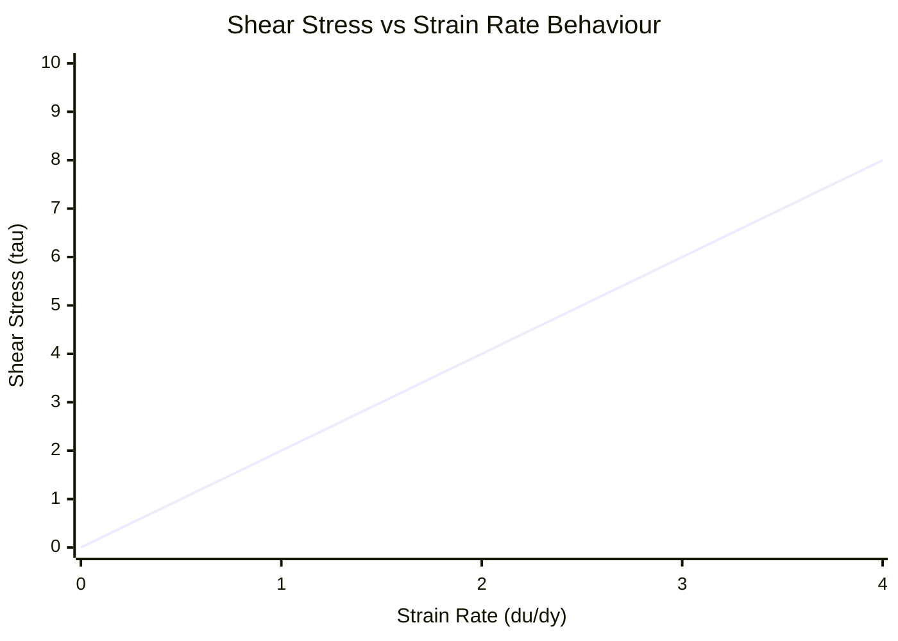

# 📖 Viscosity and Newton's Law of Viscosity

> **Definition of a fluid:** A substance that **deforms continuously** under the action of a shear or tangential stress ($\tau$), however small. It cannot remain at rest under shear.

---

## 🎯 1. Physical Foundation: The Couette Experiment

Consider two infinite parallel flat plates separated by a distance $h$, with the intermediate space filled with fluid. The lower plate is stationary ($y = 0$, $u = 0$) and the upper one moves at constant velocity $U$ ($y = h$, $u = U$).

### No-Slip Condition
Due to the molecular adhesion forces at the fluid-solid interface:
$$ u(y=0) = 0, \quad u(y=h) = U $$
For Newtonian fluids in laminar regime, the velocity profile is linear:
$$ u(y) = U \frac{y}{h} $$

---

## 📐 2. Mathematical Formulation of Newton's Law

For a one-dimensional simple shear flow:
$$ \tau = \mu \frac{du}{dy} $$
* $ \tau $: Tangential shear stress $[\text{Pa} = \text{N/m}^2]$.
* $ \mu $: **Dynamic** or absolute **viscosity** $[\text{Pa}\cdot\text{s} = \frac{\text{kg}}{\text{m}\cdot\text{s}}]$.  
  *(In the CGS system the Poise was used: $1\text{ Pa}\cdot\text{s} = 10\text{ P} = 1000\text{ cP}$. Water at 20°C has $\mu \approx 1.0\times 10^{-3}\text{ Pa}\cdot\text{s} = 1\text{ cP}$)*.
* $ \frac{du}{dy} $: Angular deformation rate or velocity gradient $[s^{-1}]$.

### Kinematic Viscosity ($\nu$)
It is the ratio between the diffusive viscous forces and the volumetric inertia forces:
$$ \nu = \frac{\mu}{\rho} \quad \left[\frac{\text{m}^2}{\text{s}}\right] $$
*(In CGS: $1\text{ Stokes (St)} = 10^{-4}\text{ m}^2/\text{s}$)*.

---

## 🔬 3. Variation of Viscosity with Temperature

The physical origin of viscosity is radically opposite in liquids and gases:

### In Gases (Molecular momentum transfer)
As $T$ increases, the molecules move at higher thermal speed, increasing the transverse collisions $\implies \mathbf{\mu \text{ increases with } T}$.

**Sutherland's Law (Official formula for aerospace air):**
$$ \mu(T) = \mu_0 \left(\frac{T}{T_0}\right)^{3/2} \frac{T_0 + S}{T + S} $$
For air:
* $ T_0 = 273.15 \text{ K} $
* $ \mu_0 = 1.716 \times 10^{-5} \text{ Pa}\cdot\text{s} $
* $ S = 110.4 \text{ K} $ (Effective Sutherland constant)

### In Liquids (Intermolecular cohesion forces)
As $T$ increases, thermal agitation breaks the cohesive intermolecular bonds $\implies \mathbf{\mu \text{ decreases exponentially with } T}$ (Andrade / Arrhenius equation):
$$ \mu(T) \approx A \cdot e^{B/T} $$

---

## 📊 4. Rheological Classification of Fluids

$$ \tau = k \left(\frac{du}{dy}\right)^n $$

1. **Newtonian ($n=1$):** Straight line through the origin ($\mu = \text{const}$). Examples: Water, air, gasoline, light oils.
2. **Pseudoplastic ($n < 1$, *Shear-Thinning*):** The apparent viscosity decreases as the gradient increases. Examples: Paints, blood, polymers.
3. **Dilatant ($n > 1$, *Shear-Thickening*):** The viscosity increases as the gradient increases. Examples: Cornstarch-in-water mixture (Oobleck), quicksand.
4. **Bingham Plastic:** Requires overcoming an initial yield threshold ($\tau_0$) to begin to flow. Examples: Toothpaste, mayonnaise, drilling muds.

---

## 🔗 Related Concepts
* [[01 - Fluid Mechanics/Topic 1 - Introductory Remarks and Starting Assumptions|Back to Topic 1]]
* [[01 - Fluid Mechanics/Concept - Fundamental Equation of Fluid Statics|Next: Fluid Statics]]
