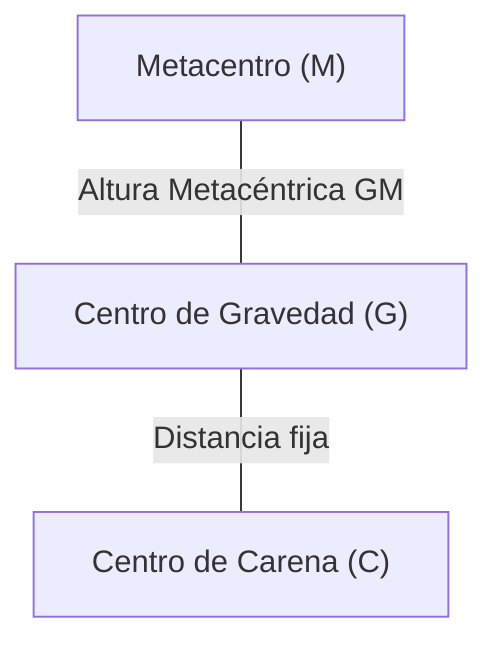

# 📖 Principio de Arquímedes y Estabilidad de Cuerpos Flotantes

> **Enunciado clásico:** Todo cuerpo sumergido total o parcialmente en un fluido en reposo experimenta un empuje vertical hacia arriba igual al peso del volumen de fluido desalojado por el cuerpo.

---

## 🔍 1. Demostración Mediante Teorema de Gauss (Divergencia)

Consideremos un cuerpo sumergido que ocupa un volumen $V$ delimitado por una superficie cerrada orientada $\partial V$. La fuerza neta ejercida por la presión del fluido es:
$$ \vec{F}_B = -\oint_{\partial V} p \, d\vec{A} $$

Aplicando el **Teorema de la Divergencia de Gauss**:
$$ -\oint_{\partial V} p \, d\vec{A} = -\int_V \nabla p \, dV $$

Sustituyendo la ecuación fundamental de la hidrostática $\nabla p = \rho \vec{g} = (0, 0, -\rho g)$:
$$ \vec{F}_B = -\int_V (-\rho g \vec{k}) \, dV = \left(\int_V \rho g \, dV\right) \vec{k} = \mathbf{m_f g \, \vec{k}} $$

* **Empuje boyante:** $E = \rho_{\text{fluido}} \cdot g \cdot V_{\text{desalojado}}$.
* **Punto de aplicación:** El **Centro de Carena ($C$ o $B$)**, que es el centroide geométrico del volumen de fluido desalojado.

---

## ⚖️ 2. Estabilidad de Cuerpos Totalmente Sumergidos (Submarinos, Dirigibles)

Depende exclusivamente de la posición relativa vertical entre el Centro de Gravedad del cuerpo ($G$) y el Centro de Carena ($C$):

* **Estabilidad Positiva / Estable ($G$ por debajo de $C$):** Un giro genera un par restaurador que devuelve el cuerpo a la vertical.
* **Equilibrio Indiferente ($G$ coincide con $C$):** Permanece en cualquier orientación.
* **Inestable ($G$ por encima de $C$):** Cualquier perturbación angular genera un par de vuelco.

---

## 🚢 3. Estabilidad de Cuerpos Flotantes (Barcos, Plataformas, Hidroaviones)

En un cuerpo que flota parcialmente sumergido, **$G$ suele estar situado por encima de $C$**. A pesar de ello, el equilibrio puede ser perfectamente **estable** porque al escorarse un ángulo $\theta$, la forma geométrica de la carena sumergida cambia, desplazando el centro de carena $C$ hacia el lado sumergido ($C'$).

### 3.1 Definición del Metacentro ($M$)
Es el punto de intersección de la línea de acción vertical del empuje en posición inclinada con el eje de simetría original del cuerpo.

### 3.2 Radio Metacéntrico ($\overline{CM}$)
Demostrado por Bouguer:
$$ \overline{CM} = \frac{I_{0}}{V_{\text{sumergido}}} $$
* $ I_{0} $: Segundo momento de inercia del **área de flotación** (la sección del cuerpo en la superficie del agua) respecto al eje longitudinal de giro.
* $ V_{\text{sumergido}} $: Volumen de la carena.

### 3.3 Altura Metacéntrica ($\overline{GM}$)
Determina la estabilidad del sistema:
$$ \mathbf{\overline{GM} = \overline{CM} \pm \overline{CG} = \frac{I_{0}}{V_{\text{sum}}} - \overline{CG}} $$

| Condición | Tipo de Equilibrio | Comportamiento |
| :--- | :--- | :--- |
| **$\mathbf{\overline{GM} > 0}$ ($M$ sobre $G$)** | **Estable** | El par $(W, E)$ es **restaurador**: devuelve el buque a la horizontal. |
| **$\overline{GM} = 0$ ($M$ coincide con $G$)** | Neutro | No hay par; permanece escorado. |
| **$\mathbf{\overline{GM} < 0}$ ($M$ bajo $G$)** | **Inestable** | El par es **zozobrante**: vuelco o zozobra catastrófica. |

---

## 🔗 Conceptos Relacionados
* `[[01 - Fluid Mechanics/Tema 1 - Propiedades y Estatica de Fluidos|Volver al Tema 1]]`
* `[[01 - Fluid Mechanics/Formulario - Tema 1 Estatica y Propiedades|Ver Formulario Completo]]`
