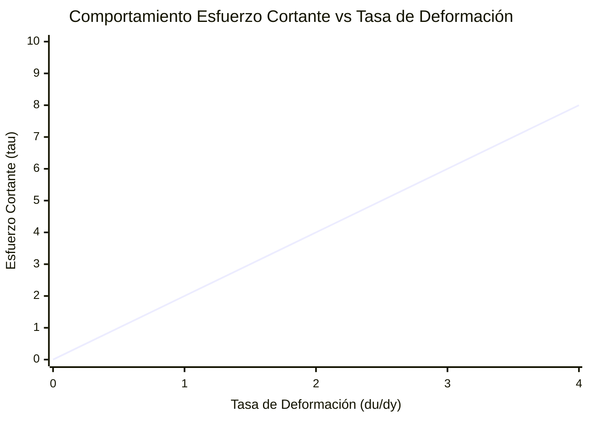

# 📖 Viscosidad y Ley de Newton de la Viscosidad

> **Definición de fluido:** Una sustancia que **se deforma continuamente** bajo la acción de un esfuerzo cortante o tangencial ($\tau$), por pequeño que este sea. No puede mantener el reposo bajo cortadura.

---

## 🎯 1. Fundamento Físico: El Experimento de Couette

Consideremos dos placas planas paralelas infinitas separadas una distancia $h$, con el espacio intermedio lleno de fluido. La placa inferior está inmóvil ($y = 0$, $u = 0$) y la superior se desplaza a velocidad constante $U$ ($y = h$, $u = U$).

### Condición de No Deslizamiento (*No-Slip Condition*)
Debido a las fuerzas de adhesión molecular en la interfase fluido-sólido:
$$ u(y=0) = 0, \quad u(y=h) = U $$
Para fluidos newtonianos en régimen laminar, el perfil de velocidad es lineal:
$$ u(y) = U \frac{y}{h} $$

---

## 📐 2. Formulación Matemática de la Ley de Newton

Para un flujo unidimensional de corte simple:
$$ \tau = \mu \frac{du}{dy} $$
* $ \tau $: Esfuerzo cortante tangencial $[\text{Pa} = \text{N/m}^2]$.
* $ \mu $: **Viscosidad dinámica** o absoluta $[\text{Pa}\cdot\text{s} = \frac{\text{kg}}{\text{m}\cdot\text{s}}]$.  
  *(En el sistema CGS se usaba el Poise: $1\text{ Pa}\cdot\text{s} = 10\text{ P} = 1000\text{ cP}$. El agua a 20°C tiene $\mu \approx 1.0\times 10^{-3}\text{ Pa}\cdot\text{s} = 1\text{ cP}$)*.
* $ \frac{du}{dy} $: Tasa de deformación angular o gradiente de velocidad $[s^{-1}]$.

### Viscosidad Cinemática ($\nu$)
Es el cociente entre las fuerzas viscosas difusivas y las fuerzas de inercia volumétrica:
$$ \nu = \frac{\mu}{\rho} \quad \left[\frac{\text{m}^2}{\text{s}}\right] $$
*(En CGS: $1\text{ Stoke (St)} = 10^{-4}\text{ m}^2/\text{s}$)*.

---

## 🔬 3. Variación de la Viscosidad con la Temperatura

El origen físico de la viscosidad es radicalmente opuesto en líquidos y gases:

### En Gases (Transferencia de cantidad de movimiento molecular)
Al aumentar $T$, las moléculas se mueven a mayor velocidad térmica, aumentando las colisiones transversales $\implies \mathbf{\mu \text{ aumenta con } T}$.

**Ley de Sutherland (Fórmula oficial para aire aeroespacial):**
$$ \mu(T) = \mu_0 \left(\frac{T}{T_0}\right)^{3/2} \frac{T_0 + S}{T + S} $$
Para el aire:
* $ T_0 = 273.15 \text{ K} $
* $ \mu_0 = 1.716 \times 10^{-5} \text{ Pa}\cdot\text{s} $
* $ S = 110.4 \text{ K} $ (Constante de Sutherland efectiva)

### En Líquidos (Fuerzas de cohesión intermolecular)
Al aumentar $T$, la agitación térmica rompe los enlaces intermoleculares cohesivos $\implies \mathbf{\mu \text{ disminuye exponencialmente con } T}$ (Ecuación de Andrade / Arrhenius):
$$ \mu(T) \approx A \cdot e^{B/T} $$

---

## 📊 4. Clasificación Reológica de los Fluidos

$$ \tau = k \left(\frac{du}{dy}\right)^n $$

1. **Newtoniano ($n=1$):** Línea recta que pasa por el origen ($\mu = \text{cte}$). Ejemplos: Agua, aire, gasolina, aceites ligeros.
2. **Pseudoplástico ($n < 1$, *Shear-Thinning*):** La viscosidad aparente disminuye al aumentar el gradiente. Ejemplos: Pinturas, sangre, polímeros.
3. **Dilatante ($n > 1$, *Shear-Thickening*):** La viscosidad aumenta al aumentar el gradiente. Ejemplos: Mezcla de almidón de maíz en agua (Oobleck), arenas movedizas.
4. **Plástico de Bingham:** Requiere superar un umbral de fluencia inicial ($\tau_0$) para empezar a fluir. Ejemplos: Pasta de dientes, mayonesa, lodos de perforación.

---

## 🔗 Conceptos Relacionados
* `[[01 - Fluid Mechanics/Tema 1 - Propiedades y Estatica de Fluidos|Volver al Tema 1]]`
* `[[01 - Fluid Mechanics/Concepto - Ecuacion Fundamental de la Estatica de Fluidos|Siguiente: Estática de Fluidos]]`
