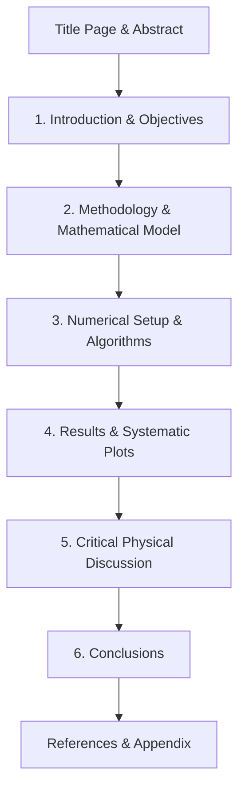

# 🔬 Laboratory Guidelines & Scientific Report Standards

> **Primary Course Reference:** *Mechanics Applied to Aerospace Engineering (MAAE) — UC3M*  
> **Source Documents:** [[mechanics_labs.pdf]] | [[Lab1_notes.pptx]]  
> **Navigation:** [[Engineering Mechanics MOC|⬅️ Mechanics MOC]] | [[00 - Indice Central/Master Index|Master Index]]

---

## 🎯 1. Laboratory Objectives & Overview

The laboratory and computer sessions of *Mechanics Applied to Aerospace Engineering* are structured around three fundamental learning axes:
1. **Numerical Integration of Equations of Motion:** Developing robust MATLAB algorithms using appropriate solvers (`ode45`, `ode23s`), custom event detection functions (`stopfun`), and vectorization.
2. **Experimental Measurement & Data Processing:** Capturing real mechanical dynamics using high-speed digital video, extracting marker trajectories via computer vision, estimating initial conditions, and computing physical invariants.
3. **Rigorous Scientific & Technical Reporting:** Communicating physical phenomena, mathematical formulations, and engineering results with absolute precision and professional typesetting.

### Course Laboratory Program (4 Sessions)
* **Session 1:** [[Lab 1 - Particle Connected to a Spool|Particle Connected to a Spool]] (Numerical Integration & Discontinuous Events)
* **Session 2:** [[Lab 2 - Particle on Oscillating Loop|Particle on Oscillating Loop]] (Dynamics in Rotating Non-Inertial Frames & Phase Space)
* **Session 3:** [[Lab 3 and 4 - Compound Double Pendulum|Compound Double Pendulum (Part I: Experimental Testing & Video Tracking)]]
* **Session 4:** [[Lab 3 and 4 - Compound Double Pendulum|Compound Double Pendulum (Part II: Numerical Integration & Deterministic Chaos)]]

---

## 📐 2. Scientific Technical Report Standards

> [!WARNING] Mandatory Compliance
> Failure to follow the report structure, missing the Introduction/Abstract, or providing non-functional code will result in a **zero (0) grade**.

### 2.1 Core Rules for Technical Writing
* **Impersonal & Objective Voice:** Never write in first person singular (*"I measured"*, *"I observed"*). Use impersonal constructions (*"The trajectory was obtained"*, *"It is observed that"*) or first person plural (*"We analyze"*).
* **Conciseness & Precision:** State physical facts clearly. Avoid empty adverbs and colloquialisms (*"very fast"*, *"extremely high"*, *"a lot"*). Specify exact numerical bounds and tolerances.
* **No Screenshot Equations:** All equations must be rendered using proper typesetting ($\text{\LaTeX}$). Do not insert screenshots of mathematical expressions from lecture slides.
* **Self-Contained Abstract:** A concise summary (100–150 words) placed at the top that enables the reader to understand the problem, methods, key quantitative results, and conclusions without reading the entire document.

### 2.2 Standard Document Structure (Max 10 Pages)


1. **Title Page & Header:** Full names and student IDs of all 3 team members, lab group (e.g., LA or LB), course name, and submission date.
2. **Introduction:** Physical problem definition, engineering context, and roadmap of the report.
3. **Methodology:** Complete analytical derivation of kinematics, Newton-Euler equations, constraint equations, and non-inertial forces. State all hypotheses explicitly.
4. **Results:** High-quality figures illustrating the computed and measured state variables over time and phase planes.
5. **Discussion:** Physical explanation of the observed behavior (energy conservation, resonance, centrifugal vs Coriolis effects, string unwinding/slackening). Never merely state *"the curve goes up"*; explain **why** it goes up based on the governing equations.
6. **Conclusions:** Summary of key quantitative takeaways and limitations of the models.

---

## 📊 3. Plotting Guidelines & Quality Standards

Graphs are the primary scientific medium for communicating dynamics. Every figure must satisfy professional publication criteria.

### 3.1 Essential Plot Rules
* **Explicit Axes and Units:** Every axis must feature the physical variable (in italics) and its SI unit in brackets or parentheses: e.g., $x\text{ (m)}$, $\dot{\theta}\text{ (rad/s)}$, $t\text{ (s)}$.
* **Dimensionless Quantities:** If a quantity is non-dimensional, indicate it explicitly using `[-]`: e.g., $t\text{ (-)}$ or $y\text{ (-)}$.
* **Font Size & Legibility:** Text inside figures must be comparable in size to the report body text (typically 12–14 pt).
* **Multiple Scales & Axes:** When plotting two variables that differ by orders of magnitude (e.g., position $x \sim 1\text{ m}$ vs force $F \sim 10^7\text{ N}$), **never** plot them on the same vertical axis. Use dual vertical axes (`yyaxis` / `plotyy`) or separate subplots.

### 3.2 Sampling Frequency & Aliasing (Nyquist Criterion)
To numerically display continuous oscillatory signals $y(t) = \sin(2\pi f_0 t)$:
* **Nyquist-Shannon Theorem:** Sampling rate $f_s$ must satisfy $f_s > 2 f_0$ to avoid aliasing.
* **Visual Quality Standard:** For clear graphical representation without artificial polygonal distortion or deceptive beat patterns, the sampling frequency should be at least **$15 f_0$** ($f_s \ge 15 f_0$).

```
Under-sampled (fs = 1.1 f0)  --> Fundamental frequency completely lost (Aliasing artifact)
Marginal (fs = 2.3 f0)       --> Distorted triangular envelope, highly noisy
Optimal (fs >= 15 f0)        --> Clean, smooth sinusoidal curve
```

---

## 💻 4. MATLAB Standards & Startup Scripts

To ensure uniform figure styles across all generated plots, initialize the default graphics root properties at the start of your MATLAB session.

### 4.1 Recommended Startup Configuration (`startup.m`)
```matlab
%% MATLAB Graphics Root Configuration for Lab Reports
close all; clear all; clc;

% Axes & Labels Font Configuration
set(groot, 'defaultAxesFontSize', 12);
set(groot, 'defaultTextFontSize', 12);
set(groot, 'defaultLegendFontSize', 11);

% LaTeX Interpreter by default
set(groot, 'defaultAxesTickLabelInterpreter', 'latex');
set(groot, 'defaultTextInterpreter', 'latex');
set(groot, 'defaultLegendInterpreter', 'latex');

% Line and Grid Properties
set(groot, 'defaultAxesLineWidth', 1.0);
set(groot, 'defaultLineLineWidth', 1.5);
set(groot, 'defaultLineMarkerSize', 6);
set(groot, 'defaultAxesXMinorTick', 'on');
set(groot, 'defaultAxesYMinorTick', 'on');
set(groot, 'defaultAxesXGrid', 'on');
set(groot, 'defaultAxesYGrid', 'on');
set(groot, 'defaultLegendBox', 'off');
```

---

## 📦 5. Deliverables & Submission Protocol

Submissions are handled exclusively through AulaGlobal by one designated member per 3-person team:

* **File Archive Name:** `Group_Li_S1_S2_S3.zip` (e.g. `Group_LA_Sanchez_Gonzalez_Garcia.zip`)
* **Report Document:** `Report_Li_S1_S2_S3.pdf` (maximum 10 pages, $\text{\LaTeX}$ template recommended for +1 extra mark).
* **Code Subdirectory:** `code_Li_S1_S2_S3/`
  * Must contain an automated master script: `main.m` (or `main_exp.m` and `main_num.m` for Labs 3–4).
  * Running `main.m` must produce **all report figures and tables without any user intervention or manual input**.
  * All functions (`diffeq.m`, `stopfun.m`, etc.) and data files (`.mat`) must be standalone.
