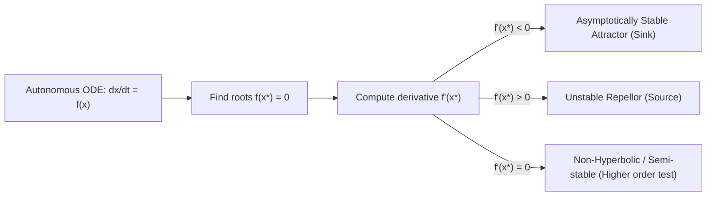
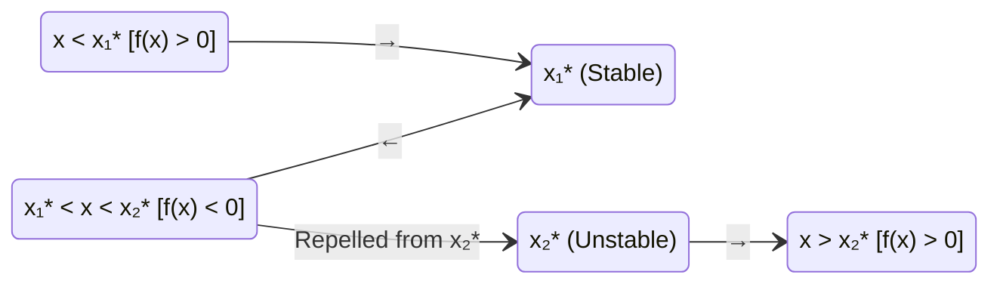

# 📖 Análisis Cualitativo de EDOs Autónomas y Estabilidad

> **Key idea in one sentence:** For autonomous dynamical systems $\dot{x} = f(x)$, global qualitative trajectories can be predicted without analytical integration by analyzing stationary equilibria $f(x^*)=0$, evaluating their stability via the spectral derivative $f'(x^*)$, and applying Picard's no-crossing theorem to confine trajectories inside invariant phase corridors.

---

## 🎯 1. Autonomous Differential Equations and Equilibria

An ordinary differential equation is **autonomous** if the rate of change $\dot{x} \equiv \frac{dx}{dt}$ does not depend explicitly on the independent variable time $t$:

$$ \frac{dx}{dt} = f(x) \tag{1} $$

where $f: \mathbb{R} \to \mathbb{R}$ is a $C^1$ scalar vector field.

### Stationary Points (Equilibria / Critical Points)
A state $x^* \in \mathbb{R}$ is an **equilibrium point** (or stationary/fixed point) of $(1)$ if the velocity vanishes:

$$ f(x^*) = 0 \tag{2} $$

If the system starts at an equilibrium $x(0) = x^*$, the unique solution is constant for all time:
$$ x(t) \equiv x^* \quad \forall t \in \mathbb{R} $$

---

## 📐 2. Analytical Linear Stability Criterion

To evaluate the response of the equilibrium $x^*$ to an infinitesimal perturbation $\xi(t)$, let:
$$ x(t) = x^* + \xi(t), \quad |\xi(t)| \ll 1 \tag{3} $$

Differentiating with respect to time:
$$ \dot{\xi}(t) = \dot{x}(t) = f(x^* + \xi(t)) $$

Expand $f(x^* + \xi)$ in a first-order Taylor series around the equilibrium $x^*$:
$$ f(x^* + \xi) = f(x^*) + f'(x^*) \xi + \frac{1}{2} f''(x^*) \xi^2 + \mathcal{O}(\xi^3) $$

Since $f(x^*) = 0$, dropping higher-order terms $\mathcal{O}(\xi^2)$ yields the **linearized perturbation equation**:
$$ \frac{d\xi}{dt} \approx f'(x^*) \xi(t) \tag{4} $$

The exact solution of equation $(4)$ is:
$$ \xi(t) = \xi_0 \exp\left( f'(x^*) t \right) \tag{5} $$

### Classification of Equilibria:
1. **Asymptotically Stable (Attractor / Sink):** $f'(x^*) < 0$.
   Perturbations decay exponentially: $\lim_{t \to \infty} \xi(t) = 0$. Nearby trajectories converge asymptotically to $x^*$.
2. **Unstable (Repellor / Source):** $f'(x^*) > 0$.
   Perturbations grow exponentially: $|\xi(t)| \to \infty$ as $t$ advances. Trajectories are pushed away from $x^*$.
3. **Non-Hyperbolic / Semistable:** $f'(x^*) = 0$.
   Linearization is inconclusive. Stability is determined by the sign of the first non-vanishing higher derivative $f^{(k)}(x^*)$.

---

## 🧭 3. 1D Phase Line Dynamics

Because $x$ is a scalar, the state space is the real line $\mathbb{R}$ (the **phase line**). The sign of $f(x)$ dictates the direction of motion:
* If $f(x) > 0$: $\dot{x} > 0 \implies$ the state $x(t)$ moves to the **right** ($\to$).
* If $f(x) < 0$: $\dot{x} < 0 \implies$ the state $x(t)$ moves to the **left** ($\leftarrow$).

> [!NOTE] Monotonicity Principle in 1D
> In a scalar autonomous ODE $\dot{x} = f(x)$, because $f(x)$ depends only on $x$, $\dot{x}$ cannot change sign without passing through an equilibrium $f(x^*)=0$. Therefore, **all non-equilibrium solutions $x(t)$ are strictly monotonic** (either strictly increasing or strictly decreasing). Oscillations and limit cycles are mathematically impossible in 1D state spaces!

---

## 🛡️ 4. The No-Crossing Theorem and Trajectory Confinement

A fundamental geometric consequence of the **Picard-Lindelöf Uniqueness Theorem** is the **No-Crossing Theorem**:

### Theorem (Non-Intersection of Trajectories)
Let $f(t, x)$ and $\frac{\partial f}{\partial x}$ be continuous on an open domain $D \subseteq \mathbb{R}^2$. If $x_1(t)$ and $x_2(t)$ are two solutions to $\dot{x} = f(t, x)$ whose graphs lie in $D$, then their curves **cannot cross or touch**:
$$ x_1(t_0) \neq x_2(t_0) \implies x_1(t) \neq x_2(t) \quad \forall t \text{ in their common domain} $$

#### Proof by Contradiction:
Suppose there exists a time $t^*$ such that $x_1(t^*) = x_2(t^*) = x^*$. Then both $x_1(t)$ and $x_2(t)$ solve the Initial Value Problem:
$$ \begin{cases} \dot{x} = f(t, x) \\ x(t^*) = x^* \end{cases} $$
By the Picard-Lindelöf Theorem, this IVP has a **unique** local solution. Therefore, $x_1(t) \equiv x_2(t)$ on the entire neighborhood, contradicting the hypothesis that $x_1$ and $x_2$ are distinct solutions. $\blacksquare$

### Trajectory Confinement Corridors:
1. **Confinement between Equilibria:** If $x_1^* < x_2^*$ are two adjacent equilibria of $\dot{x} = f(x)$, the constant functions $x_1(t) \equiv x_1^*$ and $x_2(t) \equiv x_2^*$ act as impermeable impenetrable barriers. Any solution starting inside with $x_0 \in (x_1^*, x_2^*)$ is trapped for all time:
   $$ x_1^* < x(t) < x_2^* \quad \forall t \in (-\infty, \infty) $$
2. **Confinement by Non-Constant Known Solutions (Problem 2.12):**
   If $y_1(t) = -t - 1$ and $y_2(t) = t^2 + 1$ are known solutions to $\dot{y} = f(y, t)$, and we examine a third solution with $y(0) = 0$:
   * At $t = 0$: $y_1(0) = -1 < y(0) = 0 < y_2(0) = 1$.
   * By the No-Crossing Theorem, $y(t)$ can never intersect $y_1(t)$ or $y_2(t)$.
   * Consequently:
     $$ \mathbf{-t - 1 < y(t) < t^2 + 1} \quad \forall t \in \mathbb{R} $$

---

## 💥 5. Pitchfork Bifurcations: $\dot{x} = x(\kappa^2 - x^2)$

In aerospace structures and aeroelastic stability (e.g., panel flutter and wing divergence), stability changes as physical parameters vary. Consider Problem 2.16:
$$ \frac{dx}{dt} = x(\kappa^2 - x^2) \quad (\kappa > 0) $$
* **Equilibria:** $x(\kappa - x)(\kappa + x) = 0 \implies x_1^* = -\kappa, \quad x_2^* = 0, \quad x_3^* = +\kappa$.
* **Stability Evaluation:** $f'(x) = \kappa^2 - 3x^2$.
  * At $x = 0$: $f'(0) = \kappa^2 > 0 \implies \mathbf{Unstable\ (Repellor)}$.
  * At $x = \pm\kappa$: $f'(\pm\kappa) = \kappa^2 - 3\kappa^2 = -2\kappa^2 < 0 \implies \mathbf{Asymptotically\ Stable\ (Attractors)}$.
* **Phase Flow:** Trajectories with $x_0 > 0$ converge to $+\kappa$; trajectories with $x_0 < 0$ converge to $-\kappa$. This represents a supercritical **pitchfork bifurcation**, where the origin loses stability and gives birth to two symmetric stable trim states.

---

## 🔗 Related Concepts and Problems
* `[[04 - Advanced Maths/Tema 2 - First-Order ODEs and Qualitative Dynamics|Tema 2 Guide]]`
* `[[04 - Advanced Maths/Concepto - Well-Posed Problems and Picard Theorem|Picard-Lindelöf Existence and Uniqueness]]`
* `[[04 - Advanced Maths/Problema - Ch2-P12 Trajectory Crossing and Uniqueness Bounds|Problem 2.12: Trajectory Crossing Bounds]]`
* `[[04 - Advanced Maths/Problema - Ch2-P13 Multi-Equilibria Autonomous Phase Line Dynamics|Problem 2.13: Multi-Equilibria Phase Line]]`
* `[[04 - Advanced Maths/Problema - Ch2-P16 Pitchfork Phase Line and Stability Regimes|Problem 2.16: Pitchfork Bifurcation Dynamics]]`
