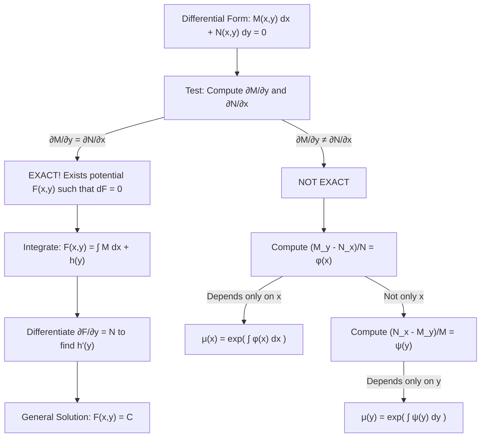

# 📖 Ecuaciones Exactas y Factores Integrantes Especiales

> **Key idea in one sentence:** A first-order differential equation written in differential form $M(x, y) dx + N(x, y) dy = 0$ is exact if its coefficients represent the gradient of a scalar potential function $F(x, y)$, verifiable by the symmetry of mixed partial derivatives $\frac{\partial M}{\partial y} = \frac{\partial N}{\partial x}$, allowing implicit solutions $F(x, y) = C$ or conversion to exactness via special integrating factors.

---

## 🎯 1. Differential Forms and The Exactness Criterion

Consider a first-order differential equation written symmetrically in differential form:

$$ M(x, y) \, dx + N(x, y) \, dy = 0 \tag{1} $$

or equivalently in derivative notation:
$$ M(x, y) + N(x, y) \frac{dy}{dx} = 0 $$

### Definition: Exact Differential Form
The expression $(1)$ is an **exact differential equation** on an open, simply connected domain $D \subseteq \mathbb{R}^2$ if there exists a continuously differentiable ($C^2$) scalar potential function $F(x, y)$ such that its total differential equals the differential form:

$$ dF = \frac{\partial F}{\partial x} \, dx + \frac{\partial F}{\partial y} \, dy \equiv M(x, y) \, dx + N(x, y) \, dy \tag{2} $$

If such a potential function $F(x, y)$ exists, equation $(1)$ is simply $dF = 0$, whose general solution is the level curves of the potential surface:
$$ \mathbf{F(x, y) = C} \tag{3} $$
where $C \in \mathbb{R}$ is an arbitrary integration constant.

---

## 📐 2. The Necessary and Sufficient Condition for Exactness

### Theorem (Euler-Cauchy-Schwarz Compatibility Criterion)
Let $M(x, y)$ and $N(x, y)$ have continuous first partial derivatives on a simply connected open region $D \subseteq \mathbb{R}^2$. The differential equation $M \, dx + N \, dy = 0$ is **exact if and only if**:

$$ \mathbf{\frac{\partial M}{\partial y} = \frac{\partial N}{\partial x}} \quad \forall (x, y) \in D \tag{4} $$

#### Proof of Necessity:
If the equation is exact, there exists $F$ such that:
$$ M(x, y) = \frac{\partial F}{\partial x} \quad \text{and} \quad N(x, y) = \frac{\partial F}{\partial y} $$
Differentiating $M$ with respect to $y$ and $N$ with respect to $x$:
$$ \frac{\partial M}{\partial y} = \frac{\partial}{\partial y} \left( \frac{\partial F}{\partial x} \right) = \frac{\partial^2 F}{\partial y \partial x} $$
$$ \frac{\partial N}{\partial x} = \frac{\partial}{\partial x} \left( \frac{\partial F}{\partial y} \right) = \frac{\partial^2 F}{\partial x \partial y} $$
By **Schwarz's Theorem (Clairaut's Theorem)** on the equality of mixed partial derivatives for $C^2$ functions:
$$ \frac{\partial^2 F}{\partial y \partial x} = \frac{\partial^2 F}{\partial x \partial y} \implies \frac{\partial M}{\partial y} = \frac{\partial N}{\partial x} $$
Sufficiency follows from Poincaré's Lemma on simply connected domains.

---

## 🔍 3. Systematic Reconstruction of the Potential Function $F(x, y)$

Once condition $(4)$ is verified, determine $F(x, y)$ by the two-step partial integration method:

### Step 1: Integrate with respect to $x$
Since $\frac{\partial F}{\partial x} = M(x, y)$, integrate holding $y$ constant:
$$ F(x, y) = \int M(x, y) \, dx + h(y) \tag{5} $$
where the integration "constant" $h(y)$ is an unknown function depending solely on $y$.

### Step 2: Differentiate with respect to $y$ and equate to $N(x, y)$
Differentiate equation $(5)$ with respect to $y$:
$$ \frac{\partial F}{\partial y} = \frac{\partial}{\partial y} \left( \int M(x, y) \, dx \right) + h'(y) $$
Equating this to the prescribed $N(x, y)$:
$$ \frac{\partial}{\partial y} \left( \int M(x, y) \, dx \right) + h'(y) = N(x, y) $$
Isolate $h'(y)$:
$$ h'(y) = N(x, y) - \frac{\partial}{\partial y} \left( \int M(x, y) \, dx \right) \tag{6} $$

> [!NOTE] Independence from $x$
> Because the equation is exact ($\frac{\partial M}{\partial y} = \frac{\partial N}{\partial x}$), the right-hand side of equation $(6)$ is **guaranteed to be completely independent of $x$**. If any $x$ remains, an algebraic error was made in previous steps!

Integrate $h'(y)$ with respect to $y$ to obtain $h(y)$, and write the implicit solution $F(x, y) = C$.

---

## 🛠️ 4. Special Integrating Factors for Non-Exact Equations

If $\frac{\partial M}{\partial y} \neq \frac{\partial N}{\partial x}$, we search for a multiplier $\mu(x, y)$ such that:
$$ \mu M \, dx + \mu N \, dy = 0 $$
is exact. This requires:
$$ \frac{\partial(\mu M)}{\partial y} = \frac{\partial(\mu N)}{\partial x} \implies \mu \frac{\partial M}{\partial y} + M \frac{\partial \mu}{\partial y} = \mu \frac{\partial N}{\partial x} + N \frac{\partial \mu}{\partial x} $$
$$ N \frac{\partial \mu}{\partial x} - M \frac{\partial \mu}{\partial y} = \mu \left( \frac{\partial M}{\partial y} - \frac{\partial N}{\partial x} \right) \tag{7} $$

### Case 1: Integrating Factor Depending Only on $x$ ($\mu = \mu(x)$)
If $\mu$ depends only on $x$, then $\frac{\partial \mu}{\partial y} = 0$ and $\frac{\partial \mu}{\partial x} = \frac{d\mu}{dx}$. Equation $(7)$ reduces to:
$$ N \frac{d\mu}{dx} = \mu \left( \frac{\partial M}{\partial y} - \frac{\partial N}{\partial x} \right) \implies \frac{1}{\mu} \frac{d\mu}{dx} = \frac{\frac{\partial M}{\partial y} - \frac{\partial N}{\partial x}}{N} $$
If the fraction depends **solely on $x$**:
$$ \phi(x) \equiv \frac{M_y - N_x}{N} \implies \mathbf{\mu(x) = \exp\left( \int \phi(x) \, dx \right)} \tag{8} $$

### Case 2: Integrating Factor Depending Only on $y$ ($\mu = \mu(y)$)
If $\mu$ depends only on $y$, then $\frac{\partial \mu}{\partial x} = 0$ and $\frac{\partial \mu}{\partial y} = \frac{d\mu}{dy}$. Equation $(7)$ reduces to:
$$ -M \frac{d\mu}{dy} = \mu \left( \frac{\partial M}{\partial y} - \frac{\partial N}{\partial x} \right) \implies \frac{1}{\mu} \frac{d\mu}{dy} = \frac{\frac{\partial N}{\partial x} - \frac{\partial M}{\partial y}}{M} $$
If the fraction depends **solely on $y$**:
$$ \psi(y) \equiv \frac{N_x - M_y}{M} \implies \mathbf{\mu(y) = \exp\left( \int \psi(y) \, dy \right)} \tag{9} $$

---

## ⚡ 5. Universal Exactness of Separated Equations

Consider any separated differential equation:
$$ f(x) + g(y) \frac{dy}{dx} = 0 \iff f(x) \, dx + g(y) \, dy = 0 $$
Here:
$$ M(x, y) = f(x), \quad N(x, y) = g(y) $$
Computing partial derivatives:
$$ \frac{\partial M}{\partial y} = \frac{\partial f(x)}{\partial y} = 0, \quad \frac{\partial N}{\partial x} = \frac{\partial g(y)}{\partial x} = 0 $$
Since $0 = 0$, **any separable equation is automatically and unconditionally an exact differential equation**. Its potential function is simply:
$$ F(x, y) = \int f(x) \, dx + \int g(y) \, dy = C $$

---

## 🔗 Related Concepts and Problems
* `[[04 - Advanced Maths/Tema 2 - First-Order ODEs and Qualitative Dynamics|Tema 2 Guide]]`
* `[[04 - Advanced Maths/Concepto - Metodos de Integracion Directa y Ecuaciones Separables|Separable Equations]]`
* `[[04 - Advanced Maths/Problema - Ch2-P4 Exact Differential Equations|Problem 2.4: 4 Exact Equations Solved]]`
* `[[04 - Advanced Maths/Problema - Ch2-P5 Integrating Factor for Non-Exact Equations|Problem 2.5: Special Integrating Factor μ(x)=x]]`
* `[[04 - Advanced Maths/Problema - Ch2-P6 Exactness of Separated Differential Forms|Problem 2.6: Exactness of Separated Forms]]`
