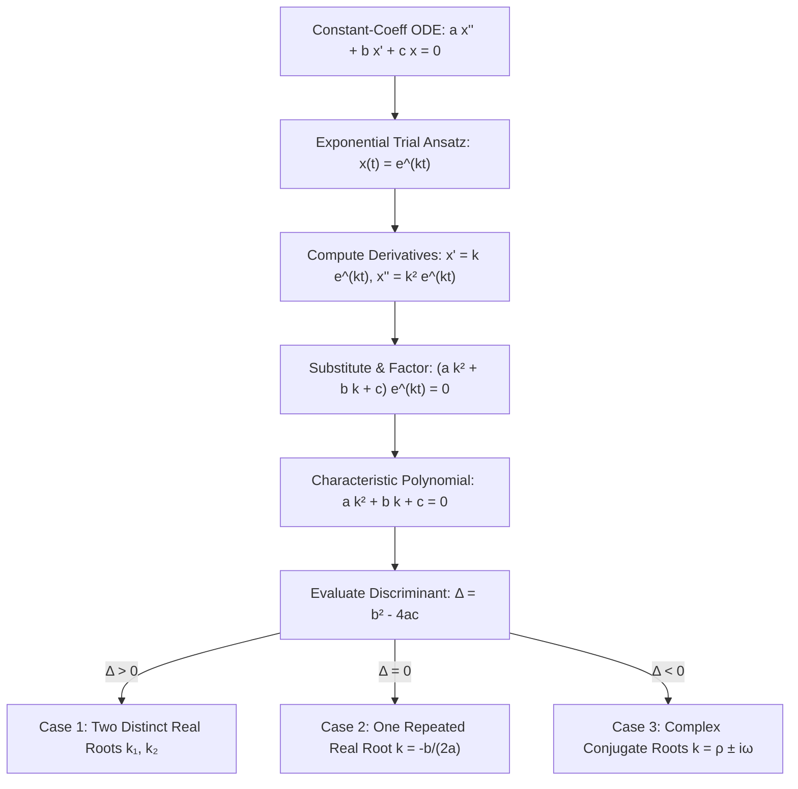
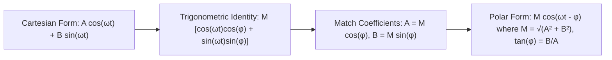

# 📖 Ecuaciones Homogéneas con Coeficientes Constantes y Ecuación Característica

> **Key idea in one sentence:** For second-order linear homogeneous ODEs with constant coefficients $a x'' + b x' + c x = 0$, the exponential ansatz $x(t) = e^{kt}$ converts the differential equation into the algebraic characteristic equation $a k^2 + b k + c = 0$, whose discriminant $\Delta = b^2 - 4ac$ uniquely partitions the dynamic response into distinct exponential relaxation ($\Delta > 0$), critically damped quasi-polynomial decay ($\Delta = 0$), or underdamped pseudo-harmonic oscillations ($\Delta < 0$) derived via Euler's formula.

---

## 🎯 1. The Canonical Equation and the Exponential Ansatz

Consider the homogeneous second-order linear differential equation with constant real coefficients:

$$ a \frac{d^2 x}{dt^2} + b \frac{dx}{dt} + c x(t) = 0 \tag{1} $$

where $a, b, c \in \mathbb{R}$ with $a \neq 0$.

### Derivation of the Characteristic Equation:
Motivated by first-order equations where solutions are pure exponentials, we test the **exponential trial ansatz**:

$$ x(t) = e^{kt} \tag{2} $$

where $k \in \mathbb{C}$ is an unknown constant parameter.
Differentiating $x(t)$ with respect to $t$:
$$ x'(t) = k e^{kt}, \quad x''(t) = k^2 e^{kt} \tag{3} $$

Substitute $(2)$ and $(3)$ into equation $(1)$:
$$ a (k^2 e^{kt}) + b (k e^{kt}) + c (e^{kt}) = 0 $$

Factor out the common non-zero exponential factor $e^{kt}$:
$$ (a k^2 + b k + c) e^{kt} = 0 \tag{4} $$

Since $e^{kt} \neq 0$ for all $t \in \mathbb{R}$, equation $(4)$ is satisfied if and only if $k$ is a root of the **characteristic polynomial**:

$$ \mathbf{a k^2 + b k + c = 0} \tag{5} $$

The roots of this quadratic polynomial are given by:

$$ k = \frac{-b \pm \sqrt{b^2 - 4ac}}{2a} \tag{6} $$

The nature of the fundamental solutions is dictated entirely by the **discriminant**:

$$ \Delta \equiv b^2 - 4ac \tag{7} $$

---

## 🟢 2. Case 1: Distinct Real Roots ($\Delta = b^2 - 4ac > 0$)

When $\Delta > 0$, the characteristic equation has two distinct real roots:
$$ k_1 = \frac{-b + \sqrt{\Delta}}{2a}, \quad k_2 = \frac{-b - \sqrt{\Delta}}{2a}, \quad k_1 \neq k_2 \in \mathbb{R} \tag{8} $$

### Fundamental Solutions:
$$ x_1(t) = e^{k_1 t}, \quad x_2(t) = e^{k_2 t} \tag{9} $$

### Wronskian Verification of Linear Independence:
$$ W[x_1, x_2](t) = \det \begin{pmatrix} e^{k_1 t} & e^{k_2 t} \\ k_1 e^{k_1 t} & k_2 e^{k_2 t} \end{pmatrix} = (k_2 - k_1) e^{(k_1 + k_2)t} \tag{10} $$
Since $k_1 \neq k_2$ and the exponential never vanishes, $W(t) \neq 0$ for all $t$. Thus, $\{e^{k_1 t}, e^{k_2 t}\}$ is a fundamental set of solutions.

### General Solution (Case 1):
$$ \mathbf{x(t) = c_1 e^{k_1 t} + c_2 e^{k_2 t}} \quad (c_1, c_2 \in \mathbb{R}) \tag{11} $$

*Physical Meaning (Overdamped Mechanical System):* Both solutions are pure exponentials. Trajectories decay or grow monotonically without oscillation.

---

## 🟡 3. Case 2: Repeated Real Root ($\Delta = b^2 - 4ac = 0$)

When $\Delta = 0$, the quadratic has a single repeated real root of multiplicity 2:
$$ k = -\frac{b}{2a} \in \mathbb{R} \tag{12} $$

The ansatz provides only one exponential solution: $x_1(t) = e^{kt}$. To span the 2-dimensional solution space, a second linearly independent solution is required.

### Theorem: The Second Solution is $x_2(t) = t e^{kt}$
The function:
$$ x_2(t) \equiv t e^{kt} \tag{13} $$
is a second, linearly independent solution to equation $(1)$.

### Rigorous Proof:
#### Method A: Direct Differential Verification
Compute the derivatives of $x_2(t) = t e^{kt}$ using the product and chain rules:
$$ x_2'(t) = 1 \cdot e^{kt} + t \cdot k e^{kt} = (1 + kt) e^{kt} $$
$$ x_2''(t) = k e^{kt} + k(1 + kt) e^{kt} = (2k + k^2 t) e^{kt} $$

Substitute $x_2, x_2'$, and $x_2''$ into $L[x_2] = a x_2'' + b x_2' + c x_2$:
$$ \begin{aligned}
L[x_2] &= a (2k + k^2 t) e^{kt} + b (1 + kt) e^{kt} + c (t) e^{kt} \\
&= \left[ t (a k^2 + b k + c) + (2a k + b) \right] e^{kt}
\end{aligned} $$

Now, examine the two terms inside the brackets:
1. $a k^2 + b k + c = 0$ because $k$ is a root of the characteristic equation.
2. Since $k = -\frac{b}{2a}$, we have $2a k + b = 2a\left(-\frac{b}{2a}\right) + b = -b + b = 0$.

Therefore:
$$ L[x_2] = [t(0) + 0] e^{kt} \equiv 0 \quad \forall t \in \mathbb{R} $$
Hence $x_2(t) = t e^{kt}$ is an exact solution!

#### Method B: Derivation via Reduction of Order (d'Alembert Formula)
Using Abel's reduction of order formula with normalized coefficient $p = \frac{b}{a} = -2k$:
$$ x_2(t) = x_1(t) \int \frac{\exp\left( -\int p \, dt \right)}{[x_1(t)]^2} \, dt = e^{kt} \int \frac{e^{-pt}}{e^{2kt}} \, dt = e^{kt} \int \frac{e^{2kt}}{e^{2kt}} \, dt = e^{kt} \int 1 \, dt = t e^{kt} $$

### Wronskian Verification:
$$ W[e^{kt}, t e^{kt}](t) = \det \begin{pmatrix} e^{kt} & t e^{kt} \\ k e^{kt} & (1 + kt) e^{kt} \end{pmatrix} = e^{kt}(1 + kt)e^{kt} - t e^{kt}(k e^{kt}) = e^{2kt} \neq 0 \tag{14} $$
The Wronskian is strictly non-zero $\forall t$.

### General Solution (Case 2):
$$ \mathbf{x(t) = (c_1 + c_2 t) e^{kt} = c_1 e^{kt} + c_2 t e^{kt}} \quad (c_1, c_2 \in \mathbb{R}) \tag{15} $$

*Physical Meaning (Critically Damped System):* This regime achieves the fastest possible return to equilibrium without experiencing overshoot oscillations.

---

## 🔵 4. Case 3: Complex Conjugate Roots ($\Delta = b^2 - 4ac < 0$)

When $\Delta < 0$, $\sqrt{\Delta} = \sqrt{-(4ac - b^2)} = i \sqrt{4ac - b^2}$ with $4ac - b^2 > 0$. The roots are a complex conjugate pair:

$$ k = \rho \pm i \omega \tag{16} $$

where the real and imaginary parts are:
$$ \rho = -\frac{b}{2a}, \quad \omega = \frac{\sqrt{4ac - b^2}}{2a} > 0 \tag{17} $$

### Complex Solutions and Euler's Formula:
Testing the exponential ansatz yields two complex-valued solutions:
$$ z_1(t) = e^{(\rho + i\omega)t} = e^{\rho t} e^{i\omega t} \tag{18} $$
$$ z_2(t) = e^{(\rho - i\omega)t} = e^{\rho t} e^{-i\omega t} \tag{19} $$

Recall **Euler's Formula**:
$$ e^{i\theta} = \cos\theta + i\sin\theta \tag{20} $$
Applying Euler's formula to $(18)$ and $(19)$:
$$ z_1(t) = e^{\rho t} \left[ \cos(\omega t) + i \sin(\omega t) \right] $$
$$ z_2(t) = e^{\rho t} \left[ \cos(-\omega t) + i \sin(-\omega t) \right] = e^{\rho t} \left[ \cos(\omega t) - i \sin(\omega t) \right] $$

### Construction of Real-Valued Fundamental Solutions:
Because the differential operator $L$ has real coefficients, the real and imaginary parts of any complex solution are themselves real solutions. By the Superposition Principle:
$$ u(t) \equiv \frac{z_1(t) + z_2(t)}{2} = e^{\rho t} \cos(\omega t) \tag{21} $$
$$ v(t) \equiv \frac{z_1(t) - z_2(t)}{2i} = e^{\rho t} \sin(\omega t) \tag{22} $$

### Wronskian of the Real Oscillatory Solutions:
$$ \begin{aligned}
W[u, v](t) &= \det \begin{pmatrix} e^{\rho t} \cos(\omega t) & e^{\rho t} \sin(\omega t) \\ e^{\rho t}(\rho \cos\omega t - \omega \sin\omega t) & e^{\rho t}(\rho \sin\omega t + \omega \cos\omega t) \end{pmatrix} \\
&= e^{2\rho t} \left[ \cos\omega t (\rho \sin\omega t + \omega \cos\omega t) - \sin\omega t (\rho \cos\omega t - \omega \sin\omega t) \right] \\
&= e^{2\rho t} \left[ \rho \cos\omega t \sin\omega t + \omega \cos^2\omega t - \rho \sin\omega t \cos\omega t + \omega \sin^2\omega t \right] \\
&= \omega e^{2\rho t} \left( \cos^2\omega t + \sin^2\omega t \right) = \mathbf{\omega e^{2\rho t}} \neq 0
\end{aligned} \tag{23} $$
Since $\omega > 0$, $W(t) \neq 0$ for all $t \in \mathbb{R}$. Thus, $\{e^{\rho t}\cos\omega t, e^{\rho t}\sin\omega t\}$ forms an authentic real fundamental set!

### General Real Solution (Case 3):
$$ \mathbf{x(t) = e^{\rho t} \left[ A \cos(\omega t) + B \sin(\omega t) \right]} \quad (A, B \in \mathbb{R}) \tag{24} $$

---

## 🌊 5. The Amplitude-Phase Polar Representation

For physical vibrations and acoustics, equation $(24)$ is rewritten in polar form:

$$ x(t) = M e^{\rho t} \cos(\omega t - \phi) \tag{25} $$

where:
* **Initial Amplitude:** $M = \sqrt{A^2 + B^2} \ge 0$
* **Phase Lag:** $\phi = \text{atan2}(B, A) \in (-\pi, \pi]$
* **Quasi-frequency:** $\omega = \frac{\sqrt{4ac - b^2}}{2a}$
* **Quasi-period:** $T = \frac{2\pi}{\omega}$
* **Exponential Envelope:** $\pm M e^{\rho t}$

---

## 📊 6. Summary of Mechanical Damping Regimes ($m \ddot{x} + c \dot{x} + k x = 0$)

| Damping Regime | Discriminant $\Delta = c^2 - 4mk$ | Characteristic Roots $k_{1,2}$ | General Solution $x(t)$ | Physical Motion |
| :--- | :--- | :--- | :--- | :--- |
| **Undamped** ($c = 0$) | $\Delta = -4mk < 0$ | $k = \pm i \omega_0 \quad (\omega_0 = \sqrt{k/m})$ | $x(t) = M \cos(\omega_0 t - \phi)$ | Pure periodic harmonic motion, constant amplitude $M$. |
| **Underdamped** ($c^2 < 4mk$) | $\Delta < 0$ | $k = -\frac{c}{2m} \pm i \omega_d$ | $x(t) = M e^{-\frac{c}{2m}t} \cos(\omega_d t - \phi)$ | Decaying oscillation trapped within exponential envelope $\pm M e^{-\frac{c}{2m}t}$. |
| **Critically Damped** ($c^2 = 4mk$) | $\Delta = 0$ | $k = -\frac{c}{2m}$ (repeated) | $x(t) = (c_1 + c_2 t) e^{-\frac{c}{2m}t}$ | Fastest non-oscillatory return to equilibrium (suspensions). |
| **Overdamped** ($c^2 > 4mk$) | $\Delta > 0$ | $k_1, k_2 \in \mathbb{R}^-$, $k_1 \neq k_2$ | $x(t) = c_1 e^{k_1 t} + c_2 e^{k_2 t}$ | Sluggish monotonic return to equilibrium without oscillation. |

---

## ⚠️ 7. Typical Exam Pitfalls

> [!WARNING] Forgetting the Factor $t$ in Repeated Roots
> Writing $x(t) = c_1 e^{kt} + c_2 e^{kt} = (c_1 + c_2) e^{kt} = C e^{kt}$ collapses the solution to a 1-dimensional subspace. The second term **must** include the factor $t$: $x_2(t) = t e^{kt}$.

> [!CAUTION] Mixing Real and Complex Constants
> In Case 3, write $x(t) = e^{\rho t}(A \cos\omega t + B \sin\omega t)$ with real constants $A, B \in \mathbb{R}$. Do not leave solutions as complex exponentials $c_1 e^{(\rho+i\omega)t} + c_2 e^{(\rho-i\omega)t}$ unless complex initial conditions are explicitly requested.

---

## 🔗 Related Concepts and Topics
* `[[04 - Advanced Maths/Tema 3 - Second-Order Linear ODEs General Theory and Constant Coefficients|Tema 3 Guide: Second-Order Linear ODEs]]`
* `[[04 - Advanced Maths/Concepto - Independencia Lineal de Funciones y Determinante Wronskiano|Independencia Lineal y Determinante Wronskiano]]`
* `[[04 - Advanced Maths/Concepto - Identidad de Abel y Propiedades del Wronskiano|Identidad de Abel]]`
* `[[04 - Advanced Maths/Concepto - Operador Lineal y Principio de Superposicion|Operador Lineal y Principio de Superposición]]`
* `[[04 - Advanced Maths/Concepto - Teorema de Existencia y Unicidad para EDOs de Segundo Orden|Teorema de Existencia y Unicidad]]`
