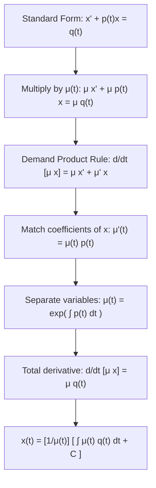

# 📖 Factor Integrante y Ecuaciones Lineales de Primer Orden

> **Key idea in one sentence:** The method of the integrating factor transforms a first-order linear non-homogeneous differential equation into an exact total derivative of a product, providing a closed-form quadrature that separates the transient homogeneous relaxation from the forced asymptotic response.

---

## 🎯 1. Standard Form of First-Order Linear ODEs

A first-order linear ordinary differential equation in the dependent variable $x(t)$ can always be cast into the **canonical standard form**:

$$ \frac{dx}{dt} + p(t) x(t) = q(t) \tag{1} $$

where $p(t)$ (coefficient function) and $q(t)$ (forcing/source term) are assumed continuous on an open interval $I \subseteq \mathbb{R}$.

> [!IMPORTANT] Normalization Requirement
> If the equation is presented with a coefficient multiplying the derivative, such as $a_1(t) \dot{x} + a_0(t) x = b(t)$, it **must first be divided by $a_1(t)$** (for $a_1(t) \neq 0$) to set the leading coefficient strictly to $1$ before identifying $p(t) = \frac{a_0(t)}{a_1(t)}$ and $q(t) = \frac{b(t)}{a_1(t)}$.

---

## 📐 2. Formal Derivation of the Integrating Factor

The strategy is to find a non-zero auxiliary multiplier function $\mu(t) > 0$ such that multiplying equation $(1)$ transforms the left-hand side into the exact derivative of the product $\mu(t) x(t)$.

### Step 1: Multiply by Unknown Function $\mu(t)$
$$ \mu(t) \frac{dx}{dt} + \mu(t) p(t) x(t) = \mu(t) q(t) \tag{2} $$

### Step 2: Equate to Product Rule Derivative
By the product rule of differential calculus:
$$ \frac{d}{dt} \left[ \mu(t) x(t) \right] = \mu(t) \frac{dx}{dt} + \frac{d\mu}{dt} x(t) \tag{3} $$

For the left-hand sides of $(2)$ and $(3)$ to be identically equal:
$$ \mu(t) \frac{dx}{dt} + \mu(t) p(t) x(t) \equiv \mu(t) \frac{dx}{dt} + \frac{d\mu}{dt} x(t) $$

Canceling the common term $\mu(t) \frac{dx}{dt}$:
$$ \frac{d\mu}{dt} x(t) = \mu(t) p(t) x(t) $$

Since this identity must hold for all arbitrary trajectories $x(t)$:
$$ \frac{d\mu}{dt} = p(t) \mu(t) \tag{4} $$

### Step 3: Solve the Auxiliary Equation for $\mu(t)$
Equation $(4)$ is a first-order separable ODE for $\mu(t)$:
$$ \frac{1}{\mu} \, d\mu = p(t) \, dt \implies \int \frac{1}{\mu} \, d\mu = \int p(t) \, dt $$
$$ \ln|\mu(t)| = \int p(t) \, dt + C_0 $$
Because we only require *any single valid integrating factor*, we set $C_0 = 0$ and choose $\mu > 0$:
$$ \mathbf{\mu(t) = \exp\left( \int p(t) \, dt \right)} \tag{5} $$

---

## 🔢 3. The General Analytical Solution

Substitute $\mu(t)$ back into $(2)$:
$$ \frac{d}{dt} \left[ \mu(t) x(t) \right] = \mu(t) q(t) \tag{6} $$

Integrate both sides with respect to $t$:
$$ \mu(t) x(t) = \int \mu(t) q(t) \, dt + C $$

Dividing by $\mu(t) \neq 0$:
$$ \mathbf{x(t) = \frac{1}{\mu(t)} \left[ \int \mu(t) q(t) \, dt + C \right]} \tag{7} $$

### Definite Initial Value Formulation ($x(t_0) = x_0$):
Choosing the definite integral representation with base point $t_0$:
$$ \mu(t) = \exp\left( \int_{t_0}^t p(s) \, ds \right) $$
Integrating $(6)$ from $t_0$ to $t$:
$$ \mu(t) x(t) - \mu(t_0) x(t_0) = \int_{t_0}^t \mu(s) q(s) \, ds $$
Since $\mu(t_0) = \exp(0) = 1$:
$$ \mathbf{x(t) = x_0 e^{-\int_{t_0}^t p(u) du} + \int_{t_0}^t e^{-\int_s^t p(u) du} q(s) \, ds} \tag{8} $$
* The first term is the **homogeneous transient solution** $x_h(t)$, decaying or growing depending on $\int p$.
* The second term is the **particular forced response** $x_p(t)$ driven by the input $q(s)$.

---

## 📈 4. Long-Term Asymptotic Regimes ($t \to \infty$)

Consider the frequent aerospace system where $p(t)$ and $q(t)$ stabilize asymptotically to non-zero constants:
$$ \lim_{t \to \infty} p(t) = a > 0, \quad \lim_{t \to \infty} q(t) = b $$
Example (Problem 2.3(viii)):
$$ \frac{dx}{dt} + \left( a + \frac{1}{t} \right) x = b \quad (a > 0) $$
1. Integrating factor:
   $$ \int \left( a + \frac{1}{t} \right) dt = at + \ln t \implies \mu(t) = e^{at + \ln t} = t e^{at} $$
2. General solution:
   $$ x(t) = \frac{1}{t e^{at}} \left[ \int b t e^{at} \, dt + C \right] $$
   Using integration by parts ($\int t e^{at} dt = \frac{t e^{at}}{a} - \frac{e^{at}}{a^2}$):
   $$ x(t) = \frac{1}{t e^{at}} \left[ b \left( \frac{t e^{at}}{a} - \frac{e^{at}}{a^2} \right) + C \right] = \frac{b}{a} - \frac{b}{a^2 t} + \frac{C}{t} e^{-at} $$
3. Evaluating the limit as $t \to \infty$:
   Since $a > 0$, $e^{-at} \to 0$ and $\frac{1}{t} \to 0$:
   $$ \lim_{t \to \infty} x(t) = \frac{b}{a} - 0 + 0 = \mathbf{\frac{b}{a}} $$
*Physical Significance:* In any stable linear dissipative system ($a > 0$), memory of the initial state $x_0$ decays exponentially ($\sim e^{-at}$), and the state settles onto the steady-state equilibrium dictated by the ratio of forcing to damping: $x_\infty = \frac{b}{a}$.

---

## ⚠️ 5. Typical Exam Pitfalls

> [!WARNING] Forgetting the Constant Before Inverting
> A classic exam blunder is writing $x(t) = \frac{1}{\mu(t)} \int \mu(t) q(t) dt + C$. The integration constant $C$ **must be inside the bracket multiplied by $\frac{1}{\mu(t)}$**! Thus, $C$ decays as $C / \mu(t)$, rather than remaining as an independent additive constant.

> [!CAUTION] The Minus Sign in Standard Form
> If the equation is given as $x' = -p(t)x + q(t)$, moving terms to the left gives $x' + p(t)x = q(t)$. If given as $x' - p(t)x = q(t)$, then the coefficient is $-p(t)$, and the integrating factor is $\mu(t) = \exp(-\int p dt)$.

---

## 🔗 Related Concepts and Problems
* `[[04 - Advanced Maths/Tema 2 - First-Order ODEs and Qualitative Dynamics|Tema 2 Guide]]`
* `[[04 - Advanced Maths/Concepto - First-Order Physical Models|First-Order Physical Models (Newton Cooling, CSTR)]]`
* `[[04 - Advanced Maths/Problema - Ch2-P3 Integrating Factor Method and Asymptotics|Problem 2.3: 8 Integrating Factor Problems]]`
* `[[04 - Advanced Maths/Problema - Ch2-P10 Uniqueness via Integrating Transformation|Problem 2.10: Uniqueness Proof via Integrating Transformation]]`
