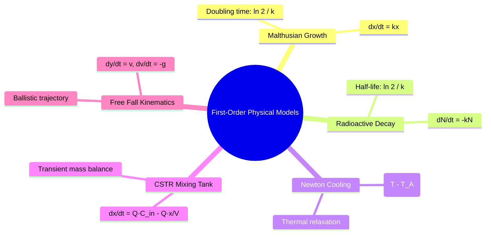

# 📖 First-Order Physical Models

> **Key idea in one sentence:** First-order differential equations are the mathematical manifestation of fundamental physical balance laws—stating that the instantaneous rate of accumulation of a scalar quantity equals the net flux entering the system plus internal generation minus consumption.

---

## 🎯 1. The Universal Conservation Principle

In aerospace and physical sciences, first-order differential equations arise from a macroscopic balance over a control volume:

$$ \frac{d\Phi}{dt} = \dot{\Phi}_{\text{in}} - \dot{\Phi}_{\text{out}} + \dot{\Phi}_{\text{generation}} - \dot{\Phi}_{\text{consumption}} \tag{1} $$

Depending on whether the conserved property $\Phi$ represents population count, radioactive nuclei, thermal energy, dissolved mass, or linear momentum, equation $(1)$ generates the canonical foundational models of engineering mathematics.

---

## 📐 2. The Five Canonical Models

### 1. Malthusian Population Dynamics
* **Physical Postulate:** The rate of change of a population $x(t)$ in an unconstrained environment is directly proportional to the current population size (constant per-capita growth rate $k = \beta - \delta$, where $\beta$ is birth rate and $\delta$ is death rate):
  $$ \frac{dx}{dt} = k x(t), \quad x(0) = x_0 \tag{2} $$
* **Analytical Solution:** Separating variables $\int \frac{dx}{x} = \int k \, dt \implies \ln|x| = kt + C$:
  $$ x(t) = x_0 e^{kt} \tag{3} $$
* **Asymptotic Regimes:**
  * $k > 0$: Exponential explosion ($\lim_{t\to\infty} x(t) = +\infty$).
  * $k < 0$: Exponential extinction ($\lim_{t\to\infty} x(t) = 0$).
  * $k = 0$: Steady state ($x(t) \equiv x_0$).
* **Doubling Time ($t_d$):** Time required for $x(t_d) = 2x_0$:
  $$ x_0 e^{k t_d} = 2 x_0 \implies e^{k t_d} = 2 \implies \mathbf{t_d = \frac{\ln 2}{k}} \tag{4} $$

---

### 2. Radioactive Isotope Decay & Half-Life
* **Physical Postulate:** For an unstable atomic nucleus, decay is a stochastic Poisson process at the quantum level. Macroscopically, the rate of disintegration of $N(t)$ nuclei is proportional to $N(t)$:
  $$ \frac{dN}{dt} = -k N(t), \quad k > 0 \tag{5} $$
  where $k$ is the radioactive decay constant $[\text{time}^{-1}]$.
* **Analytical Solution:**
  $$ N(t) = N_0 e^{-kt} \tag{6} $$
* **Half-Life ($t_{1/2}$):** The elapsed time for half the initial nuclei to decay:
  $$ N(t_{1/2}) = \frac{1}{2} N_0 \implies e^{-k t_{1/2}} = \frac{1}{2} \implies -k t_{1/2} = -\ln 2 \implies \mathbf{t_{1/2} = \frac{\ln 2}{k}} \tag{7} $$
  Conversely, given the experimental half-life:
  $$ k = \frac{\ln 2}{t_{1/2}} $$
* **Aerospace Context:** Plutonium-239 ($^{239}\text{Pu}$) used in Radioisotope Thermoelectric Generators (RTGs) for deep-space probes has $t_{1/2} \approx 24{,}000\text{ years}$, yielding $k \approx 2.888 \times 10^{-5}\text{ yr}^{-1}$.

---

### 3. Newton's Law of Cooling
* **Physical Postulate:** The rate of heat loss from a body to its surrounding fluid is proportional to the temperature difference between the surface and the ambient medium:
  $$ \dot{Q} = h A_s \left( T_A(t) - T(t) \right) $$
  Applying the thermal energy balance $m c_p \frac{dT}{dt} = \dot{Q}$:
  $$ \frac{dT}{dt} = -k \left( T(t) - T_A(t) \right) \tag{8} $$
  where $k = \frac{h A_s}{m c_p} > 0$ is the thermal relaxation coefficient $[\text{s}^{-1}]$, $h$ is the convective heat transfer coefficient, $A_s$ is surface area, $m$ is mass, and $c_p$ is specific heat capacity.
* **Analytical Solution for Constant Ambient Temperature $T_A$:**
  $$ \frac{d(T - T_A)}{dt} = -k(T - T_A) \implies T(t) = T_A + (T_0 - T_A)e^{-kt} \tag{9} $$
* **Asymptotic Limit:** $\lim_{t\to\infty} T(t) = T_A$ (thermal equilibrium with the ambient reservoir).

---

### 4. Mass Balance in Continuous Stirred-Tank Reactors (CSTR)
* **Physical Setup:** A tank of volume $V(t)$ contains dissolved solute $x(t)$ [$\text{kg}$]. Fluid enters at volumetric flow rate $Q_{\text{in}}$ with concentration $C_{\text{in}}$ [$\text{kg/L}$] and leaves at $Q_{\text{out}}$ with tank concentration $C(t) = \frac{x(t)}{V(t)}$.
* **Conservation of Mass:**
  $$ \frac{dx}{dt} = \dot{m}_{\text{in}} - \dot{m}_{\text{out}} = Q_{\text{in}} C_{\text{in}} - Q_{\text{out}} \frac{x(t)}{V(t)} \tag{10} $$
* **Equal Flow Rates ($Q_{\text{in}} = Q_{\text{out}} = Q \implies V(t) \equiv V_0$ constant):**
  $$ \frac{dx}{dt} + \frac{Q}{V_0} x(t) = Q C_{\text{in}} \tag{11} $$
  Defining the residence timescale $\tau = \frac{V_0}{Q}$:
  $$ \frac{dx}{dt} + \frac{1}{\tau} x = Q C_{\text{in}} $$
* **Washout Regime ($C_{\text{in}} = 0$):** Fresh water flushes the tank:
  $$ x(t) = x_0 e^{-t/\tau} \implies \lim_{t\to\infty} x(t) = 0 $$
* **Uniform Inflow Concentration ($C_{\text{in}} = s$):**
  $$ x(t) = s V_0 + (x_0 - s V_0) e^{-t/\tau} \implies \lim_{t\to\infty} x(t) = s V_0 $$

---

### 5. Free Fall Motion under Gravity
* **Kinematics & Newton's 2nd Law:** For a point mass $m$ falling vertically along the coordinate $y$ (measured upwards from the ground) in the absence of aerodynamic drag:
  $$ m \frac{d^2 y}{dt^2} = -m g \implies \frac{d^2 y}{dt^2} = -g \tag{12} $$
* **First-Order State Space System:** Defining velocity $v(t) \equiv \frac{dy}{dt}$:
  $$ \begin{cases} \dfrac{dy}{dt} = v \\ \dfrac{dv}{dt} = -g \end{cases} \tag{13} $$
* **Step-by-step Integration:**
  $$ \int_0^t \frac{dv}{ds} \, ds = \int_0^t -g \, ds \implies v(t) - v_0 = -g t \implies v(t) = v_0 - gt $$
  $$ \int_0^t \frac{dy}{ds} \, ds = \int_0^t (v_0 - gs) \, ds \implies y(t) - y_0 = v_0 t - \frac{1}{2}gt^2 $$
  $$ \mathbf{y(t) = y_0 + v_0 t - \frac{1}{2} g t^2} \tag{14} $$

---

## 📊 3. Summary & Comparison Table

| Model | Differential Equation | Order | Linearity | Characteristic Timescale |
| :--- | :--- | :---: | :---: | :--- |
| **Malthus** | $\dot{x} = k x$ | 1 | Linear | $\tau_d = \frac{\ln 2}{k}$ |
| **Radioactive Decay** | $\dot{N} = -k N$ | 1 | Linear | $\tau_{1/2} = \frac{\ln 2}{k}$ |
| **Newton Cooling** | $\dot{T} + k T = k T_A(t)$ | 1 | Linear | $\tau_{\text{thermal}} = \frac{1}{k} = \frac{m c_p}{h A_s}$ |
| **CSTR Mixing** | $\dot{x} + \frac{Q}{V} x = Q C_{\text{in}}$ | 1 | Linear | $\tau_{\text{residence}} = \frac{V}{Q}$ |
| **Free Fall** | $\ddot{y} = -g$ | 2 | Linear | $t_{\text{impact}} = \sqrt{\frac{2 y_0}{g}}$ (if $v_0=0$) |

---

## ⚠️ 4. Typical Exam Pitfalls

> [!WARNING] Dimensional Consistency of Rates
> Notice that in the CSTR equation, the term subtracted is $\frac{x(t)}{V(t)} \cdot Q_{\text{out}}$, NOT just $x(t)$. The concentration in the effluent stream is $\frac{x(t)}{V(t)}$ [$\text{kg/L}$], which when multiplied by $Q_{\text{out}}$ [$\text{L/min}$] gives mass rate [$\text{kg/min}$]. Omitting the volume division is the most frequent dimensional error in student exams.

---

## 🔗 Related Concepts and Problems
* `[[04 - Advanced Maths/Concepto - Logistic Equation and Carrying Capacity|Logistic Equation (Nonlinear Extension of Malthus)]]`
* `[[04 - Advanced Maths/Problema - Ch1-P2 Malthusian Population Dynamics|Problem 1.2: Malthusian Population Dynamics]]`
* `[[04 - Advanced Maths/Problema - Ch1-P3 Plutonium 239 Radioactive Decay|Problem 1.3: Plutonium 239 Radioactive Decay]]`
* `[[04 - Advanced Maths/Problema - Ch1-P4 Newton Law of Cooling Modeling|Problem 1.4: Newton Law of Cooling Modeling]]`
* `[[04 - Advanced Maths/Problema - Ch1-P5 Forensic Time of Death Estimation|Problem 1.5: Forensic Time of Death Estimation]]`
* `[[04 - Advanced Maths/Problema - Ch1-P6 Saline Mixing Tank Dynamics|Problem 1.6: Saline Mixing Tank Dynamics]]`
* `[[04 - Advanced Maths/Problema - Ch1-P7 Free Fall Motion under Gravity|Problem 1.7: Free Fall Motion under Gravity]]`
