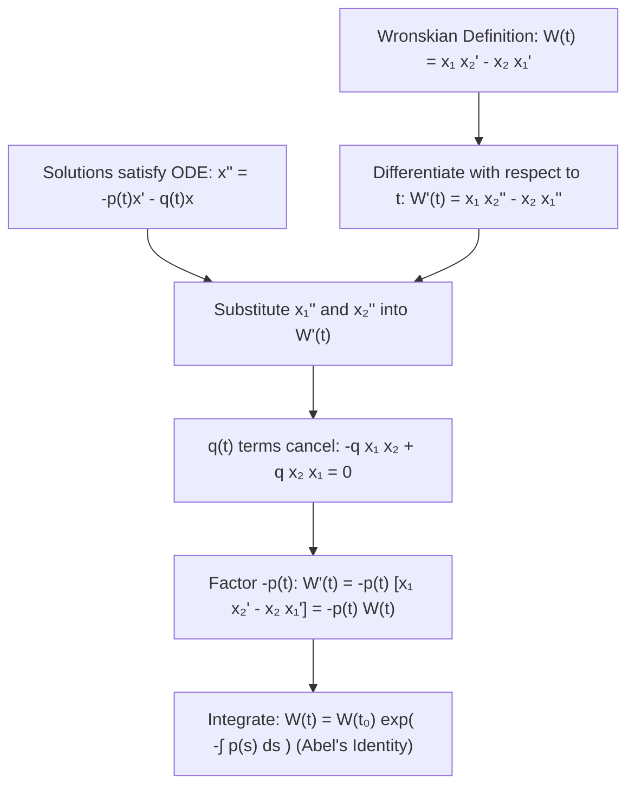
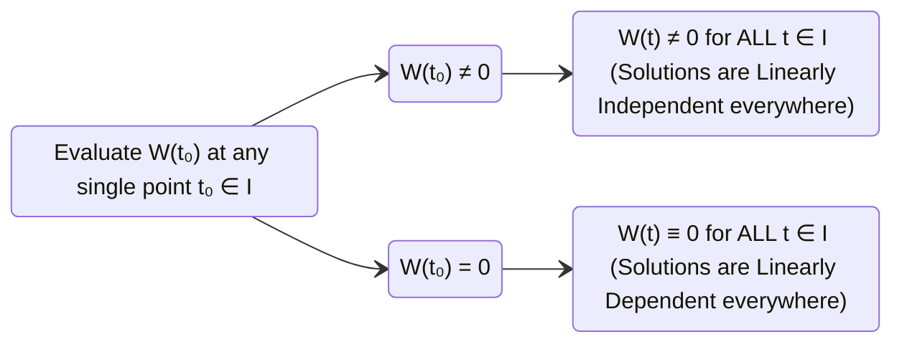

# 📖 Identidad de Abel y Propiedades del Wronskiano

> **Key idea in one sentence:** Abel's Theorem proves that the Wronskian of any two solutions to $x'' + p(t)x' + q(t)x = 0$ satisfies the first-order differential equation $W' = -p(t)W$, yielding the closed-form identity $W(t) = W(t_0)\exp\left(-\int_{t_0}^t p(s)ds\right)$, which establishes the fundamental dichotomy that the Wronskian of solutions is either non-zero everywhere or identically zero everywhere.

---

## 🎯 1. Statement and Derivation of Abel's Theorem

Consider two arbitrary solutions $x_1(t)$ and $x_2(t)$ to the normalized second-order linear homogeneous ODE on an open interval $I \subseteq \mathbb{R}$:

$$ x'' + p(t)x' + q(t)x = 0 \tag{1} $$

where $p(t)$ and $q(t)$ are continuous functions on $I$.

### Theorem 11.3 (Abel's Theorem / Liouville's Formula)
Let $x_1(t)$ and $x_2(t)$ be solutions of $x'' + p(t)x' + q(t)x = 0$ on $I$. Then their Wronskian $W(t) = W[x_1, x_2](t)$ satisfies the first-order linear differential equation:

$$ \mathbf{\frac{dW}{dt} = -p(t) W(t)} \tag{2} $$

Consequently, for any fixed base point $t_0 \in I$:

$$ \mathbf{W(t) = W(t_0) \exp\left( -\int_{t_0}^t p(s) \, ds \right)} \tag{3} $$

---

## 📐 2. Rigorous Proof of Abel's Identity

Recall the definition of the Wronskian determinant:
$$ W(t) = x_1(t) x_2'(t) - x_2(t) x_1'(t) \tag{4} $$

### Step 1: Differentiate the Wronskian
Differentiating equation $(4)$ with respect to $t$ using the product rule:
$$ \begin{aligned}
\frac{dW}{dt} &= \frac{d}{dt}\left[ x_1(t) x_2'(t) \right] - \frac{d}{dt}\left[ x_2(t) x_1'(t) \right] \\
&= \left( x_1'(t) x_2'(t) + x_1(t) x_2''(t) \right) - \left( x_2'(t) x_1'(t) + x_2(t) x_1''(t) \right)
\end{aligned} $$

Notice that the cross terms $x_1'(t) x_2'(t)$ and $x_2'(t) x_1'(t)$ cancel out completely:
$$ \frac{dW}{dt} = x_1(t) x_2''(t) - x_2(t) x_1''(t) \tag{5} $$

### Step 2: Use the Differential Equation
Since both $x_1(t)$ and $x_2(t)$ are solutions to equation $(1)$, their second derivatives satisfy:
$$ x_1''(t) = -p(t) x_1'(t) - q(t) x_1(t) \tag{6} $$
$$ x_2''(t) = -p(t) x_2'(t) - q(t) x_2(t) \tag{7} $$

Substitute equations $(6)$ and $(7)$ into $(5)$:
$$ \begin{aligned}
\frac{dW}{dt} &= x_1(t) \left[ -p(t) x_2'(t) - q(t) x_2(t) \right] - x_2(t) \left[ -p(t) x_1'(t) - q(t) x_1(t) \right] \\
&= -p(t) x_1(t) x_2'(t) - q(t) x_1(t) x_2(t) + p(t) x_2(t) x_1'(t) + q(t) x_1(t) x_2(t)
\end{aligned} $$

The terms involving $q(t)$ cancel identically:
$$ -q(t) x_1(t) x_2(t) + q(t) x_1(t) x_2(t) = 0 $$

Leaving:
$$ \frac{dW}{dt} = -p(t) \left[ x_1(t) x_2'(t) - x_2(t) x_1'(t) \right] $$

Recognizing the bracketed term as $W(t)$:
$$ \frac{dW}{dt} = -p(t) W(t) $$

### Step 3: Solve the Separable Equation
Equation $(2)$ is a first-order separable linear ODE for $W(t)$:
$$ \frac{1}{W} \, dW = -p(t) \, dt \implies \int_{W(t_0)}^{W(t)} \frac{1}{w} \, dw = -\int_{t_0}^t p(s) \, ds $$
$$ \ln\left| \frac{W(t)}{W(t_0)} \right| = -\int_{t_0}^t p(s) \, ds \implies W(t) = W(t_0) \exp\left( -\int_{t_0}^t p(s) \, ds \right) \quad \blacksquare $$

---

## 🛡️ 3. The Fundamental Dichotomy of the Wronskian

A profound and essential consequence of Abel's identity is the **Dichotomy Principle**:

### Corollary (The Wronskian Dichotomy)
Because the exponential function is strictly positive for all real exponents:
$$ \exp\left( -\int_{t_0}^t p(s) \, ds \right) > 0 \quad \forall t \in I $$
the value of $W(t)$ is controlled entirely by the scalar factor $W(t_0)$:
1. **Case 1: $W(t_0) \neq 0$**  
   Then $W(t) \neq 0$ for **every** $t \in I$. The solutions $x_1$ and $x_2$ are linearly independent across the entire interval $I$.
2. **Case 2: $W(t_0) = 0$**  
   Then $W(t) = 0$ for **every** $t \in I$. The solutions $x_1$ and $x_2$ are linearly dependent across the entire interval $I$.

> [!IMPORTANT] The "Never Crosses Zero" Rule
> The Wronskian of two solutions to a linear ODE $x'' + p(t)x' + q(t)x = 0$ with continuous coefficients **can NEVER change sign or cross zero**. It is either strictly positive, strictly negative, or identically zero on the whole domain.

---

## 🚀 4. Analytical Application: Reduction of Order (d'Alembert Formula)

Abel's formula provides a powerful direct method to compute a second linearly independent solution $x_2(t)$ whenever one non-zero solution $x_1(t)$ is known.

### Derivation via Quotient Rule on the Wronskian:
Consider the quotient $\frac{x_2(t)}{x_1(t)}$ on an interval where $x_1(t) \neq 0$:
$$ \frac{d}{dt}\left( \frac{x_2}{x_1} \right) = \frac{x_2' x_1 - x_2 x_1'}{x_1^2} = \frac{W(t)}{x_1(t)^2} \tag{8} $$

Substitute Abel's identity $W(t) = C \exp\left(-\int p(s) ds\right)$ into equation $(8)$:
$$ \frac{d}{dt}\left( \frac{x_2}{x_1} \right) = \frac{C \exp\left(-\int p(s) \, ds\right)}{[x_1(t)]^2} $$

Integrating both sides:
$$ \frac{x_2(t)}{x_1(t)} = C \int \frac{\exp\left(-\int p(s) \, ds\right)}{[x_1(t)]^2} \, dt + K $$

Choosing $C = 1$ and $K = 0$ yields the celebrated **d'Alembert Reduction of Order Formula**:

$$ \mathbf{x_2(t) = x_1(t) \int \frac{\exp\left( -\int p(s) \, ds \right)}{[x_1(t)]^2} \, dt} \tag{9} $$

By construction, $W[x_1, x_2](t) = \exp(-\int p ds) \neq 0$, guaranteeing that $\{x_1, x_2\}$ is a fundamental set of solutions.

---

## ⚠️ 5. Typical Exam Pitfalls

> [!WARNING] The Coefficient $p(t)$ Must Come from the Normalized Equation
> In an equation given as $a_2(t) x'' + a_1(t) x' + a_0(t) x = 0$, Abel's identity has $-p(t) = -\frac{a_1(t)}{a_2(t)}$. Forgetting to divide by $a_2(t)$ leads to an incorrect exponent in $W(t)$.

> [!CAUTION] Constant Coefficients Case ($p(t) \equiv p = \text{const}$)
> When $p(t) = \text{const}$, Abel's formula simplifies to:
> $$ W(t) = W(0) e^{-pt} $$
> For undamped harmonic oscillators ($x'' + \omega_0^2 x = 0$), $p = 0$, so $W'(t) \equiv 0 \implies \mathbf{W(t) = \text{constant}}$ for all $t$.

---

## 🔗 Related Concepts and Topics
* `[[04 - Advanced Maths/Tema 3 - Second-Order Linear ODEs General Theory and Constant Coefficients|Tema 3 Guide: Second-Order Linear ODEs]]`
* `[[04 - Advanced Maths/Concepto - Independencia Lineal de Funciones y Determinante Wronskiano|Independencia Lineal y Determinante Wronskiano]]`
* `[[04 - Advanced Maths/Concepto - Operador Lineal y Principio de Superposicion|Operador Lineal y Principio de Superposición]]`
* `[[04 - Advanced Maths/Concepto - Teorema de Existencia y Unicidad para EDOs de Segundo Orden|Teorema de Existencia y Unicidad]]`
* `[[04 - Advanced Maths/Concepto - Ecuaciones Homogeneas con Coeficientes Constantes y Ecuacion Caracteristica|Ecuaciones con Coeficientes Constantes]]`
