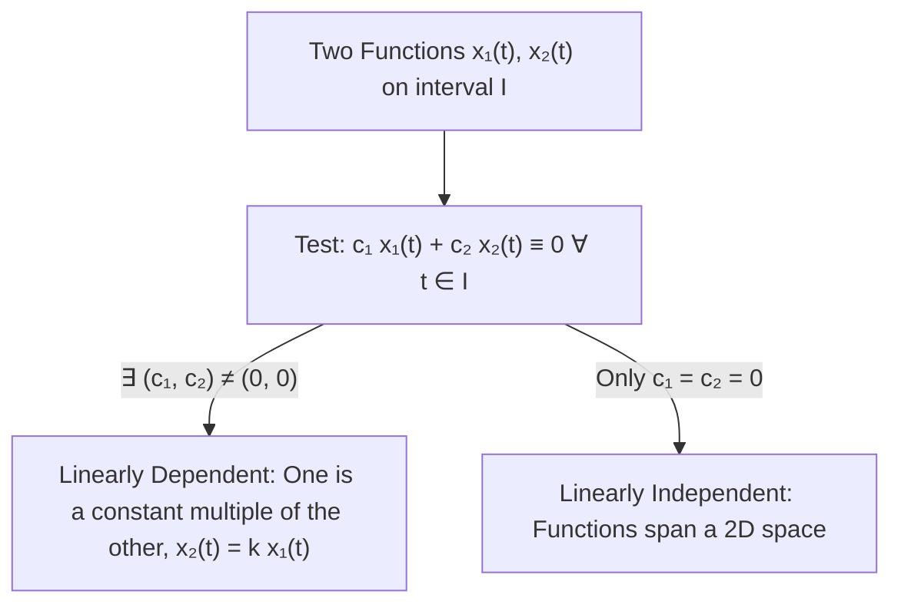
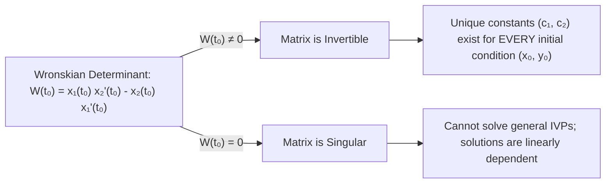

# 📖 Independencia Lineal de Funciones y Determinante Wronskiano

> **Key idea in one sentence:** Two solutions $x_1(t)$ and $x_2(t)$ of a homogeneous second-order linear ODE $x'' + p(t)x' + q(t)x = 0$ are linearly independent if and only if their Wronskian determinant $W[x_1, x_2](t) \equiv x_1 x_2' - x_2 x_1'$ is non-zero, in which case they form a fundamental set of solutions that spans the 2-dimensional solution space $\ker(L)$ and uniquely solves any initial value problem.

---

## 🎯 1. Linear Independence of Functions

Let $I \subseteq \mathbb{R}$ be an open interval. 

### Definition 11.2 (Robinson): Linearly Independent Functions
Two functions $x_1, x_2: I \to \mathbb{R}$ are **linearly dependent** on $I$ if there exist constants $c_1, c_2 \in \mathbb{R}$, not both zero ($c_1^2 + c_2^2 \neq 0$), such that:

$$ c_1 x_1(t) + c_2 x_2(t) = 0 \quad \forall t \in I \tag{1} $$

If no such non-trivial constants exist—meaning that the only linear combination that vanishes identically on $I$ is the trivial one:

$$ c_1 x_1(t) + c_2 x_2(t) = 0 \quad \forall t \in I \implies c_1 = 0 \text{ and } c_2 = 0 \tag{2} $$

then the functions $x_1(t)$ and $x_2(t)$ are said to be **linearly independent** on $I$.

> [!NOTE] Practical Criterion for Two Functions
> For exactly two functions, linear dependence on an interval $I$ is strictly equivalent to collinearity: one function is an identical scalar multiple of the other on $I$:
> $$ x_2(t) = k x_1(t) \quad \text{or} \quad \frac{x_2(t)}{x_1(t)} = \text{constant} \quad \forall t \in I $$

---

## 📐 2. The Wronskian Determinant and Initial Value Solvability

Suppose we possess two solutions $x_1(t)$ and $x_2(t)$ to the homogeneous linear equation:
$$ L[x] = x'' + p(t)x' + q(t)x = 0 \tag{3} $$
By the Superposition Principle, $x(t) = c_1 x_1(t) + c_2 x_2(t)$ is a solution for any constants $c_1, c_2$.

We now ask: *Can we always choose the constants $c_1$ and $c_2$ to satisfy an arbitrary Initial Value Problem at $t_0 \in I$?*
$$ \begin{cases} x(t_0) = x_0 \\ x'(t_0) = y_0 \end{cases} \tag{4} $$

### Step 1: Formulate the Algebraic System
Evaluating $x(t)$ and its derivative $x'(t) = c_1 x_1'(t) + c_2 x_2'(t)$ at $t = t_0$:
$$ \begin{cases} c_1 x_1(t_0) + c_2 x_2(t_0) = x_0 \\ c_1 x_1'(t_0) + c_2 x_2'(t_0) = y_0 \end{cases} \tag{5} $$

In matrix-vector form:
$$ \begin{pmatrix} x_1(t_0) & x_2(t_0) \\ x_1'(t_0) & x_2'(t_0) \end{pmatrix} \begin{pmatrix} c_1 \\ c_2 \end{pmatrix} = \begin{pmatrix} x_0 \\ y_0 \end{pmatrix} \tag{6} $$

### Step 2: The Invertibility Criterion (The Wronskian)
By Cramer's Rule and standard linear algebra, the $2 \times 2$ linear system $(6)$ possesses a **unique solution** for the constants $(c_1, c_2)$ for *any* prescribed initial vector $(x_0, y_0)^T$ if and only if the coefficient matrix is invertible, i.e., its determinant is non-zero.

### Definition: The Wronskian Determinant
Let $x_1, x_2 \in C^1(I)$. The **Wronskian** of $x_1$ and $x_2$, denoted $W[x_1, x_2](t)$ or simply $W(t)$, is the functional determinant:

$$ W[x_1, x_2](t) \equiv \det \begin{pmatrix} x_1(t) & x_2(t) \\ x_1'(t) & x_2'(t) \end{pmatrix} = x_1(t) x_2'(t) - x_2(t) x_1'(t) \tag{7} $$

Applying Cramer's rule to $(6)$, when $W(t_0) \neq 0$:
$$ c_1 = \frac{\det \begin{pmatrix} x_0 & x_2(t_0) \\ y_0 & x_2'(t_0) \end{pmatrix}}{W(t_0)} = \frac{x_0 x_2'(t_0) - y_0 x_2(t_0)}{W(t_0)} \tag{8} $$
$$ c_2 = \frac{\det \begin{pmatrix} x_1(t_0) & x_0 \\ x_1'(t_0) & y_0 \end{pmatrix}}{W(t_0)} = \frac{y_0 x_1(t_0) - x_0 x_1'(t_0)}{W(t_0)} \tag{9} $$

---

## 🏛️ 3. The Fundamental Theorem of the Solution Space

We now connect linear independence, the Wronskian, and the dimension of the solution space.

### Theorem (Characterization of Fundamental Solution Sets)
Let $x_1(t)$ and $x_2(t)$ be two solutions of the homogeneous equation $x'' + p(t)x' + q(t)x = 0$ on the interval $I$, where $p$ and $q$ are continuous. The following statements are **strictly equivalent**:
1. $\{x_1, x_2\}$ are linearly independent on $I$.
2. The Wronskian $W[x_1, x_2](t_0) \neq 0$ at some point $t_0 \in I$.
3. The Wronskian $W[x_1, x_2](t) \neq 0$ for **all** $t \in I$.
4. $\{x_1, x_2\}$ form a **fundamental set of solutions** (a basis for $\ker(L)$).

When these equivalent conditions hold, the **general solution** of the homogeneous equation is:
$$ \mathbf{x(t) = c_1 x_1(t) + c_2 x_2(t)} \quad (c_1, c_2 \in \mathbb{R}) \tag{10} $$

---

## 🔢 4. Proof that the Dimension of the Solution Space is Exactly 2

### Theorem: $\dim(\ker(L)) = 2$
The vector space $S_H = \ker(L) = \{ x \in C^2(I) : x'' + p(t)x' + q(t)x = 0 \}$ has dimension **exactly 2**.

#### Rigorous Constructive Proof:
1. Fix an arbitrary base point $t_0 \in I$.
2. By the Fundamental Existence and Uniqueness Theorem (Theorem 11.1), there exist two unique solutions $u_1(t)$ and $u_2(t)$ on $I$ defined by the canonical canonical initial conditions:
   $$ \begin{cases} u_1(t_0) = 1 \\ u_1'(t_0) = 0 \end{cases} \quad \text{and} \quad \begin{cases} u_2(t_0) = 0 \\ u_2'(t_0) = 1 \end{cases} \tag{11} $$
3. Compute the Wronskian of $\{u_1, u_2\}$ at $t_0$:
   $$ W[u_1, u_2](t_0) = \det \begin{pmatrix} u_1(t_0) & u_2(t_0) \\ u_1'(t_0) & u_2'(t_0) \end{pmatrix} = \det \begin{pmatrix} 1 & 0 \\ 0 & 1 \end{pmatrix} = 1 \neq 0 $$
   Since $W(t_0) = 1 \neq 0$, $u_1$ and $u_2$ are linearly independent.
4. Now, let $x(t)$ be **any** arbitrary solution of $L[x] = 0$ on $I$. Let its initial values at $t_0$ be $x(t_0) = x_0$ and $x'(t_0) = y_0$.
5. Consider the linear combination:
   $$ v(t) \equiv x_0 u_1(t) + y_0 u_2(t) $$
   * Since $u_1, u_2 \in \ker(L)$, by superposition $L[v] = 0$.
   * Evaluate the initial values of $v(t)$ at $t_0$:
     $$ v(t_0) = x_0 u_1(t_0) + y_0 u_2(t_0) = x_0(1) + y_0(0) = x_0 $$
     $$ v'(t_0) = x_0 u_1'(t_0) + y_0 u_2'(t_0) = x_0(0) + y_0(1) = y_0 $$
6. Both $x(t)$ and $v(t)$ satisfy the identical Initial Value Problem with initial conditions $(x_0, y_0)$ at $t_0$.
7. By the **Uniqueness Theorem** (Theorem 11.1), they must be the exact same function on the entire interval $I$:
   $$ x(t) \equiv v(t) = x_0 u_1(t) + y_0 u_2(t) \quad \forall t \in I $$
8. Thus, $\{u_1, u_2\}$ spans $\ker(L)$. Since they are also linearly independent, $\{u_1, u_2\}$ is a **basis** of $\ker(L)$.
9. Because the basis contains exactly 2 functions, we conclude:
   $$ \mathbf{\dim(\ker(L)) = 2} \quad \blacksquare $$

---

## ⚠️ 5. Typical Exam Pitfalls: Solutions vs. Arbitrary Functions

> [!CAUTION] Wronskian Test for Arbitrary Functions vs. ODE Solutions
> A dangerous misconception is assuming that $W[f, g](t) = 0$ always implies linear dependence for arbitrary functions. 
> * For **arbitrary functions**, $W(t) = 0$ at a point does NOT imply linear dependence. Consider $f(t) = t^3$ and $g(t) = |t|^3$ on $\mathbb{R}$. They are linearly independent on $(-1, 1)$, yet their Wronskian $W[f, g](t) \equiv 0$ everywhere!
> * However, **for solutions of a linear ODE $L[x] = 0$ with continuous coefficients**, the equivalence holds strictly without exception: $W(t) \neq 0 \iff \text{Linearly Independent}$, thanks to Abel's Theorem.

---

## 🔗 Related Concepts and Topics
* `[[04 - Advanced Maths/Tema 3 - Second-Order Linear ODEs General Theory and Constant Coefficients|Tema 3 Guide: Second-Order Linear ODEs]]`
* `[[04 - Advanced Maths/Concepto - Teorema de Existencia y Unicidad para EDOs de Segundo Orden|Teorema de Existencia y Unicidad]]`
* `[[04 - Advanced Maths/Concepto - Operador Lineal y Principio de Superposicion|Operador Lineal y Principio de Superposición]]`
* `[[04 - Advanced Maths/Concepto - Identidad de Abel y Propiedades del Wronskiano|Identidad de Abel]]`
* `[[04 - Advanced Maths/Concepto - Ecuaciones Homogeneas con Coeficientes Constantes y Ecuacion Caracteristica|Ecuación Característica]]`
