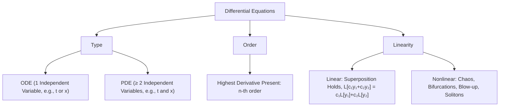

# 📖 Linearity and Order of Differential Equations

> **Key idea in one sentence:** An ordinary differential equation (ODE) is linear if and only if the unknown dependent variable and all its derivatives appear exclusively to the first power, are not multiplied together or composed within nonlinear functions, and have coefficients that depend solely on the independent variable.

---

## 🎯 1. Mathematical Intuition & Taxonomy

In engineering systems, modeling physical phenomena yields mathematical relations involving unknown functions and their rates of change. The taxonomy of differential equations rests upon three primary classifications:

### Ordinary (ODE) vs. Partial (PDE) Differential Equations
* **Ordinary Differential Equation (ODE):** Involves an unknown function of a **single independent variable** (e.g., $y(x)$ or $\mathbf{x}(t)$) and ordinary derivatives:
  $$ F\left(x, y, \frac{dy}{dx}, \frac{d^2 y}{dx^2}, \dots, \frac{d^n y}{dx^n}\right) = 0 $$
* **Partial Differential Equation (PDE):** Involves an unknown function of **two or more independent variables** (e.g., $u(x, t)$ or $\phi(x, y, z)$) and partial derivatives:
  $$ F\left(x, t, u, \frac{\partial u}{\partial t}, \frac{\partial u}{\partial x}, \frac{\partial^2 u}{\partial x^2}, \dots\right) = 0 $$

### Order of a Differential Equation
The **order** of an ODE or PDE is the order of the highest derivative occurring in the equation. For instance:
* $\frac{dy}{dx} + 5y = e^x$ is of **order 1**.
* $m \frac{d^2 x}{dt^2} + c \frac{dx}{dt} + k x = 0$ is of **order 2**.
* $\frac{\partial u}{\partial t} = \alpha \frac{\partial^2 u}{\partial x^2}$ is of **order 2** (highest derivative is $\frac{\partial^2 u}{\partial x^2}$).

---

## 📐 2. Rigorous Mathematical Definition of Linearity

Following the official formulation of the UC3M Department of Mathematics:

### Canonical Form of an $n$-th Order Linear ODE
An $n$-th order ODE is **linear** if it can be written in the form:
$$ a_n(x) y^{(n)}(x) + a_{n-1}(x) y^{(n-1)}(x) + \dots + a_2(x) y''(x) + a_1(x) y'(x) + a_0(x) y(x) = b(x) \tag{1} $$
for some coefficient functions $a_i(x)$ ($i \in \{0, 1, 2, \dots, n\}$) and a forcing function $b(x)$ defined on an open interval $I \subseteq \mathbb{R}$, with $a_n(x) \neq 0$ for all $x \in I$.

If an ODE cannot be written in the form $(1)$, it is **nonlinear**.

### The Linear Differential Operator
Defining the linear operator $L$ acting on functions $y \in C^n(I)$:
$$ L[y](x) \equiv \sum_{k=0}^n a_k(x) \frac{d^k y}{dx^k}(x) $$
Equation $(1)$ simplifies to:
$$ L[y] = b(x) $$
The operator $L$ satisfies the **linear property** for any functions $y_1, y_2 \in C^n(I)$ and scalars $c_1, c_2 \in \mathbb{R}$:
$$ L[c_1 y_1 + c_2 y_2] = c_1 L[y_1] + c_2 L[y_2] $$

### Homogeneity
* **Homogeneous:** When $b(x) \equiv 0$ on $I$, so $L[y] = 0$. The **principle of superposition** applies: if $y_1(x)$ and $y_2(x)$ are solutions, any linear combination $c_1 y_1(x) + c_2 y_2(x)$ is also a solution.
* **Nonhomogeneous (Inhomogeneous):** When $b(x) \not\equiv 0$. The general solution is $y(x) = y_h(x) + y_p(x)$, where $y_h$ is the general solution of the associated homogeneous equation and $y_p$ is a particular solution.

---

## 🔍 3. Canonical Examples & Non-linear Counterexamples

### Example 1: Standard First-Order Linear ODE
$$ u'(t) = u(t) $$
* **Rearrangement:** $1 \cdot u'(t) - 1 \cdot u(t) = 0$.
* **Classification:** Linear ODE of order 1, with $a_1(t) = 1$, $a_0(t) = -1$, and $b(t) = 0$.

### Counterexample 1: Nonlinear Derivative Term
$$ u''(t) = \left(u'(t)\right)^2 + 1 $$
* **Analysis:** The highest derivative is $u''$ (order 2). However, the first derivative $u'$ appears raised to the power of 2: $\left(u'(t)\right)^2$.
* **Conclusion:** **Nonlinear ODE of order 2**. It cannot be cast in form $(1)$ because of the quadratic derivative term.

### Counterexample 2: Nonlinear Dependent Variable Term
$$ y'(x) = 4\left(y(x)\right)^2 + x^2 $$
* **Analysis:** Rearranging yields $y'(x) - 4[y(x)]^2 = x^2$. The dependent variable $y(x)$ is squared. Notice that $x^2$ is a nonlinear function of the *independent* variable, which is entirely permissible in $b(x)$; the nonlinearity stems strictly from $[y(x)]^2$.
* **Conclusion:** **Nonlinear ODE of order 1**.

### Example 3: Variable Coefficients vs. Linearity
$$ x^2 y''(x) + \sin(x) y'(x) + e^x y(x) = \ln(x) $$
* **Analysis:** The coefficients $a_2(x) = x^2$, $a_1(x) = \sin(x)$, $a_0(x) = e^x$, and $b(x) = \ln(x)$ are nonlinear functions of the independent variable $x$. However, $y, y', y''$ appear linearly.
* **Conclusion:** **Linear ODE of order 2**.

### Counterexample 3: Product of Dependent Variable and its Derivatives
$$ y(x) y'(x) = 1 $$
* **Analysis:** The term $y \cdot y'$ is a cross-product of the unknown function and its derivative. Testing linearity: $L[c y] = (c y)(c y') = c^2 (y y') \neq c L[y]$.
* **Conclusion:** **Nonlinear ODE of order 1**.

---

## ⚠️ 4. Typical Exam Pitfalls

> [!WARNING] Dependent vs. Independent Nonlinearity
> A frequent student mistake in UC3M examinations is declaring an equation nonlinear because of terms like $\sin(x) y$ or $e^x y''$.
> * **Rule:** Nonlinear functions of the **independent variable** ($x$ or $t$) acting as coefficients $a_k(x)$ or driving terms $b(x)$ **do not affect linearity**.
> * **Rule:** Any nonlinear function involving the **dependent variable** or its derivatives (e.g., $\sin(y)$, $e^{y'}$, $\sqrt{y}$, $y y'$) immediately makes the equation **nonlinear**.

> [!CAUTION] Linearity in Systems
> In coupled systems such as:
> $$ \dot{x} = 4x - 2x^2 - xy, \quad \dot{y} = 9y - 3xy - 3y^2 $$
> the presence of cross terms $xy$ and squared terms $x^2, y^2$ renders the entire system **nonlinear**, even if each derivative appears to the first power.

---

## 🔗 Related Concepts and Problems
* `[[04 - Advanced Maths/Tema 1 - Introduction, Modeling and Classification of ODEs|Tema 1 Guide]]`
* `[[04 - Advanced Maths/Concepto - Well-Posed Problems and Picard Theorem|Well-Posed Problems and Picard Theorem]]`
* `[[04 - Advanced Maths/Problema - Ch1-P1 Classification of Differential Equations|Problem 1.1: Complete Classification of 10 Differential Equations]]`
