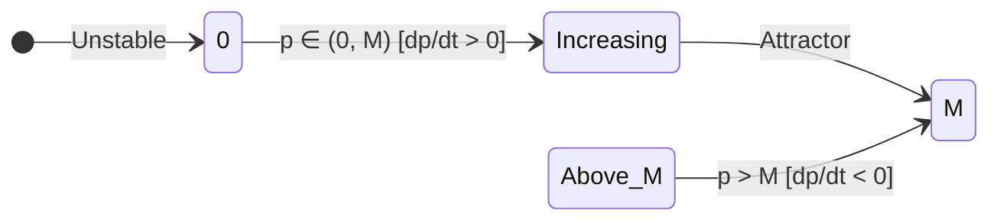

# 📖 Logistic Equation and Carrying Capacity

> **Key idea in one sentence:** The Verhulst logistic model refines Malthusian exponential growth by incorporating a quadratic self-limiting environmental resistance term, guaranteeing that populations saturate asymptotically at the carrying capacity $M$, and recovering the classical Malthusian model as $M \to \infty$.

---

## 🎯 1. Physical Motivation: Beyond Unconstrained Growth

In 1798, Thomas Malthus modeled population growth under the assumption of unlimited resources, leading to the linear ODE $\frac{dx}{dt} = kx$ with exponential growth $x(t) = x_0 e^{kt}$. In physical, biological, and aerospace systems (e.g., bacteria in closed life-support habitats, combustion reaction products, or market penetration of launch vehicles), resources (space, nutrients, fuel) are finite.

In 1838, Belgian mathematician Pierre-François Verhulst proposed that the net per-capita growth rate $\frac{1}{p}\frac{dp}{dt}$ is not constant, but decreases linearly as the population density increases:

$$ \frac{1}{p} \frac{dp}{dt} = k \left( 1 - \frac{p}{M} \right) \tag{1} $$

where:
* $p(t)$: Population size at time $t$ (dependent variable).
* $k$: Intrinsic growth rate ($k = \text{birth rate} - \text{death rate} > 0$) $[\text{time}^{-1}]$.
* $M$: Environmental **carrying capacity** (maximum sustainable population) $[\text{individuals}]$.

Multiplying equation $(1)$ by $p$:
$$ \frac{dp}{dt} = k p \left( 1 - \frac{p}{M} \right) = k p - \frac{k}{M} p^2 \tag{2} $$

> [!NOTE] Linearity Classification
> Due to the quadratic term $-\frac{k}{M} p^2$, the logistic equation is a **first-order, autonomous, nonlinear ordinary differential equation**.

---

## 🧭 2. Phase-Line Qualitative Dynamics

The equilibria (critical points) satisfy $\frac{dp}{dt} = 0$:
$$ f(p) = k p \left( 1 - \frac{p}{M} \right) = 0 \implies p = 0 \quad \text{or} \quad p = M $$

To evaluate their linear stability, compute the derivative of the vector field:
$$ f'(p) = \frac{d}{dp}\left[ kp - \frac{k}{M} p^2 \right] = k - \frac{2k}{M} p $$

1. **At $p = 0$ (Extinction state):**
   $$ f'(0) = k > 0 \implies \mathbf{\text{Unstable Node (Repellor)}} $$
   Any perturbation with $p > 0$ grows away from zero.
2. **At $p = M$ (Carrying Capacity state):**
   $$ f'(M) = k - 2k = -k < 0 \implies \mathbf{\text{Asymptotically Stable Node (Attractor)}} $$
   Any initial state $p_0 > 0$ is drawn toward $M$.

* **Region $0 < p_0 < M$:** $\frac{dp}{dt} > 0$. The population grows monotonically toward $M$. The growth rate $\frac{dp}{dt}$ reaches its maximum at the inflection point $p = \frac{M}{2}$, producing the characteristic S-shaped (sigmoidal) curve.
* **Region $p_0 > M$:** $\frac{dp}{dt} < 0$. The habitat is oversaturated; resource depletion forces mortality to exceed natality, decaying monotonically toward $M$.

---

## 🔢 3. Rigorous Analytical Derivation via Partial Fractions

Let the initial condition be $p(t_0) = p_0 > 0$ with $p_0 \neq M$.

### Step 1: Separation of Variables
$$ \frac{dp}{dt} = \frac{k}{M} p (M - p) \implies \frac{dp}{p (M - p)} = \frac{k}{M} \, dt \tag{3} $$

### Step 2: Partial Fraction Decomposition
Express the integrand as:
$$ \frac{1}{p (M - p)} = \frac{A}{p} + \frac{B}{M - p} $$
Multiplying both sides by the common denominator $p(M - p)$:
$$ 1 = A(M - p) + B p $$
* Setting $p = 0$:
  $$ 1 = A(M - 0) \implies A = \frac{1}{M} $$
* Setting $p = M$:
  $$ 1 = B(M) \implies B = \frac{1}{M} $$

Substituting $A$ and $B$ back into $(3)$:
$$ \frac{1}{M} \left( \frac{1}{p} + \frac{1}{M - p} \right) dp = \frac{k}{M} \, dt $$
Multiplying both sides by $M$:
$$ \left( \frac{1}{p} + \frac{1}{M - p} \right) dp = k \, dt \tag{4} $$

### Step 3: Exact Integration
Integrate equation $(4)$ from initial state $(t_0, p_0)$ to $(t, p)$:
$$ \int_{p_0}^p \left( \frac{1}{u} + \frac{1}{M - u} \right) du = \int_{t_0}^t k \, ds $$
Recall that $\int \frac{1}{M - u} \, du = -\ln|M - u|$:
$$ \left[ \ln|u| - \ln|M - u| \right]_{p_0}^p = k(t - t_0) $$
$$ \left[ \ln\left| \frac{u}{M - u} \right| \right]_{p_0}^p = k(t - t_0) $$
$$ \ln\left| \frac{p}{M - p} \right| - \ln\left| \frac{p_0}{M - p_0} \right| = k(t - t_0) $$
Combining logarithms via quotient rule:
$$ \ln\left| \frac{p(M - p_0)}{p_0(M - p)} \right| = k(t - t_0) \tag{5} $$

### Step 4: Exponentiation and Algebraic Inversion
Exponentiate both sides of $(5)$:
$$ \frac{p(M - p_0)}{(M - p) p_0} = e^{k(t - t_0)} $$
Multiply both sides by $(M - p) p_0$:
$$ p(M - p_0) = p_0 (M - p) e^{k(t - t_0)} = M p_0 e^{k(t - t_0)} - p p_0 e^{k(t - t_0)} $$
Collect terms containing $p$:
$$ p(M - p_0) + p p_0 e^{k(t - t_0)} = M p_0 e^{k(t - t_0)} $$
$$ p \left[ (M - p_0) + p_0 e^{k(t - t_0)} \right] = M p_0 e^{k(t - t_0)} $$
Isolating $p(t)$:
$$ p(t) = \frac{M p_0 e^{k(t - t_0)}}{(M - p_0) + p_0 e^{k(t - t_0)}} $$
Divide both numerator and denominator by $e^{k(t - t_0)}$:
$$ \mathbf{p(t) = \frac{M p_0}{p_0 + (M - p_0) e^{-k(t - t_0)}}} \tag{6} $$

---

## 🎯 4. Asymptotic Analysis & The Malthusian Limit

### Asymptotic Limit as $t \to \infty$
Since $k > 0$, the exponential term decays to zero:
$$ \lim_{t \to \infty} e^{-k(t - t_0)} = 0 $$
Substituting into $(6)$:
$$ \lim_{t \to \infty} p(t) = \frac{M p_0}{p_0 + (M - p_0) \cdot 0} = \frac{M p_0}{p_0} = \mathbf{M} $$
Regardless of the initial positive population $p_0 > 0$, the population approaches carrying capacity $M$.

### Recovery of the Malthusian Limit as $M \to \infty$
Rearrange equation $(6)$ by dividing numerator and denominator by $M$:
$$ p(t) = \frac{p_0}{\frac{p_0}{M} + \left( 1 - \frac{p_0}{M} \right) e^{-k(t - t_0)}} $$
Now take the mathematical limit as the environmental constraints vanish ($M \to \infty$):
$$ \lim_{M \to \infty} \frac{p_0}{M} = 0 $$
$$ \lim_{M \to \infty} p(t) = \frac{p_0}{0 + (1 - 0) e^{-k(t - t_0)}} = \frac{p_0}{e^{-k(t - t_0)}} = \mathbf{p_0 e^{k(t - t_0)}} $$
Thus, Verhulst's nonlinear model reduces strictly and smoothly to Malthus' exponential growth model when the carrying capacity is infinite.

---

## ⚠️ 5. Typical Exam Traps

> [!WARNING] The Negative Sign in the Logarithm
> When integrating $\int \frac{1}{M - u} \, du$, the chain rule introduces an essential negative sign: $-\ln|M - u|$. Omitting this negative sign is the single most common error in student solutions, leading to an incorrect sign in the exponential and impossible physical predictions.

---

## 🔗 Related Concepts and Problems
* `[[04 - Advanced Maths/Concepto - First-Order Physical Models|First-Order Physical Models]]`
* `[[04 - Advanced Maths/Concepto - Well-Posed Problems and Picard Theorem|Well-Posed Problems and Picard Theorem]]`
* `[[04 - Advanced Maths/Problema - Ch1-P2 Malthusian Population Dynamics|Problem 1.2: Malthusian Population Dynamics]]`
* `[[04 - Advanced Maths/Problema - Ch1-P9 Logistic Population Growth Model|Problem 1.9: Full Step-by-Step Logistic Solution]]`
