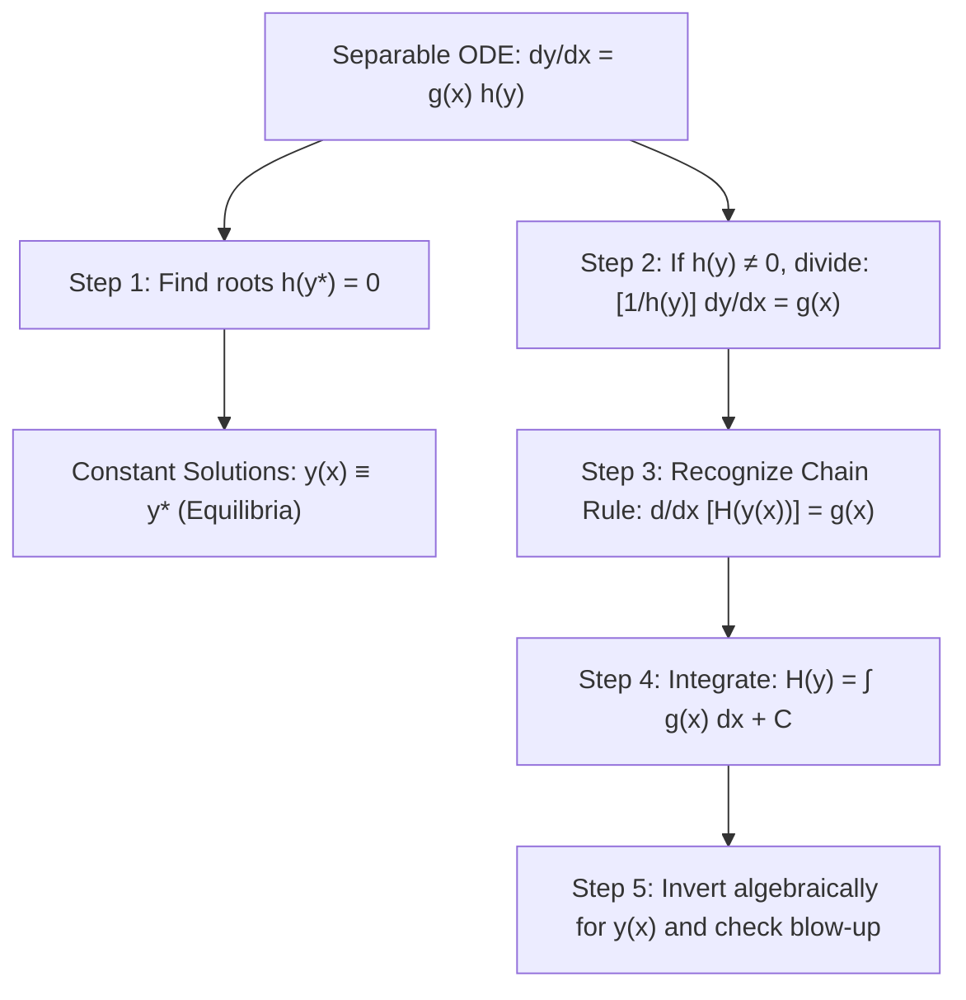

# 📖 Métodos de Integración Directa y Ecuaciones Separables

> **Key idea in one sentence:** When a first-order rate depends solely on the independent variable or factors multiplicatively into independent and dependent components ($y' = g(x)h(y)$), the solution is obtained by quadrature through the chain rule, requiring careful isolation of equilibrium roots $h(y)=0$ and awareness of nonlinear finite-time blow-up.

---

## 🎯 1. Direct Integration & Theoretical Justification

### 1.1 Direct Integration ($y' = f(x)$)
The simplest ordinary differential equation arises when the derivative depends solely on the independent variable $x$:
$$ \frac{dy}{dx} = f(x) \tag{1} $$
If $f(x)$ is continuous on an open interval $I \subseteq \mathbb{R}$, the **Fundamental Theorem of Calculus** guarantees the existence of antiderivatives. Integrating directly:
$$ y(x) = \int f(x) \, dx + C = F(x) + C $$
where $F'(x) = f(x)$ and $C \in \mathbb{R}$ is the constant of integration determined by an initial condition $y(x_0) = y_0$:
$$ y(x) = y_0 + \int_{x_0}^x f(s) \, ds \tag{2} $$

---

### 1.2 Separable Differential Equations ($y' = g(x) h(y)$)
A first-order ODE is **separable** if the velocity field factors into the product of a function of $x$ and a function of $y$:
$$ \frac{dy}{dx} = g(x) h(y) \tag{3} $$

#### Rigorous Chain Rule Justification:
Physicists frequently write $\frac{1}{h(y)} dy = g(x) dx$ and integrate both sides. Mathematically, this differential notation is justified rigorously by the **chain rule**:
1. Suppose $h(y) \neq 0$ on an interval $J \subset \mathbb{R}$. Divide $(3)$ by $h(y)$:
   $$ \frac{1}{h(y(x))} \frac{dy}{dx} = g(x) \tag{4} $$
2. Let $H(y)$ be an antiderivative of $\frac{1}{h(y)}$, so that $\frac{dH}{dy} = \frac{1}{h(y)}$.
3. By the chain rule:
   $$ \frac{d}{dx} \left[ H(y(x)) \right] = \frac{dH}{dy} \frac{dy}{dx} = \frac{1}{h(y(x))} \frac{dy}{dx} $$
4. Therefore, equation $(4)$ is equivalent to:
   $$ \frac{d}{dx} \left[ H(y(x)) \right] = g(x) $$
5. Integrating with respect to $x$ across $[x_0, x]$:
   $$ \int_{x_0}^x \frac{d}{ds}\left[ H(y(s)) \right] \, ds = \int_{x_0}^x g(s) \, ds $$
   $$ H(y(x)) - H(y(x_0)) = \int_{x_0}^x g(s) \, ds $$
6. By change of variables in the left-hand integral ($u = y(s), du = y'(s) ds$):
   $$ \int_{y_0}^{y(x)} \frac{1}{h(u)} \, du = \int_{x_0}^x g(s) \, ds \tag{5} $$

---

## 🔍 2. Advanced Phenomena: Non-Elementary Integrals and Blow-Up

### 2.1 The Gaussian Integral in Asymptotic Solutions
In aerospace diffusion, heat transfer, and boundary layer theory, equations frequently involve the Gaussian kernel $e^{-s^2}$. The definite improper integral over the half-line is:
$$ \int_0^\infty e^{-s^2} \, ds = \frac{\sqrt{\pi}}{2} \tag{6} $$
The non-elementary antiderivative defines the **error function**:
$$ \text{erf}(t) \equiv \frac{2}{\sqrt{\pi}} \int_0^t e^{-s^2} \, ds, \quad \lim_{t \to \infty} \text{erf}(t) = 1 $$

### 2.2 Finite-Time Blow-Up Threshold
Consider the separable initial value problem:
$$ \frac{dy}{dt} = e^{-t^2} y^2, \quad y(0) = y_0 > 0 $$
Separating variables and integrating:
$$ \int_{y_0}^{y(t)} \frac{du}{u^2} = \int_0^t e^{-s^2} \, ds \implies -\frac{1}{y(t)} + \frac{1}{y_0} = \int_0^t e^{-s^2} \, ds $$
Isolating $y(t)$:
$$ \frac{1}{y(t)} = \frac{1}{y_0} - \int_0^t e^{-s^2} \, ds \implies y(t) = \frac{y_0}{1 - y_0 \int_0^t e^{-s^2} \, ds} \tag{7} $$

Since $\int_0^t e^{-s^2} ds$ is strictly increasing and bounded above by $\frac{\sqrt{\pi}}{2}$ as $t \to \infty$:
* **Subcritical Regime ($y_0 < \frac{2}{\sqrt{\pi}}$):** The denominator remains strictly positive for all $t \in [0, \infty)$. The solution exists globally for all time, with horizontal asymptote:
  $$ \lim_{t \to \infty} y(t) = \frac{y_0}{1 - y_0 \frac{\sqrt{\pi}}{2}} < \infty $$
* **Critical Threshold ($y_0 = \frac{2}{\sqrt{\pi}}$):** The denominator approaches $0$ as $t \to \infty$, so $y(t) \to +\infty$ as $t \to \infty$ (blow-up at infinity).
* **Supercritical Regime ($y_0 > \frac{2}{\sqrt{\pi}}$):** The denominator reaches zero at a **finite blow-up time $t^*$** where:
  $$ \int_0^{t^*} e^{-s^2} \, ds = \frac{1}{y_0} < \frac{\sqrt{\pi}}{2} $$
  The solution ceases to exist beyond $t^*$ due to a vertical asymptote ($y(t) \to +\infty$ as $t \to t^{*-}$).

---

## ⚠️ 3. Typical Exam Pitfalls

> [!WARNING] The Lost Constant Solutions
> Whenever dividing by $h(y)$, one implicitly assumes $h(y) \neq 0$. If $h(y^*) = 0$ for some constant $y^*$, then the horizontal line $y(x) \equiv y^*$ is an **equilibrium solution**. Forgetting to include these equilibrium roots leads to an incomplete general solution.

> [!CAUTION] Absolute Values in Logarithms
> Integrating $\int \frac{1}{x} dx$ yields $\ln|x| + C$, NOT $\ln(x)$. Omitting the absolute value restricts the solution domain to $x > 0$ arbitrarily, causing errors when initial conditions lie in the negative domain ($x_0 < 0$).

---

## 🔗 Related Concepts and Problems
* `[[04 - Advanced Maths/Tema 2 - First-Order ODEs and Qualitative Dynamics|Tema 2 Guide]]`
* `[[04 - Advanced Maths/Concepto - Well-Posed Problems and Picard Theorem|Well-Posed Problems and Picard Theorem]]`
* `[[04 - Advanced Maths/Problema - Ch2-P1 Direct Integration General Solutions|Problem 2.1: Direct Integration Solutions]]`
* `[[04 - Advanced Maths/Problema - Ch2-P2 Separable ODEs and Asymptotic Integrals|Problem 2.2: Separable ODEs and Gaussian Blow-Up]]`
