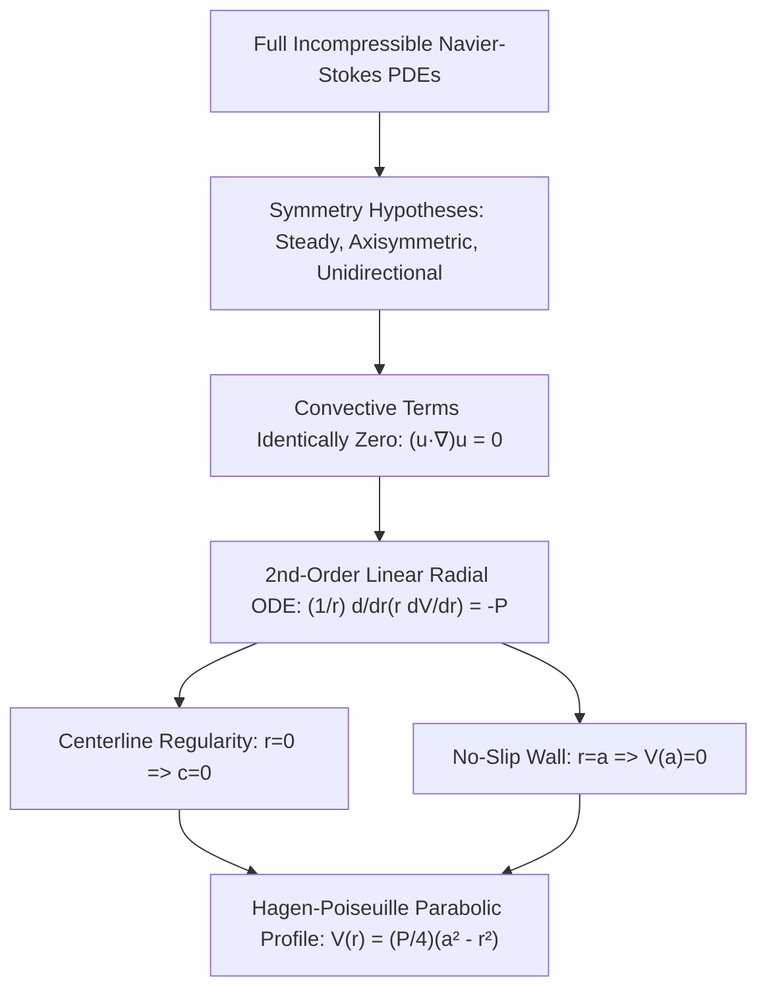

# 📖 Navier-Stokes Poiseuille Flow Reduction

> **Key idea in one sentence:** By exploiting spatial symmetry and fully developed unidirectional kinematics, the full nonlinear Navier-Stokes partial differential equations reduce identically to a second-order linear ordinary boundary value problem whose solution yields the classical Hagen-Poiseuille parabolic velocity profile.

---

## 🎯 1. Physical Foundations: From PDEs to an ODE

The incompressible Navier-Stokes equations governing Newtonian fluid flow constitute a system of four coupled, nonlinear partial differential equations (continuity plus three momentum components). In general, finding exact analytical solutions is an unsolved Millennium Prize problem.

However, in confined geometries with high symmetry—such as laminar flow through an axisymmetric circular pipe of radius $a$—the nonlinear convective acceleration $(\vec{u} \cdot \nabla)\vec{u}$ vanishes identically, reducing the governing equations to an ordinary differential equation (ODE) in the radial coordinate $r$.

---

## 📐 2. Kinematic Hypotheses in Cylindrical Coordinates

Let $(r, \theta, z)$ be cylindrical coordinates, where $z$ is the axial direction along the pipe centerline, $r \in [0, a]$ is the radial distance, and $\theta \in [0, 2\pi)$ is the azimuthal angle.

### Flow Hypotheses:
1. **Steady state:** $\frac{\partial}{\partial t} = 0$.
2. **Axisymmetry:** $\frac{\partial}{\partial \theta} = 0$, azimuthal velocity $u_\theta = 0$.
3. **Unidirectional flow:** No radial velocity, $u_r = 0$.
4. **Incompressibility:** $\nabla \cdot \vec{u} = 0$. In cylindrical coordinates:
   $$ \nabla \cdot \vec{u} = \frac{1}{r} \frac{\partial(r u_r)}{\partial r} + \frac{1}{r}\frac{\partial u_\theta}{\partial \theta} + \frac{\partial u_z}{\partial z} = 0 \implies \frac{\partial u_z}{\partial z} = 0 $$
   Therefore, the axial velocity $u_z$ is independent of $z$ (fully developed flow):
   $$ u_z = V(r) $$
5. **Constant Axial Pressure Gradient:** The driving pressure drops linearly along the pipe:
   $$ \frac{\partial p}{\partial z} = \text{constant} < 0 \implies -\frac{\partial p}{\partial z} = G > 0 $$

---

## 🔍 3. Rigorous Derivation from the Navier-Stokes Equations

The axial ($z$-component) momentum equation of the Navier-Stokes system in cylindrical coordinates is:
$$ \rho \left( \frac{\partial u_z}{\partial t} + u_r \frac{\partial u_z}{\partial r} + \frac{u_\theta}{r}\frac{\partial u_z}{\partial \theta} + u_z \frac{\partial u_z}{\partial z} \right) = -\frac{\partial p}{\partial z} + \mu \left[ \frac{1}{r}\frac{\partial}{\partial r}\left( r \frac{\partial u_z}{\partial r} \right) + \frac{1}{r^2}\frac{\partial^2 u_z}{\partial \theta^2} + \frac{\partial^2 u_z}{\partial z^2} \right] + \rho g_z \tag{1} $$

### Evaluation of Terms:
1. **Unsteady acceleration:** $\frac{\partial u_z}{\partial t} = 0$ (steady flow).
2. **Convective acceleration:**
   $$ u_r \frac{\partial u_z}{\partial r} = 0 \cdot \frac{dV}{dr} = 0 $$
   $$ \frac{u_\theta}{r}\frac{\partial u_z}{\partial \theta} = 0 \cdot 0 = 0 $$
   $$ u_z \frac{\partial u_z}{\partial z} = V(r) \cdot 0 = 0 $$
   The convective derivative vanishes completely: $(\vec{u} \cdot \nabla)\vec{u} = \vec{0}$.
3. **Viscous diffusion terms:**
   $$ \frac{1}{r^2}\frac{\partial^2 u_z}{\partial \theta^2} = 0, \quad \frac{\partial^2 u_z}{\partial z^2} = 0 $$
4. **Body force:** Neglecting gravity in the axial direction ($\rho g_z = 0$).

Substituting into $(1)$:
$$ 0 = -\frac{dp}{dz} + \mu \left[ \frac{1}{r} \frac{d}{dr}\left( r \frac{dV}{dr} \right) \right] $$
Rearranging to isolate the differential operator:
$$ \frac{1}{r} \frac{d}{dr}\left( r \frac{dV}{dr} \right) = \frac{1}{\mu} \frac{dp}{dz} \tag{2} $$

Defining the positive constant $P$:
$$ P \equiv -\frac{1}{\mu} \frac{dp}{dz} > 0 $$
Equation $(2)$ becomes the canonical ODE:
$$ \mathbf{\frac{1}{r} \frac{d}{dr}\left( r \frac{dV}{dr} \right) = -P} \tag{3} $$

---

## 🔢 4. Step-by-Step Integration and Boundary Conditions

### Step 1: First Integration
Multiply both sides of equation $(3)$ by $r$:
$$ \frac{d}{dr}\left( r \frac{dV}{dr} \right) = -P r $$
Integrate directly with respect to $r$:
$$ \int \frac{d}{dr}\left( r \frac{dV}{dr} \right) \, dr = \int -P r \, dr $$
$$ r \frac{dV}{dr} = -\frac{P r^2}{2} + c \tag{4} $$
where $c$ is an arbitrary constant of integration.

Dividing both sides by $r$:
$$ \frac{dV}{dr} = -\frac{P r}{2} + \frac{c}{r} \tag{5} $$

---

### Step 2: Physical Centerline Regularity Condition ($r = 0$)
The fluid velocity $V(r)$ and the shear stress $\tau_{rz} = \mu \frac{dV}{dr}$ must remain physically finite and bounded at every point within the flow domain, including the centerline $r = 0$.

Taking the limit as $r \to 0^+$ in equation $(5)$:
$$ \lim_{r \to 0^+} \frac{c}{r} = \begin{cases} +\infty & \text{if } c > 0 \\ -\infty & \text{if } c < 0 \end{cases} $$
A singularity at $r = 0$ implies infinite shear stress and infinite energy dissipation on the centerline, which is non-physical for a pipe flow with no line-source of momentum. Thus, physical regularity requires:
$$ \mathbf{c = 0} \tag{6} $$

Consequently:
$$ \frac{dV}{dr} = -\frac{P r}{2} \tag{7} $$

> [!NOTE] Symmetry Argument
> By axial symmetry, the velocity profile must have a horizontal tangent at the centerline: $\left.\frac{dV}{dr}\right|_{r=0} = 0$. Evaluating $(5)$ at $r = 0$ yields $\frac{c}{0} = 0$, which requires $c = 0$.

---

### Step 3: Second Integration
Integrate equation $(7)$ with respect to $r$:
$$ V(r) = \int -\frac{P r}{2} \, dr = -\frac{P r^2}{4} + C_2 \tag{8} $$
where $C_2$ is a second integration constant.

---

### Step 4: No-Slip Wall Boundary Condition ($r = a$)
Real viscous fluids adhere to solid surfaces at the molecular scale (the **no-slip condition**). At the pipe wall $r = a$:
$$ V(a) = 0 $$
Imposing this condition on equation $(8)$:
$$ -\frac{P a^2}{4} + C_2 = 0 \implies C_2 = \frac{P a^2}{4} \tag{9} $$

Substituting $C_2$ back into $(8)$:
$$ V(r) = \frac{P a^2}{4} - \frac{P r^2}{4} = \mathbf{\frac{P}{4}\left( a^2 - r^2 \right)} \tag{10} $$

---

## ✈️ 5. Aerospace Fluid Engineering Quantities

From the parabolic velocity profile $(10)$, key macroscopic quantities are determined:

1. **Maximum Centerline Velocity ($V_{\max}$):**
   $$ V_{\max} = V(0) = \frac{P a^2}{4} = \frac{a^2}{4\mu} \left( -\frac{dp}{dz} \right) $$
   Notice that $V(r) = V_{\max} \left( 1 - \frac{r^2}{a^2} \right)$.
2. **Volumetric Flow Rate ($Q$ — Hagen-Poiseuille Law):**
   $$ Q = \int_0^a V(r) \cdot 2\pi r \, dr = 2\pi \frac{P}{4} \int_0^a (a^2 r - r^3) \, dr = \frac{\pi P}{2} \left[ \frac{a^4}{2} - \frac{a^4}{4} \right] = \mathbf{\frac{\pi P a^4}{8} = \frac{\pi a^4}{8\mu}\left(-\frac{dp}{dz}\right)} $$
3. **Average Velocity ($V_{\text{avg}}$):**
   $$ V_{\text{avg}} = \frac{Q}{\pi a^2} = \frac{P a^2}{8} = \frac{1}{2} V_{\max} $$
4. **Wall Shear Stress ($\tau_w$):**
   $$ \tau_w = -\left. \mu \frac{dV}{dr} \right|_{r=a} = -\mu \left( -\frac{P a}{2} \right) = \frac{\mu P a}{2} = \mathbf{\frac{a}{2}\left(-\frac{dp}{dz}\right)} $$

---

## ⚠️ 6. Typical Exam Traps

> [!WARNING] The Centerline Boundary Condition
> In an exam, students often forget how to justify $c = 0$. You cannot simply state "because $r = 0$ makes it divide by zero". You must explicitly invoke either:
> 1. **Boundedness / Physical Regularity:** The velocity $V(0)$ and velocity gradient $\frac{dV}{dr}(0)$ must be finite.
> 2. **Axisymmetry:** By symmetry across the diameter, the velocity profile has a maximum or minimum on the axis, so $\left.\frac{dV}{dr}\right|_{r=0} = 0$.

---

## 🔗 Related Concepts and Problems
* `[[04 - Advanced Maths/Tema 1 - Introduction, Modeling and Classification of ODEs|Tema 1 Guide]]`
* `[[04 - Advanced Maths/Problema - Ch1-P10 Laminar Viscous Poiseuille Flow|Problem 1.10: Detailed 4-Phase Resolution of Poiseuille Flow]]`
* `[[01 - Fluid Mechanics/Mecanica de Fluidos MOC|Fluid Mechanics: Internal Viscous Flows]]`
