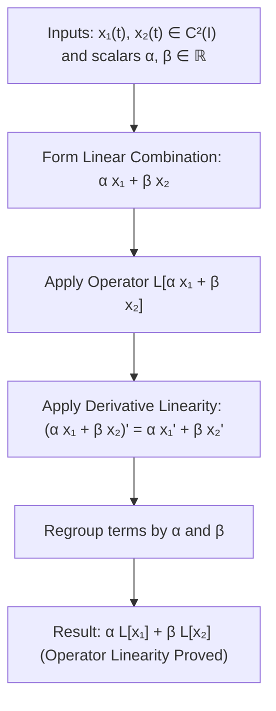
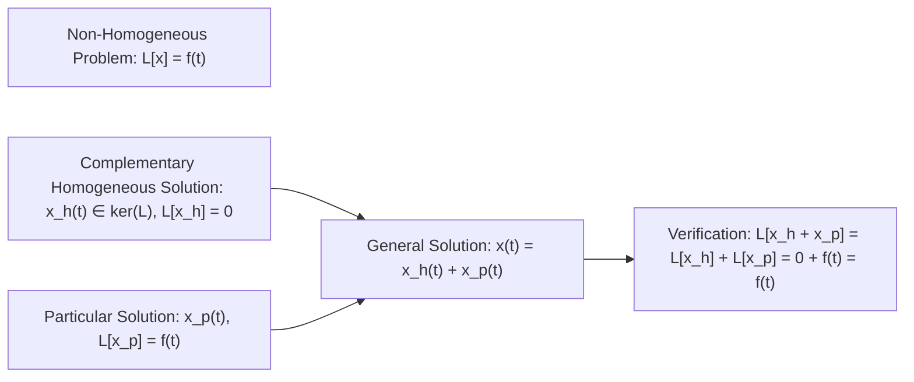

# 📖 Operador Lineal y Principio de Superposición

> **Key idea in one sentence:** The differential mapping $L[x] = x'' + p(t)x' + q(t)x$ is a linear operator between function spaces, ensuring that any linear combination of solutions to the homogeneous equation is also a solution (the Superposition Principle), making the set of homogeneous solutions a vector space, and establishing that the general non-homogeneous solution is the sum of the complementary homogeneous solution and any particular solution ($x = x_h + x_p$).

---

## 🎯 1. The Differential Operator $L$

Consider the normalized second-order linear differential equation:

$$ x'' + p(t)x' + q(t)x = f(t) \tag{1} $$

where $p(t), q(t)$, and $f(t)$ are continuous functions on an open interval $I \subseteq \mathbb{R}$.

### Definition: Second-Order Linear Differential Operator
Let $C^2(I)$ denote the vector space of real-valued functions on $I$ having continuous second derivatives, and let $C^0(I)$ denote the space of continuous functions on $I$. The **linear differential operator** $L: C^2(I) \to C^0(I)$ is defined by:

$$ L[x](t) \equiv \frac{d^2 x}{dt^2} + p(t) \frac{dx}{dt} + q(t) x(t) = x''(t) + p(t)x'(t) + q(t)x(t) \tag{2} $$

With this operator notation, the differential equation $(1)$ is written concisely as:

$$ L[x] = f \tag{3} $$

* If $f(t) \equiv 0$ on $I$, the equation is **homogeneous**:
  $$ L[x] = 0 \tag{4} $$
* If $f(t) \not\equiv 0$ on $I$, the equation is **non-homogeneous** (or inhomogeneous).

---

## 📐 2. Formal Proof of Linearity

An operator $L$ is said to be **linear** if it preserves vector addition and scalar multiplication.

### Theorem: Linearity of $L$
For any two functions $x_1, x_2 \in C^2(I)$ and any real constants $\alpha, \beta \in \mathbb{R}$:

$$ L[\alpha x_1 + \beta x_2] = \alpha L[x_1] + \beta L[x_2] \tag{5} $$

#### Rigorous Proof:
Let $x(t) = \alpha x_1(t) + \beta x_2(t)$. By the linearity of ordinary differentiation:
$$ x'(t) = \frac{d}{dt}\left[\alpha x_1(t) + \beta x_2(t)\right] = \alpha x_1'(t) + \beta x_2'(t) $$
$$ x''(t) = \frac{d^2}{dt^2}\left[\alpha x_1(t) + \beta x_2(t)\right] = \alpha x_1''(t) + \beta x_2''(t) $$

Substitute $x, x'$, and $x''$ into definition $(2)$:
$$ \begin{aligned}
L[\alpha x_1 + \beta x_2] &= (\alpha x_1'' + \beta x_2'') + p(t)(\alpha x_1' + \beta x_2') + q(t)(\alpha x_1 + \beta x_2) \\
&= \left[ \alpha x_1'' + \alpha p(t)x_1' + \alpha q(t)x_1 \right] + \left[ \beta x_2'' + \beta p(t)x_2' + \beta q(t)x_2 \right] \\
&= \alpha \left[ x_1'' + p(t)x_1' + q(t)x_1 \right] + \beta \left[ x_2'' + p(t)x_2' + q(t)x_2 \right] \\
&= \alpha L[x_1] + \beta L[x_2]
\end{aligned} $$
This confirms that $L$ is a linear operator on $C^2(I)$. $\blacksquare$

---

## ⚡ 3. The Principle of Superposition for Homogeneous Equations

A direct algebraic consequence of operator linearity is the **Principle of Superposition**:

### Theorem (Superposition Principle for $L[x] = 0$)
Let $x_1(t)$ and $x_2(t)$ be any two solutions to the homogeneous linear differential equation $L[x] = 0$ on the interval $I$. 
Then, for any arbitrary constants $c_1, c_2 \in \mathbb{R}$, the linear combination:

$$ x(t) = c_1 x_1(t) + c_2 x_2(t) \tag{6} $$

is also a solution to the homogeneous equation $L[x] = 0$ on $I$.

#### Proof:
Since $x_1$ and $x_2$ are solutions, $L[x_1] = 0$ and $L[x_2] = 0$. Applying linearity:
$$ L[x] = L[c_1 x_1 + c_2 x_2] = c_1 L[x_1] + c_2 L[x_2] = c_1(0) + c_2(0) = 0 $$
Thus $L[x] = 0$. $\blacksquare$

> [!NOTE] Linear Algebra Interpretation: The Kernel of $L$
> In linear algebra terms, the set of all solutions to the homogeneous equation is precisely the **kernel** (or null space) of the differential operator $L$:
> $$ S_H \equiv \{ x \in C^2(I) : L[x] = 0 \} = \ker(L) $$
> Because $L$ is linear, $\ker(L)$ is an authentic **vector subspace** of the infinite-dimensional function space $C^2(I)$. Closedness under vector addition and scalar multiplication is guaranteed by the Superposition Principle.

---

## 🔄 4. Structure of Solutions to the Non-Homogeneous Equation

When an external forcing term $f(t) \not\equiv 0$ is present ($L[x] = f$), the solution set is no longer a vector subspace (since the zero function is not a solution: $L[0] = 0 \neq f$). Instead, the solution space is an **affine subspace**.

### Theorem (General Solution Structure of Inhomogeneous Linear ODEs)
Let $x_p(t)$ be any fixed, particular solution to the non-homogeneous equation:
$$ L[x_p] = f(t) \tag{7} $$
Then **every solution** $x(t)$ to $L[x] = f(t)$ can be expressed in the form:
$$ \mathbf{x(t) = x_h(t) + x_p(t)} \tag{8} $$
where $x_h(t) \in \ker(L)$ is a solution to the associated homogeneous equation $L[x_h] = 0$.

#### Proof:
1. Let $x(t)$ be an arbitrary solution to $L[x] = f(t)$, and let $x_p(t)$ be the known particular solution ($L[x_p] = f(t)$).
2. Consider the difference function: $u(t) \equiv x(t) - x_p(t)$.
3. Applying the linear operator $L$ to $u(t)$:
   $$ L[u] = L[x - x_p] = L[x] - L[x_p] = f(t) - f(t) = 0 $$
4. Therefore, $u(t)$ is in the kernel: $u(t) = x_h(t) \in \ker(L)$.
5. Rearranging gives $x(t) = x_h(t) + x_p(t)$. $\blacksquare$

---

## 🏗️ 5. Extended Superposition for Multiple External Forcings

In aerospace structural dynamics, aircraft wings and fuselages are subjected to simultaneous independent aerodynamic, acoustic, and propulsion loads.

### Theorem (Superposition of Inhomogeneous Inputs)
Suppose the driving force is composed of a sum of $N$ distinct forcing functions:
$$ L[x] = f_1(t) + f_2(t) + \dots + f_N(t) \tag{9} $$
If $x_{p,k}(t)$ is a particular solution to $L[x] = f_k(t)$ for each $k = 1, \dots, N$:
$$ L[x_{p,k}] = f_k(t) $$
Then a particular solution to the total non-homogeneous equation $(9)$ is:
$$ \mathbf{x_p(t) = \sum_{k=1}^N x_{p,k}(t)} \tag{10} $$

#### Proof:
By linearity of $L$:
$$ L\left[\sum_{k=1}^N x_{p,k}\right] = \sum_{k=1}^N L[x_{p,k}] = \sum_{k=1}^N f_k(t) \quad \blacksquare $$

---

## ⚠️ 6. Typical Exam Pitfalls

> [!CAUTION] Superposition Fails for Non-Linear Equations
> The Superposition Principle is strictly restricted to **linear** differential equations. If an equation contains non-linear terms (e.g., $x'' + x^2 = 0$ or $x'' + \sin x = 0$), the sum of two solutions $x_1 + x_2$ is almost **never** a solution:
> $$ (x_1 + x_2)'' + (x_1 + x_2)^2 = (x_1'' + x_1^2) + (x_2'' + x_2^2) + 2x_1 x_2 = 0 + 0 + 2x_1 x_2 \neq 0 $$

> [!WARNING] Superposition of Particular Solutions
> If $x_1$ and $x_2$ both solve the inhomogeneous equation $L[x] = f(t)$ with $f \neq 0$, their sum $x_1 + x_2$ solves $L[x_1 + x_2] = f + f = 2f(t)$, **not** $f(t)$!

---

## 🔗 Related Concepts and Topics
* `[[04 - Advanced Maths/Tema 3 - Second-Order Linear ODEs General Theory and Constant Coefficients|Tema 3 Guide: Second-Order Linear ODEs]]`
* `[[04 - Advanced Maths/Concepto - Teorema de Existencia y Unicidad para EDOs de Segundo Orden|Teorema de Existencia y Unicidad]]`
* `[[04 - Advanced Maths/Concepto - Independencia Lineal de Funciones y Determinante Wronskiano|Independencia Lineal y Determinante Wronskiano]]`
* `[[04 - Advanced Maths/Concepto - Identidad de Abel y Propiedades del Wronskiano|Identidad de Abel]]`
* `[[04 - Advanced Maths/Concepto - Linearity and Order of Differential Equations|Linearity and Order of Differential Equations]]`
