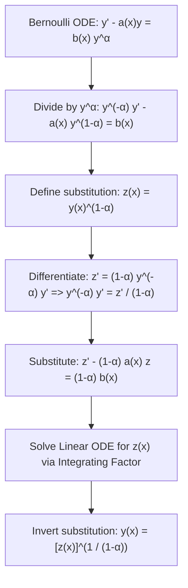

# 📖 Sustituciones No Lineales y Ecuación de Bernoulli

> **Key idea in one sentence:** Certain prominent classes of nonlinear first-order differential equations can be linearized completely through tailored coordinate transformations—most notably Bernoulli's equation through $z = y^{1-\alpha}$ and scale-invariant homogeneous equations through the similarity ratio $u = y/x$.

---

## 🎯 1. The Bernoulli Differential Equation

Formulated by Jacob Bernoulli in 1695, the canonical **Bernoulli equation** is:

$$ \frac{dy}{dx} = a(x) y(x) + b(x) [y(x)]^\alpha \tag{1} $$

or in standard form:
$$ \frac{dy}{dx} - a(x) y = b(x) y^\alpha \tag{2} $$
where $a(x)$ and $b(x)$ are continuous functions, and $\alpha \in \mathbb{R}$ is a real constant.

### Degenerate Linear Cases ($\alpha = 0$ and $\alpha = 1$):
* **Case $\alpha = 0$:** $y^0 = 1$. The equation becomes:
  $$ \frac{dy}{dx} - a(x) y = b(x) $$
  This is already a standard **linear inhomogeneous first-order ODE**, solvable directly with integrating factor $\mu(x) = \exp(-\int a(x) dx)$.
* **Case $\alpha = 1$:** $y^1 = y$. The equation becomes:
  $$ \frac{dy}{dx} - a(x) y = b(x) y \implies \frac{dy}{dx} - [a(x) + b(x)] y = 0 $$
  This is a **linear homogeneous first-order ODE**, separable and solvable directly as $y(x) = y_0 \exp\left(\int [a(x)+b(x)] dx\right)$.

---

## 📐 2. The General Linearizing Transformation for $\alpha \neq 0, 1$

When $\alpha \neq 0$ and $\alpha \neq 1$, the power $y^\alpha$ makes equation $(2)$ nonlinear.

### Step-by-Step Derivation:

#### Step 1: Divide by $y^\alpha$
Assuming $y(x) \neq 0$, divide equation $(2)$ by $y^\alpha$:
$$ y^{-\alpha} \frac{dy}{dx} - a(x) y^{1-\alpha} = b(x) \tag{3} $$

#### Step 2: Introduce the Auxiliary Variable $z(x)$
Define the new dependent variable:
$$ z(x) \equiv [y(x)]^{1-\alpha} \tag{4} $$

#### Step 3: Differentiate $z(x)$ Using the Chain Rule
$$ \frac{dz}{dx} = \frac{d}{dx} \left[ y(x)^{1-\alpha} \right] = (1 - \alpha) y^{-\alpha} \frac{dy}{dx} \tag{5} $$

Since $\alpha \neq 1$, divide by $(1 - \alpha)$:
$$ y^{-\alpha} \frac{dy}{dx} = \frac{1}{1 - \alpha} \frac{dz}{dx} \tag{6} $$

#### Step 4: Substitute into the Differential Equation
Substitute $(4)$ and $(6)$ into $(3)$:
$$ \frac{1}{1 - \alpha} \frac{dz}{dx} - a(x) z(x) = b(x) $$

Multiply the entire equation by $(1 - \alpha)$:
$$ \mathbf{\frac{dz}{dx} - (1 - \alpha) a(x) z(x) = (1 - \alpha) b(x)} \tag{7} $$

Equation $(7)$ is a **first-order linear ODE** for $z(x)$!

#### Step 5: Solve for $z(x)$ and Invert
1. Solve $(7)$ using the integrating factor $\mu_z(x) = \exp\left( -\int (1-\alpha)a(x) dx \right)$.
2. Recover the original solution $y(x)$:
   $$ \mathbf{y(x) = [z(x)]^{\frac{1}{1 - \alpha}}} \tag{8} $$
3. *Note on Trivial Solutions:* In addition to $(8)$, the constant function $y(x) \equiv 0$ is always a solution whenever $\alpha > 0$.

---

## 🔄 3. Scale-Invariant Homogeneous Equations ($u = y/x$)

A first-order ODE is **homogeneous of degree zero** if it can be written as a function of the single dimensionless ratio $\frac{y}{x}$:

$$ \frac{dy}{dx} = F\left( \frac{y}{x} \right) \tag{9} $$

### The Similarity Transformation:
Let:
$$ u(x) \equiv \frac{y(x)}{x} \implies y(x) = x u(x) \tag{10} $$

Differentiating by the product rule:
$$ \frac{dy}{dx} = u(x) + x \frac{du}{dx} \tag{11} $$

Substitute $(10)$ and $(11)$ into $(9)$:
$$ u + x \frac{du}{dx} = F(u) \implies x \frac{du}{dx} = F(u) - u \tag{12} $$

Equation $(12)$ is always **separable**:
$$ \mathbf{\frac{du}{F(u) - u} = \frac{dx}{x}} \tag{13} $$

---

## 🔬 4. Tailored Nonlinear Substitutions: $z = y^2$ Example

Nonlinear substitutions are not restricted to powers of $1-\alpha$. Consider Problem 2.7:
$$ y'(x) = y(x) + \frac{x}{y(x)}, \quad y(0) = 1 $$
* Notice the term $\frac{x}{y}$. Multiplying by $y$:
  $$ y y' = y^2 + x $$
* Let $z(x) = y(x)^2$. By the chain rule:
  $$ z'(x) = 2 y(x) y'(x) \implies y y' = \frac{1}{2} z'(x) $$
* Substitute:
  $$ \frac{1}{2} z' = z + x \iff z' - 2z = 2x $$
  which linearizes the problem completely, yielding $z(x) = \frac{3}{2}e^{2x} - x - \frac{1}{2}$ and $y(x) = \sqrt{z(x)}$.

---

## ⚠️ 5. Typical Exam Pitfalls

> [!WARNING] Forgetting the Factor $(1 - \alpha)$ in the RHS
> When multiplying by $(1 - \alpha)$ to bring equation $(7)$ into standard form, students frequently multiply $a(x)$ but forget to multiply the forcing term $b(x)$, writing $z' - (1-\alpha)az = b(x)$ instead of $(1-\alpha)b(x)$.

> [!CAUTION] Domain Restrictions on Inverting Fractional Powers
> Inverting $y = z^{1/(1-\alpha)}$ requires verifying the sign of $z$. If $1 - \alpha$ is even, $z$ must be non-negative ($z \ge 0$), and the sign of $y$ must match the initial condition $y_0$.

---

## 🔗 Related Concepts and Problems
* `[[04 - Advanced Maths/Tema 2 - First-Order ODEs and Qualitative Dynamics|Tema 2 Guide]]`
* `[[04 - Advanced Maths/Concepto - Factor Integrante y Ecuaciones Lineales de Primer Orden|Integrating Factor Method]]`
* `[[04 - Advanced Maths/Problema - Ch2-P7 Nonlinear Change of Variables|Problem 2.7: Nonlinear Change of Variable z=y²]]`
* `[[04 - Advanced Maths/Problema - Ch2-P8 General Bernoulli Equation Reduction|Problem 2.8: General Bernoulli Equation Reduction]]`
