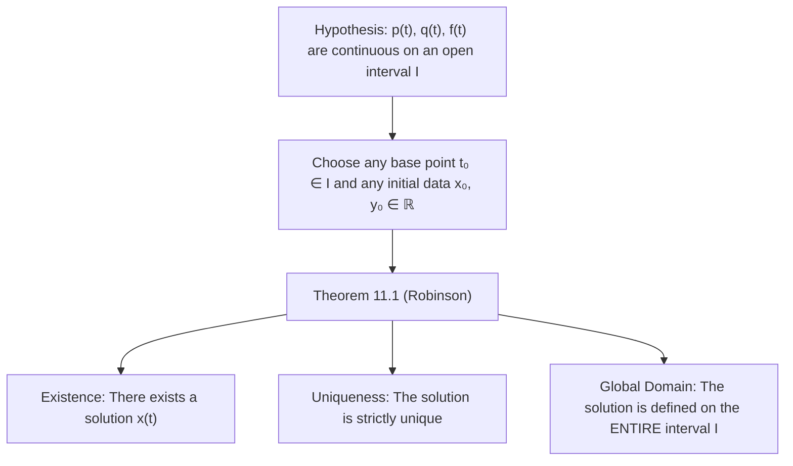

# 📖 Teorema de Existencia y Unicidad para EDOs de Segundo Orden

> **Key idea in one sentence:** For any second-order linear differential equation in normalized standard form $x'' + p(t)x' + q(t)x = f(t)$ with coefficients continuous on an interval $I$, specifying both initial position $x(t_0) = x_0$ and initial velocity $x'(t_0) = y_0$ guarantees the existence of a unique solution that persists globally across the entire interval $I$ without finite-time blow-up.

---

## 🎯 1. Canonical Forms of Second-Order Linear ODEs

### 1.1 General Linear Form
A general second-order linear ordinary differential equation in the unknown function $x(t)$ is formulated as:

$$ a_2(t) \frac{d^2 x}{dt^2} + a_1(t) \frac{dx}{dt} + a_0(t) x(t) = g(t) \tag{1} $$

where $a_2(t), a_1(t), a_0(t)$, and $g(t)$ are given real-valued functions defined on an interval $I \subseteq \mathbb{R}$.

### 1.2 Normalized Standard Form
On any subinterval where the leading coefficient does not vanish ($a_2(t) \neq 0$), equation $(1)$ can be normalized by dividing through by $a_2(t)$:

$$ \frac{d^2 x}{dt^2} + p(t) \frac{dx}{dt} + q(t) x(t) = f(t) \tag{2} $$

or in prime notation:
$$ x'' + p(t)x' + q(t)x = f(t) $$

where the normalized coefficient functions and non-homogeneous source are defined by:
$$ p(t) \equiv \frac{a_1(t)}{a_2(t)}, \quad q(t) \equiv \frac{a_0(t)}{a_2(t)}, \quad f(t) \equiv \frac{g(t)}{a_2(t)} \tag{3} $$

> [!IMPORTANT] Normalization Condition
> Normalization requires $a_2(t) \neq 0$. Any point $t_s$ where $a_2(t_s) = 0$ is a **singular point** of the differential equation, where the coefficient functions $p(t)$ or $q(t)$ may become unbounded and where the standard existence and uniqueness theorem ceases to apply.

---

## ⚙️ 2. Physical Motivation: The Second-Order Initial Value Problem

In classical mechanics and aerospace dynamics, Newton's Second Law for a point mass or rigid body asserts that the acceleration $\ddot{x} = \frac{d^2 x}{dt^2}$ is determined by the forces acting on the system:

$$ m \frac{d^2 x}{dt^2} = F\left(t, x, \frac{dx}{dt}\right) $$

For a linear spring-mass-damper oscillator:
$$ m \ddot{x} + c \dot{x} + k x = F_{\text{ext}}(t) \implies \ddot{x} + \frac{c}{m}\dot{x} + \frac{k}{m}x = \frac{F_{\text{ext}}(t)}{m} \tag{4} $$

To predict the state of the mechanical system forward and backward in time, knowing the initial position $x(t_0) = x_0$ alone is insufficient; one must also prescribe the initial velocity $x'(t_0) = y_0$. This physical necessity translates mathematically into the **Initial Value Problem (IVP)** for a second-order ODE.

### Definition: Second-Order Initial Value Problem (IVP)
The IVP consists of finding a twice-differentiable function $x: I \to \mathbb{R}$ satisfying:

$$ \begin{cases} x'' + p(t)x' + q(t)x = f(t) \\ x(t_0) = x_0 \\ x'(t_0) = y_0 \end{cases} \tag{5} $$

for a specified base time $t_0 \in I$ and given initial constants $x_0, y_0 \in \mathbb{R}$.

---

## 📜 3. The Fundamental Existence and Uniqueness Theorem

The central analytical foundation of second-order linear differential equations is given by Robinson's Theorem 11.1:

### Theorem 11.1 (Existence and Uniqueness for 2nd-Order Linear ODEs)
Let the coefficient functions $p(t)$, $q(t)$, and the forcing term $f(t)$ be **continuous** on an open interval $I = (a, b) \subseteq \mathbb{R}$. Let $t_0 \in I$ be any arbitrary point, and let $x_0, y_0 \in \mathbb{R}$ be arbitrary prescribed real numbers.

Then there exists a **unique solution** $x(t)$ to the initial value problem:

$$ \begin{cases} x'' + p(t)x' + q(t)x = f(t) \\ x(t_0) = x_0 \\ x'(t_0) = y_0 \end{cases} $$

Furthermore, this unique solution $x(t)$ is defined on the **entire interval** $I$.

---

## 🔍 4. Analytical Significance & First-Order vs. Second-Order Comparisons

### 4.1 Absence of Finite-Time Blow-Up
A profound property of *linear* differential equations (in stark contrast to non-linear equations such as $x' = x^2$) is that **solutions cannot experience finite-time blow-up within the interval of continuity $I$**.
* In non-linear equations, a solution may cease to exist at a finite time $t^* < \infty$ even when the vector field is smooth everywhere (e.g., $x(t) = \frac{1}{1-t}$ for $x' = x^2, x(0)=1$).
* In linear ODEs, the maximal interval of existence of the solution $x(t)$ is **at least as large as the common interval of continuity** of $p(t), q(t)$, and $f(t)$. Singularities in $x(t)$ can only occur where $p(t)$, $q(t)$, or $f(t)$ possess singularities (or where $a_2(t) = 0$).

### 4.2 Reduction to a First-Order $2 \times 2$ Vector System
The rigorous proof of Theorem 11.1 relies on transforming the scalar second-order equation into an equivalent first-order planar system. Defining the phase-space state vector:

$$ \mathbf{X}(t) = \begin{pmatrix} x_1(t) \\ x_2(t) \end{pmatrix} \equiv \begin{pmatrix} x(t) \\ x'(t) \end{pmatrix} \tag{6} $$

Differentiating with respect to $t$:
$$ \frac{d\mathbf{X}}{dt} = \begin{pmatrix} x_1' \\ x_2' \end{pmatrix} = \begin{pmatrix} x' \\ x'' \end{pmatrix} = \begin{pmatrix} x_2 \\ -q(t)x_1 - p(t)x_2 + f(t) \end{pmatrix} $$

In matrix-vector notation:
$$ \frac{d\mathbf{X}}{dt} = \begin{pmatrix} 0 & 1 \\ -q(t) & -p(t) \end{pmatrix} \mathbf{X}(t) + \begin{pmatrix} 0 \\ f(t) \end{pmatrix}, \quad \mathbf{X}(t_0) = \begin{pmatrix} x_0 \\ y_0 \end{pmatrix} \tag{7} $$

Since the matrix elements are continuous on $I$, the vector field satisfies a global Lipschitz condition on any compact subinterval of $I$. The classical Picard-Lindelöf theorem for first-order vector systems immediately establishes both local existence, global extension across $I$, and uniqueness of $\mathbf{X}(t)$, and hence of $x(t)$.

---

## ⚠️ 5. Typical Exam Pitfalls

> [!WARNING] The Hidden Singular Points from Normalization
> Given an equation like $(t - 2) x'' + t x' + x = \sin t$ with initial conditions at $t_0 = 0$, normalization gives $p(t) = \frac{t}{t-2}$. The continuity interval containing $t_0 = 0$ is $I = (-\infty, 2)$. Theorem 11.1 guarantees existence and uniqueness on $(-\infty, 2)$, but **not** across the singularity at $t = 2$.

> [!CAUTION] Prescribing Only One Initial Condition
> For a second-order ODE, prescribing only $x(t_0) = x_0$ leaves an entire 1-parameter family of solutions (differing by their initial slope $x'(t_0)$). Uniqueness fails if both conditions are not specified.

---

## 🔗 Related Concepts and Topics
* `[[04 - Advanced Maths/Tema 3 - Second-Order Linear ODEs General Theory and Constant Coefficients|Tema 3 Guide: Second-Order Linear ODEs]]`
* `[[04 - Advanced Maths/Concepto - Operador Lineal y Principio de Superposicion|Operador Lineal y Principio de Superposición]]`
* `[[04 - Advanced Maths/Concepto - Independencia Lineal de Funciones y Determinante Wronskiano|Independencia Lineal y Determinante Wronskiano]]`
* `[[04 - Advanced Maths/Concepto - Identidad de Abel y Propiedades del Wronskiano|Identidad de Abel]]`
* `[[04 - Advanced Maths/Concepto - Well-Posed Problems and Picard Theorem|Picard-Lindelöf Theorem for 1st-Order ODEs]]`
