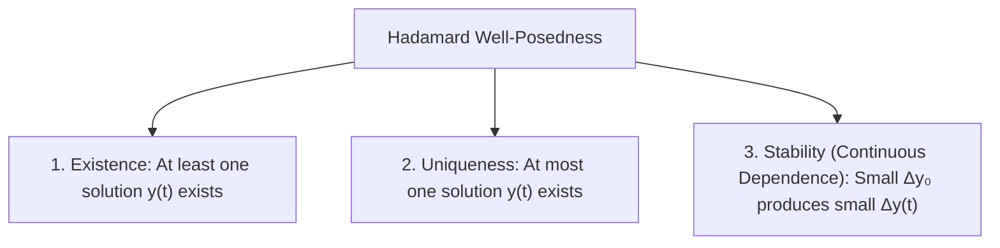
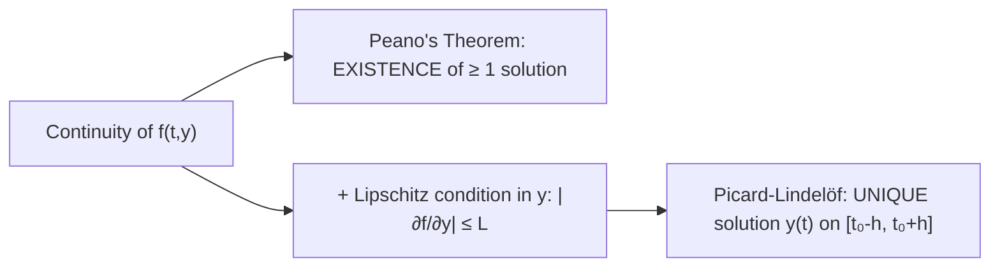

# 📖 Well-Posed Problems and Picard-Lindelöf Theorem

> **Key idea in one sentence:** An Initial Value Problem (IVP) is well-posed if a unique solution exists and depends continuously on initial conditions; local existence and uniqueness are guaranteed by the Picard-Lindelöf theorem when the velocity field $f(t, y)$ is continuous and locally Lipschitz in $y$, while failure of Lipschitz continuity allows branching non-uniqueness and nonlinearity can cause finite-time blow-up.

---

## 🎯 1. Hadamard's Notion of Well-Posedness

In 1902, Jacques Hadamard established that a mathematical model describing a physical process must satisfy three fundamental postulates to be considered **well-posed** (*bien posé*):

1. **Existence:** There exists at least one function $y(t)$ satisfying both the differential equation and the prescribed initial conditions.
2. **Uniqueness:** There is exactly one such solution. If a physical experiment is repeated under identical conditions, the outcome must be identical (deterministic physics).
3. **Continuous Dependence (Stability):** The solution depends continuously on the initial data and parameters. A small perturbation $\varepsilon$ in $y(0) = y_0 \pm \varepsilon$ does not cause an unbounded instantaneous divergence in $y(t)$ over finite time intervals.

---

## 📐 2. The Initial Value Problem (IVP) and Volterra Integral Form

Consider the canonical first-order scalar IVP:
$$ \begin{cases} \dfrac{dy}{dt} = f(t, y) \\ y(t_0) = y_0 \end{cases} \tag{1} $$
where $f: D \to \mathbb{R}$ is defined on an open domain $D \subseteq \mathbb{R}^2$ containing $(t_0, y_0)$.

### The Equivalent Volterra Integral Equation
Integrating $(1)$ directly from $t_0$ to $t$:
$$ \int_{t_0}^t \frac{dy}{ds} \, ds = \int_{t_0}^t f(s, y(s)) \, ds $$
By the Fundamental Theorem of Calculus:
$$ y(t) = y_0 + \int_{t_0}^t f(s, y(s)) \, ds \tag{2} $$

> [!NOTE] Integral Equivalence
> Equation $(2)$ incorporates the initial condition $y(t_0) = y_0$ automatically. Any continuous solution of $(2)$ is automatically a continuously differentiable ($C^1$) solution of the IVP $(1)$.

### Picard Successive Approximations Scheme
Equation $(2)$ is a fixed-point problem $y = \mathcal{T}[y]$. Picard iterations generate a sequence of approximating functions $\{y_k(t)\}_{k=0}^\infty$:
$$ y_0(t) = y_0 $$
$$ y_{k+1}(t) = y_0 + \int_{t_0}^t f(s, y_k(s)) \, ds, \quad k = 0, 1, 2, \dots $$
Under the conditions of Picard's theorem, this sequence converges uniformly to the unique solution $y(t) = \lim_{k\to\infty} y_k(t)$.

---

## 🔍 3. The Picard-Lindelöf Theorem & The Lipschitz Condition

### Definition: Lipschitz Continuity
Let $D \subset \mathbb{R}^2$. A function $f(t, y)$ is **Lipschitz continuous with respect to $y$** on $D$ if there exists a finite constant $L \ge 0$ (the Lipschitz constant) such that:
$$ |f(t, y_1) - f(t, y_2)| \le L |y_1 - y_2|, \quad \forall (t, y_1), (t, y_2) \in D \tag{3} $$

> [!TIP] Practical Sufficient Condition for Lipschitz
> If $f(t, y)$ has a continuous partial derivative $\frac{\partial f}{\partial y}$ on a closed, bounded (compact) rectangle $D$, then by the Mean Value Theorem:
> $$ |f(t, y_1) - f(t, y_2)| = \left| \frac{\partial f}{\partial y}(t, \xi) \right| |y_1 - y_2| \le L |y_1 - y_2| $$
> where $L = \max_{(t, y) \in D} \left| \frac{\partial f}{\partial y}(t, y) \right| < \infty$.

### Statement of the Picard-Lindelöf Theorem
Let $R$ be the closed rectangle centered at $(t_0, y_0)$:
$$ R = \left\{ (t, y) \in \mathbb{R}^2 : |t - t_0| \le a, \; |y - y_0| \le b \right\} $$
Suppose:
1. $f(t, y)$ is continuous on $R$, so by the Extreme Value Theorem, $|f(t, y)| \le M$ for all $(t, y) \in R$.
2. $f(t, y)$ satisfies the Lipschitz condition $(3)$ with respect to $y$ on $R$.

Then, the IVP $(1)$ has a **unique** solution $y(t)$ defined on the interval:
$$ I = [t_0 - h, t_0 + h], \quad \text{where } h = \min\left( a, \, \frac{b}{M} \right) $$

---

## 💥 4. Pathologies: Failure Modes of Uniqueness and Global Existence

### Pathology 1: Non-Uniqueness (Failure of Lipschitz Condition)
Consider the initial value problem:
$$ \begin{cases} \dfrac{dy}{dt} = y^{1/3} \\ y(0) = 0 \end{cases} $$
1. **Check Continuity:** $f(t, y) = y^{1/3}$ is continuous on all of $\mathbb{R}^2$. By Peano's Theorem, **at least one solution exists**.
2. **Check Lipschitz Condition:** Compute the partial derivative:
   $$ \frac{\partial f}{\partial y} = \frac{1}{3 y^{2/3}} $$
   As $y \to 0$, $\frac{\partial f}{\partial y} \to \infty$. Thus, $\frac{\partial f}{\partial y}$ is unbounded in any neighborhood containing $y = 0$, violating the Lipschitz condition.
3. **Multiple Solutions:**
   * **Trivial solution:** $y_1(t) \equiv 0$ satisfies $y_1'(0) = 0 = 0^{1/3}$ and $y_1(0) = 0$.
   * **Separation of variables:** For $y \neq 0$:
     $$ \int y^{-1/3} \, dy = \int dt \implies \frac{3}{2} y^{2/3} = t + C $$
     Using $y(0) = 0 \implies C = 0$, which gives:
     $$ y^{2/3} = \frac{2}{3} t \implies y_2(t) = +\left(\frac{2}{3} t\right)^{3/2}, \quad y_3(t) = -\left(\frac{2}{3} t\right)^{3/2} \quad (t \ge 0) $$
   * **Infinite family:** Solutions can stay at $y=0$ until an arbitrary time $c > 0$ and then branch off:
     $$ y(t) = \begin{cases} 0 & 0 \le t \le c \\ \pm \left( \frac{2}{3}(t - c) \right)^{3/2} & t > c \end{cases} $$
   **Conclusion:** Uniqueness completely fails because the Lipschitz condition is violated at the initial state.

---

### Pathology 2: Finite-Time Blow-Up (Local vs. Global Existence)
Consider the initial value problem:
$$ \begin{cases} \dfrac{dy}{dt} = y^2 \\ y(0) = y_0 > 0 \end{cases} $$
1. **Check Continuity and Lipschitz:**
   $$ f(t, y) = y^2, \quad \frac{\partial f}{\partial y} = 2y $$
   Both are smooth and polynomial on any compact set. Picard-Lindelöf guarantees that a **unique local solution exists** in an interval $[0, h)$.
2. **Analytical Solution:**
   $$ \int \frac{dy}{y^2} = \int dt \implies -\frac{1}{y} = t + C $$
   Imposing $y(0) = y_0$:
   $$ -\frac{1}{y_0} = C \implies -\frac{1}{y} = t - \frac{1}{y_0} = \frac{y_0 t - 1}{y_0} $$
   Inverting both sides:
   $$ y(t) = \frac{y_0}{1 - y_0 t} $$
3. **Blow-Up Singularity:**
   As $t \to \left(\frac{1}{y_0}\right)^-$, the denominator approaches $0$, so:
   $$ \lim_{t \to (1/y_0)^-} y(t) = +\infty $$
   The solution ceases to exist at the finite time $T^* = \frac{1}{y_0}$.

> [!CAUTION] Local vs. Global Existence
> Picard's theorem provides **local** existence on $[t_0 - h, t_0 + h]$. For a linear equation $y' + p(t)y = q(t)$, the solution exists globally across any interval where $p(t)$ and $q(t)$ are continuous. For **nonlinear equations**, smooth velocity fields can cause solutions to escape to infinity in finite time (blow-up).

---

## ⚠️ 5. Typical Exam Traps

> [!WARNING] Common Mistakes
> 1. **Asserting that non-Lipschitz implies no solution:** False! If $f$ is continuous, a solution always exists (Peano). The loss of Lipschitz continuity only destroys **uniqueness**.
> 2. **Assuming linear equations can blow up:** Linear ODEs with continuous coefficients on an interval $I$ *never* exhibit finite-time blow-up inside $I$. Blow-up is an inherently nonlinear phenomenon.

---

## 🔗 Related Concepts and Problems
* `[[04 - Advanced Maths/Concepto - Linearity and Order of Differential Equations|Linearity and Order of Differential Equations]]`
* `[[04 - Advanced Maths/Concepto - Logistic Equation and Carrying Capacity|Logistic Equation (Saturation vs. Blow-up)]]`
* `[[04 - Advanced Maths/Problema - Ch1-P2 Malthusian Population Dynamics|Problem 1.2: Malthusian Population Dynamics]]`
* `[[04 - Advanced Maths/Problema - Ch1-P9 Logistic Population Growth Model|Problem 1.9: Logistic Population Growth Model]]`
