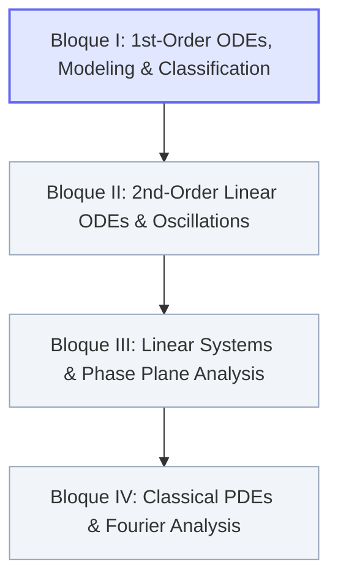

# 📐 Advanced Mathematics — MOC (Map of Content)

> **Course:** Advanced Mathematics (2nd Year, B.Sc. in Aerospace Engineering, UC3M)  
> **NotebookLM Notebook:** `c27033c3-5a64-403f-a517-5847831aabcb`  
> **Master Index Return:** `[[00 - Indice Central/Indice Maestro|⬅️ Central Master Index]]`  
> **Interactive Web Portal:** `subjects/advanced-maths/`

---

## 🧭 Overview & Pedagogical Roadmap

The official syllabus of Advanced Mathematics for Aerospace Engineering at Universidad Carlos III de Madrid covers Ordinary Differential Equations (ODEs), dynamic systems modeling, second-order linear oscillations, linear systems & phase portraits, and classical Partial Differential Equations (PDEs) solved via Fourier methods.

---

## 📑 Syllabus Structure & Active Units

### 🚀 Bloque I: First-Order ODEs, Modeling and Classification
* **Unit Guide:** `[[04 - Advanced Maths/Tema 1 - Introduction, Modeling and Classification of ODEs|Tema 1: Introduction, Modeling and Classification of ODEs]]`
* **Theoretical Concepts:**
  * `[[04 - Advanced Maths/Concepto - Linearity and Order of Differential Equations|Linearity and Order of Differential Equations]]` — Canonical algebraic definition $a_n(x)y^{(n)} + \dots + a_0(x)y = b(x)$, classification criteria, ODEs vs PDEs.
  * `[[04 - Advanced Maths/Concepto - Well-Posed Problems and Picard Theorem|Well-Posed Problems and Picard-Lindelöf Theorem]]` — IVP formulations, local existence and uniqueness, Lipschitz continuity, non-uniqueness and finite-time blow-up.
  * `[[04 - Advanced Maths/Concepto - First-Order Physical Models|First-Order Physical Models]]` — Derivations of Malthusian growth, radioactive decay, Newton's law of cooling, CSTR mixing tanks, and free fall.
  * `[[04 - Advanced Maths/Concepto - Logistic Equation and Carrying Capacity|Logistic Equation and Carrying Capacity]]` — Verhulst model, partial fraction integration, carrying capacity saturation $M$, asymptotic limits.
  * `[[04 - Advanced Maths/Concepto - Navier-Stokes Poiseuille Flow Reduction|Navier-Stokes Poiseuille Flow Reduction]]` — Navier-Stokes reduction to ODE in pipe flow, centerline regularity, no-slip condition, parabolic velocity profile.
* **Problem Sheet 1 (Full 4-Phase Step-by-Step Solutions):**
  1. `[[04 - Advanced Maths/Problema - Ch1-P1 Classification of Differential Equations|Problem 1.1: Classification of Differential Equations]]` — 10 canonical equations (Bessel, Burgers, Duffing, Newton, wave, logistic, etc.).
  2. `[[04 - Advanced Maths/Problema - Ch1-P2 Malthusian Population Dynamics|Problem 1.2: Malthusian Population Dynamics]]` — Exponential growth/decay, asymptotic behavior, doubling time $t_d = \frac{\ln 2}{k}$.
  3. `[[04 - Advanced Maths/Problema - Ch1-P3 Plutonium 239 Radioactive Decay|Problem 1.3: Plutonium-239 Radioactive Decay]]` — Half-life derivation $t_{1/2} = 24{,}000\text{ yr}$, decay constant $k = \frac{\ln 2}{24000}\text{ yr}^{-1}$.
  4. `[[04 - Advanced Maths/Problema - Ch1-P4 Newton Law of Cooling Modeling|Problem 1.4: Newton's Law of Cooling Modeling]]` — Thermal exchange, dependent/independent variables, parameter modeling.
  5. `[[04 - Advanced Maths/Problema - Ch1-P5 Forensic Time of Death Estimation|Problem 1.5: Forensic Time of Death Estimation]]` — Cooling in cold ambient $5^\circ\text{C}$, death time back-calculation to $\approx 12:33\text{ pm}$.
  6. `[[04 - Advanced Maths/Problema - Ch1-P6 Saline Mixing Tank Dynamics|Problem 1.6: Saline Mixing Tank Dynamics]]` — 100 L CSTR mass balance, pure water washout, asymptotic salinity with inlet concentration $s$.
  7. `[[04 - Advanced Maths/Problema - Ch1-P7 Free Fall Motion under Gravity|Problem 1.7: Free Fall Motion under Gravity]]` — Constant gravity acceleration, successive integrations, kinematic trajectory.
  8. `[[04 - Advanced Maths/Problema - Ch1-P8 Simple Pendulum Equation of Motion|Problem 1.8: Simple Pendulum Equation of Motion]]` — Newton's 2nd law along arc length and conservation of mechanical energy.
  9. `[[04 - Advanced Maths/Problema - Ch1-P9 Logistic Population Growth Model|Problem 1.9: Logistic Population Growth Model]]` — Exact separation of variables, partial fractions, initial value matching, $t \to \infty$ and $M \to \infty$ limits.
  10. `[[04 - Advanced Maths/Problema - Ch1-P10 Laminar Viscous Poiseuille Flow|Problem 1.10: Laminar Viscous Poiseuille Flow]]` — Navier-Stokes cylindrical reduction, double integration, centerline boundedness, no-slip wall condition.

---

### ⚙️ Bloque II: Second-Order Linear ODEs and Oscillations
* **Topics:** Homogeneous and non-homogeneous equations, linear independence, the Wronskian determinant, reduction of order, characteristic equations (real, repeated, and complex conjugate roots), method of undetermined coefficients, variation of parameters, forced mechanical oscillations and resonance.
* *Status: Scheduled for upcoming unit development.*

---

### 🔄 Bloque III: Linear Systems and Phase Plane Analysis
* **Topics:** First-order systems $\dot{\mathbf{x}} = A\mathbf{x}$, eigenvalues and eigenvectors, classification of critical points (nodes, saddles, spirals, centers), stability analysis, phase portraits, non-linear perturbations and linearization.
* *Status: Scheduled for upcoming unit development.*

---

### 🌊 Bloque IV: Classical PDEs and Fourier Analysis
* **Topics:** Classification of 2nd-order linear PDEs (elliptic, parabolic, hyperbolic), separation of variables, Fourier series (sine, cosine, full trigonometric), Dirichlet and Neumann boundary conditions, 1D Wave equation (vibrating string), 1D Heat equation (thermal conduction), 2D Laplace equation in Cartesian and polar domains.
* *Status: Scheduled for upcoming unit development.*

---

## 🔗 Cross-Subject Aerospace Connections
* **Fluid Mechanics (`01 - Fluid Mechanics`):** Direct application of Navier-Stokes simplification to Hagen-Poiseuille pipe flow (`[[04 - Advanced Maths/Concepto - Navier-Stokes Poiseuille Flow Reduction|Navier-Stokes Reduction]]` $\leftrightarrow$ `[[01 - Fluid Mechanics/Mecanica de Fluidos MOC|Fluid Mechanics MOC]]`).
* **Engineering Mechanics (`03 - Engineering Mechanics`):** Pendulum and mass-spring dynamics (`[[04 - Advanced Maths/Problema - Ch1-P8 Simple Pendulum Equation of Motion|Pendulum Equation]]` $\leftrightarrow$ `[[03 - Engineering Mechanics/Mecanica de Estructuras MOC|Engineering Mechanics MOC]]`).
