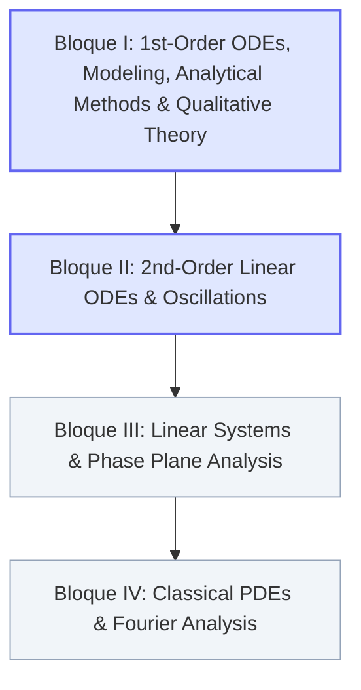

# 📐 Advanced Mathematics — MOC (Map of Content)

> **Course:** Advanced Mathematics (2nd Year, B.Sc. in Aerospace Engineering, UC3M)  
> **NotebookLM Notebook:** `c27033c3-5a64-403f-a517-5847831aabcb`  
> **Master Index Return:** `[[00 - Indice Central/Indice Maestro|⬅️ Central Master Index]]`  
> **Interactive Web Portal:** `subjects/04-advanced-maths/`

---

## 🧭 Overview & Pedagogical Roadmap

The official syllabus of Advanced Mathematics for Aerospace Engineering at Universidad Carlos III de Madrid covers Ordinary Differential Equations (ODEs), dynamic systems modeling, analytical integration and qualitative stability, second-order linear oscillations, linear systems & phase portraits, and classical Partial Differential Equations (PDEs) solved via Fourier methods.

---

## 📑 Syllabus Structure & Active Units

### 🚀 Bloque I: First-Order ODEs, Modeling, Analytical Methods and Qualitative Dynamics

#### Unit 1: Introduction, Modeling and Classification of ODEs
* **Unit Guide:** `[[04 - Advanced Maths/Tema 1 - Introduction, Modeling and Classification of ODEs|Tema 1: Introduction, Modeling and Classification of ODEs]]`
* **Theoretical Concepts:**
  * `[[04 - Advanced Maths/Concepto - Linearity and Order of Differential Equations|Linearity and Order of Differential Equations]]` — Canonical algebraic definition $a_n(x)y^{(n)} + \dots + a_0(x)y = b(x)$, classification criteria, ODEs vs PDEs.
  * `[[04 - Advanced Maths/Concepto - Well-Posed Problems and Picard Theorem|Well-Posed Problems and Picard-Lindelöf Theorem]]` — IVP formulations, local existence and uniqueness, Lipschitz continuity, non-uniqueness and finite-time blow-up.
  * `[[04 - Advanced Maths/Concepto - First-Order Physical Models|First-Order Physical Models]]` — Derivations of Malthusian growth, radioactive decay, Newton's law of cooling, CSTR mixing tanks, and free fall.
  * `[[04 - Advanced Maths/Concepto - Logistic Equation and Carrying Capacity|Logistic Equation and Carrying Capacity]]` — Verhulst model, partial fraction integration, carrying capacity saturation $M$, asymptotic limits.
  * `[[04 - Advanced Maths/Concepto - Navier-Stokes Poiseuille Flow Reduction|Navier-Stokes Poiseuille Flow Reduction]]` — Navier-Stokes reduction to ODE in pipe flow, centerline regularity, no-slip condition, parabolic velocity profile.
* **Problem Sheet 1 (Full 4-Phase Step-by-Step Solutions):**
  1. `[[04 - Advanced Maths/Problema - Ch1-P1 Classification of Differential Equations|Problem 1.1: Classification of Differential Equations]]` — 10 canonical equations (Bessel, Burgers, Duffing, Newton, wave, logistic, etc.).
  2. `[[04 - Advanced Maths/Problema - Ch1-P2 Malthusian Population Dynamics|Problem 1.2: Malthusian Population Dynamics]]` — Exponential growth/decay, asymptotic behavior, doubling time $t_d = \frac{\ln 2}{k}$.
  3. `[[04 - Advanced Maths/Problema - Ch1-P3 Plutonium 239 Radioactive Decay|Problem 1.3: Plutonium-239 Radioactive Decay]]` — Half-life derivation $t_{1/2} = 24{,}000\text{ yr}$, decay constant $k = \frac{\ln 2}{24000}\text{ yr}^{-1}$.
  4. `[[04 - Advanced Maths/Problema - Ch1-P4 Newton Law of Cooling Modeling|Problem 1.4: Newton's Law of Cooling Modeling]]` — Thermal exchange, dependent/independent variables, parameter modeling.
  5. `[[04 - Advanced Maths/Problema - Ch1-P5 Forensic Time of Death Estimation|Problem 1.5: Forensic Time of Death Estimation]]` — Cooling in cold ambient $5^\circ\text{C}$, death time back-calculation to $\approx 12:33\text{ pm}$.
  6. `[[04 - Advanced Maths/Problema - Ch1-P6 Saline Mixing Tank Dynamics|Problem 1.6: Saline Mixing Tank Dynamics]]` — 100 L CSTR mass balance, pure water washout, asymptotic salinity with inlet concentration $s$.
  7. `[[04 - Advanced Maths/Problema - Ch1-P7 Free Fall Motion under Gravity|Problem 1.7: Free Fall Motion under Gravity]]` — Constant gravity acceleration, successive integrations, kinematic trajectory.
  8. `[[04 - Advanced Maths/Problema - Ch1-P8 Simple Pendulum Equation of Motion|Problem 1.8: Simple Pendulum Equation of Motion]]` — Newton's 2nd law along arc length and conservation of mechanical energy.
  9. `[[04 - Advanced Maths/Problema - Ch1-P9 Logistic Population Growth Model|Problem 1.9: Logistic Population Growth Model]]` — Exact separation of variables, partial fractions, initial value matching, $t \to \infty$ and $M \to \infty$ limits.
  10. `[[04 - Advanced Maths/Problema - Ch1-P10 Laminar Viscous Poiseuille Flow|Problem 1.10: Laminar Viscous Poiseuille Flow]]` — Navier-Stokes cylindrical reduction, double integration, centerline boundedness, no-slip wall condition.

---

#### Unit 2: First-Order ODEs and Qualitative Dynamics
* **Unit Guide:** `[[04 - Advanced Maths/Tema 2 - First-Order ODEs and Qualitative Dynamics|Tema 2: First-Order ODEs and Qualitative Dynamics]]`
* **Theoretical Concepts:**
  * `[[04 - Advanced Maths/Concepto - Metodos de Integracion Directa y Ecuaciones Separables|Métodos de Integración Directa y Ecuaciones Separables]]` — Quadrature, Leibniz chain rule justification, Gaussian integrals, error functions, and finite-time blow-up thresholds.
  * `[[04 - Advanced Maths/Concepto - Factor Integrante y Ecuaciones Lineales de Primer Orden|Factor Integrante y Ecuaciones Lineales de Primer Orden]]` — Standard form $x' + p(t)x = q(t)$, rigorous integrating factor derivation $\mu(t) = \exp(\int p dt)$, and asymptotic limit $x(t) \to b/a$.
  * `[[04 - Advanced Maths/Concepto - Ecuaciones Exactas y Factores Integrantes Especiales|Ecuaciones Exactas y Factores Integrantes Especiales]]` — Differential forms $M dx + N dy = 0$, Euler-Cauchy-Schwarz condition $\frac{\partial M}{\partial y} = \frac{\partial N}{\partial x}$, potential surfaces $F(x, y) = C$, and special integrating factors $\mu(x), \mu(y)$.
  * `[[04 - Advanced Maths/Concepto - Sustituciones No Lineales y Ecuacion de Bernoulli|Sustituciones No Lineales y Ecuación de Bernoulli]]` — Linearizing reduction $z = y^{1-\alpha}$ for Bernoulli's ODE $y' - ay = b y^\alpha$, similarity ratios $u = y/x$ for homogeneous equations, and tailored substitutions.
  * `[[04 - Advanced Maths/Concepto - Analisis Cualitativo de EDOs Autonomas y Estabilidad|Análisis Cualitativo de EDOs Autónomas y Estabilidad]]` — Autonomous flow $\dot{x} = f(x)$, equilibria $f(x^*) = 0$, linear stability via $f'(x^*)$, 1D phase line portraits, and Picard's No-Crossing Theorem for trajectory confinement.
* **Problem Sheet 2 (Full 4-Phase Step-by-Step Solutions — 17 Problems):**
  1. `[[04 - Advanced Maths/Problema - Ch2-P1 Direct Integration General Solutions|Problem 2.1: Direct Integration General Solutions]]` — 5 antiderivative solutions.
  2. `[[04 - Advanced Maths/Problema - Ch2-P2 Separable ODEs and Asymptotic Integrals|Problem 2.2: Separable ODEs and Asymptotic Integrals]]` — 5 separable equations with Gaussian blow-up threshold $y_0 = \frac{2}{\sqrt{\pi}}$.
  3. `[[04 - Advanced Maths/Problema - Ch2-P3 Integrating Factor Method and Asymptotics|Problem 2.3: Integrating Factor Method and Asymptotics]]` — 8 linear ODEs solved with $\mu(t)$ and $t \to \infty$ limits.
  4. `[[04 - Advanced Maths/Problema - Ch2-P4 Exact Differential Equations|Problem 2.4: Exact Differential Equations]]` — 4 exact equations and potential reconstruction $F(x, y) = C$.
  5. `[[04 - Advanced Maths/Problema - Ch2-P5 Integrating Factor for Non-Exact Equations|Problem 2.5: Integrating Factor for Non-Exact Equations]]` — Special integrating factor $\mu(x) = x$.
  6. `[[04 - Advanced Maths/Problema - Ch2-P6 Exactness of Separated Differential Forms|Problem 2.6: Exactness of Separated Differential Forms]]` — Universal proof that separated equations are exact.
  7. `[[04 - Advanced Maths/Problema - Ch2-P7 Nonlinear Change of Variables|Problem 2.7: Nonlinear Change of Variables]]` — Substitution $z = y^2$ linearizing $y' = y + x/y$.
  8. `[[04 - Advanced Maths/Problema - Ch2-P8 General Bernoulli Equation Reduction|Problem 2.8: General Bernoulli Equation Reduction]]` — General transformation $z = y^{1-\alpha}$.
  9. `[[04 - Advanced Maths/Problema - Ch2-P9 Solution Uniqueness and Lipschitz Analysis|Problem 2.9: Solution Uniqueness and Lipschitz Analysis]]` — Rigorous Lipschitz derivative testing at $x_0 = 0$.
  10. `[[04 - Advanced Maths/Problema - Ch2-P10 Uniqueness via Integrating Transformation|Problem 2.10: Uniqueness via Integrating Transformation]]` — Non-Picard uniqueness proof via $z(t) = y(t)\exp(\int p ds)$.
  11. `[[04 - Advanced Maths/Problema - Ch2-P11 Invariance of Solution Ratios in Linear ODEs|Problem 2.11: Invariance of Solution Ratios in Linear ODEs]]` — Quotient rule proof that $\frac{d}{dt}(y_1/y_2) = 0$.
  12. `[[04 - Advanced Maths/Problema - Ch2-P12 Trajectory Crossing and Uniqueness Bounds|Problem 2.12: Trajectory Crossing and Uniqueness Bounds]]` — No-crossing theorem bounds.
  13. `[[04 - Advanced Maths/Problema - Ch2-P13 Multi-Equilibria Autonomous Phase Line Dynamics|Problem 2.13: Multi-Equilibria Autonomous Phase Line Dynamics]]` — Confinement across 4 invariant intervals.
  14. `[[04 - Advanced Maths/Problema - Ch2-P14 Non-Lipschitz Branching Pathology in Picard Theorem|Problem 2.14: Non-Lipschitz Branching Pathology in Picard Theorem]]` — Dual solutions and Picard Lipschitz violation.
  15. `[[04 - Advanced Maths/Problema - Ch2-P15 Singular ODE and Domain of Definition|Problem 2.15: Singular ODE and Domain of Definition]]` — Coexistence of multiple solutions at $t = 0$ due to domain singularity.
  16. `[[04 - Advanced Maths/Problema - Ch2-P16 Pitchfork Phase Line and Stability Regimes|Problem 2.16: Pitchfork Phase Line and Stability Regimes]]` — Stationary points and pitchfork bifurcation.
  17. `[[04 - Advanced Maths/Problema - Ch2-P17 Direct Difference Method for Uniqueness|Problem 2.17: Direct Difference Method for Uniqueness]]` — Solution by inspection and uniqueness via energy functional $E(t) = [w(t)]^2$.

---

### ⚙️ Bloque II: Second-Order Linear ODEs and Oscillations

#### Unit 3: Second-Order Linear ODEs: General Theory and Constant Coefficients
* **Unit Guide:** `[[04 - Advanced Maths/Tema 3 - Second-Order Linear ODEs General Theory and Constant Coefficients|Tema 3: Second-Order Linear ODEs General Theory and Constant Coefficients]]`
* **Theoretical Concepts:**
  * `[[04 - Advanced Maths/Concepto - Teorema de Existencia y Unicidad para EDOs de Segundo Orden|Teorema de Existencia y Unicidad para EDOs de Segundo Orden]]` — Standard normalized form $x'' + p(t)x' + q(t)x = f(t)$, Robinson Theorem 11.1, two initial conditions $x(t_0)=x_0, x'(t_0)=y_0$, global existence without finite-time blow-up, and reduction to $2\times 2$ first-order system.
  * `[[04 - Advanced Maths/Concepto - Operador Lineal y Principio de Superposicion|Operador Lineal y Principio de Superposición]]` — Differential operator $L[x] = x'' + p(t)x' + q(t)x$, linearity proof, Superposition Principle for homogeneous equations, algebraic structure $\ker(L) \subset C^2(I)$, and general non-homogeneous decomposition $x = x_h + x_p$.
  * `[[04 - Advanced Maths/Concepto - Independencia Lineal de Funciones y Determinante Wronskiano|Independencia Lineal de Funciones y Determinante Wronskiano]]` — Linear independence definition, IVP solvability, the Wronskian determinant $W[x_1, x_2](t) = x_1 x_2' - x_2 x_1'$, fundamental solution sets, and constructive proof that $\dim(\ker(L)) = 2$.
  * `[[04 - Advanced Maths/Concepto - Identidad de Abel y Propiedades del Wronskiano|Identidad de Abel y Propiedades del Wronskiano]]` — Derivation of $W'(t) = -p(t)W(t)$, Abel's identity $W(t) = W(t_0)\exp(-\int p ds)$, the Wronskian Dichotomy (either non-zero everywhere or identically zero), and d'Alembert reduction of order.
  * `[[04 - Advanced Maths/Concepto - Ecuaciones Homogeneas con Coeficientes Constantes y Ecuacion Caracteristica|Ecuaciones Homogéneas con Coeficientes Constantes y Ecuación Característica]]` — Exponential ansatz $x = e^{kt}$, characteristic equation $a k^2 + b k + c = 0$, distinct real roots ($\Delta > 0$), repeated root ($\Delta = 0$) with proof of $t e^{kt}$, complex conjugate roots ($\Delta < 0$) via Euler's formula, polar amplitude-phase form $M e^{\rho t}\cos(\omega t - \phi)$, and mechanical damping regimes.
* **Problem Sheet 3 (Full 4-Phase Step-by-Step Solutions — 11 Problems):**
  1. `[[04 - Advanced Maths/Problema - Ch3-P1 Linear Independence via Wronskian|Problem 3.1: Linear Independence via Wronskian]]` — Wronskian evaluation for exponential, secular, and oscillatory pairs.
  2. `[[04 - Advanced Maths/Problema - Ch3-P2 Abels Identity and Wronskian Dichotomy|Problem 3.2: Abel's Identity and Wronskian Dichotomy]]` — Rigorous proof of $W' = -p_1(t)W$ and the zero/non-zero dichotomy.
  3. `[[04 - Advanced Maths/Problema - Ch3-P3 Peano Counterexample on Wronskian Vanishing|Problem 3.3: Peano Counterexample on Wronskian Vanishing]]` — Non-equivalence of $W \equiv 0$ and dependence for non-ODE functions ($t^2|t|, t^3$).
  4. `[[04 - Advanced Maths/Problema - Ch3-P4 Second Order Homogeneous Linear ODEs with IVPs|Problem 3.4: Second-Order Homogeneous Linear ODEs with IVPs]]` — 15 complete initial value problems (subproblems i to xv) covering all root configurations.
  5. `[[04 - Advanced Maths/Problema - Ch3-P5 Saddle Invariant Manifold and Asymptotic Decay|Problem 3.5: Saddle Invariant Manifold and Asymptotic Decay]]` — Stable manifold condition $y_0 = -k_2 x_0$ for asymptotic decay in saddle equilibria.
  6. `[[04 - Advanced Maths/Problema - Ch3-P6 Amplitude-Phase Transformation for Oscillations|Problem 3.6: Amplitude-Phase Transformation for Oscillations]]` — Derivation of $M = \sqrt{A^2+B^2}$ and $\phi = \arctan(B/A)$.
  7. `[[04 - Advanced Maths/Problema - Ch3-P7 Simple Pendulum Energy and Small Oscillations|Problem 3.7: Simple Pendulum Energy and Small Oscillations]]` — Mechanical energy conservation, $\ddot{\theta} = -(g/L)\sin\theta$, and small-amplitude frequency $\omega = \sqrt{g/L}$.
  8. `[[04 - Advanced Maths/Problema - Ch3-P8 Damped Harmonic Oscillator Regimes|Problem 3.8: Damped Harmonic Oscillator Regimes]]` — Underdamped, critically damped ($\mu_c = 2\sqrt{mk}$), and overdamped physical regimes.
  9. `[[04 - Advanced Maths/Problema - Ch3-P9 Falling Chain from Table and Hyperbolic Motion|Problem 3.9: Falling Chain from Table and Hyperbolic Motion]]` — Newton's 2nd law along table edge, hyperbolic solution $x_0\cosh(\alpha t)$, and detachment time $t^* \approx 1.637\text{ s}$.
  10. `[[04 - Advanced Maths/Problema - Ch3-P10 Parachutist Linear Drag and Terminal Velocity|Problem 3.10: Parachutist Linear Drag and Terminal Velocity]]` — Velocity ODE with linear aerodynamic drag, terminal speed $v_\infty = mg/c$, and comparison with free fall.
  11. `[[04 - Advanced Maths/Problema - Ch3-P11 Euler-Cauchy Equation via Exponential Transformation|Problem 3.11: Euler-Cauchy Equation via Exponential Transformation]]` — Chain rule transformation $x = e^z$ and resonant solution for $p=3, q=-3, g=4x$.

---

### 🔄 Bloque III: Linear Systems and Phase Plane Analysis
* **Topics:** First-order systems $\dot{\mathbf{x}} = A\mathbf{x}$, eigenvalues and eigenvectors, classification of critical points (nodes, saddles, spirals, centers), stability analysis, phase portraits, non-linear perturbations and linearization.
* *Status: Scheduled for upcoming unit development.*

---

### 🌊 Bloque IV: Classical PDEs and Fourier Analysis
* **Topics:** Classification of 2nd-order linear PDEs (elliptic, parabolic, hyperbolic), separation of variables, Fourier series (sine, cosine, full trigonometric), Dirichlet and Neumann boundary conditions, 1D Wave equation (vibrating string), 1D Heat equation (thermal conduction), 2D Laplace equation in Cartesian and polar domains.
* *Status: Scheduled for upcoming unit development.*

---

## 🔗 Cross-Subject Aerospace Connections
* **Fluid Mechanics (`01 - Fluid Mechanics`):** Direct application of Navier-Stokes simplification to Hagen-Poiseuille pipe flow (`[[04 - Advanced Maths/Concepto - Navier-Stokes Poiseuille Flow Reduction|Navier-Stokes Reduction]]` $\leftrightarrow$ `[[01 - Fluid Mechanics/Mecanica de Fluidos MOC|Fluid Mechanics MOC]]`).
* **Engineering Mechanics (`03 - Engineering Mechanics`):** Pendulum and mass-spring dynamics (`[[04 - Advanced Maths/Problema - Ch1-P8 Simple Pendulum Equation of Motion|Pendulum Equation]]` $\leftrightarrow$ `[[03 - Engineering Mechanics/Mecanica de Estructuras MOC|Engineering Mechanics MOC]]`).
* **Aerodynamics & Aeroelastic Stability:** Pitchfork bifurcation and trim stability (`[[04 - Advanced Maths/Problema - Ch2-P16 Pitchfork Phase Line and Stability Regimes|Problem 2.16]]`).
