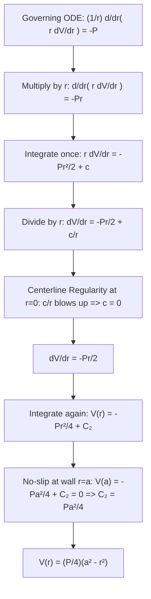
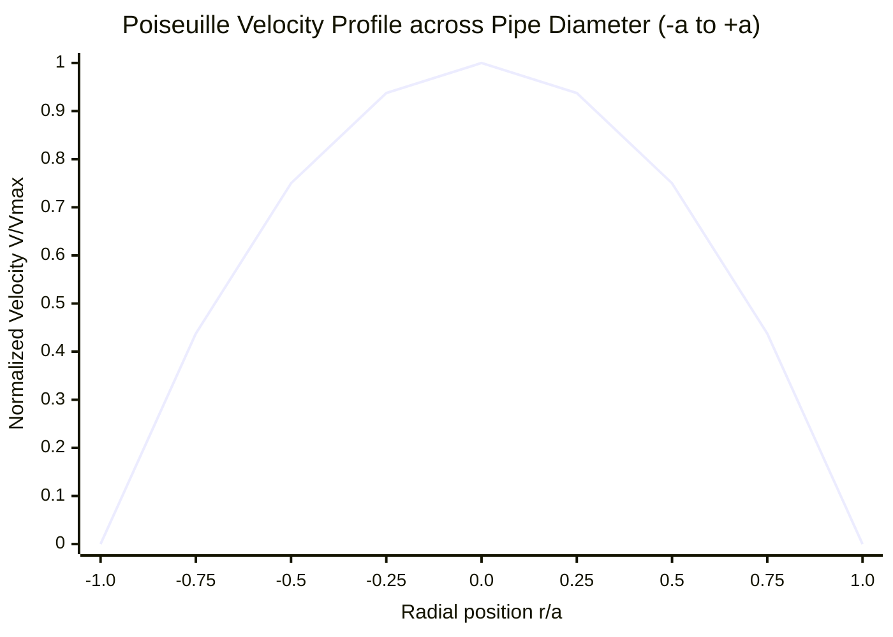

# ✏️ Problem 1.10: Laminar Viscous Poiseuille Flow

## 📄 Enunciado (Problem Statement)

In general, it is not possible to find explicit solutions of the Navier-Stokes equations that govern fluid flow. However, in certain cases the equations simplify very strongly. Suppose that a fluid is flowing down a pipe that has a circular cross-section of radius $a$. Assuming that the velocity $V$ of the fluid depends only on its distance from the centre of the pipe, the equation satisfied by $V$ is:
$$ \frac{1}{r} \frac{d}{dr}\left( r \frac{dV}{dr} \right) = -P $$
where $P > 0$.

Multiply by $r$ and integrate once to show that:
$$ \frac{dV}{dr} = -\frac{Pr}{2} + \frac{c}{r} $$
where $c$ is an arbitrary constant.

Integrate again to find an expression for the velocity, and then use the facts that:  
(i) the velocity should be finite at all points in the pipe, and  
(ii) fluids 'stick' to boundaries (which means that $V(a) = 0$),  
to show that:
$$ V(r) = \frac{P}{4}\left( a^2 - r^2 \right) $$
(Poiseuille flow).

---

## 📊 1. Identificación de Datos e Hipótesis (Phase 1)

### Geometric & Physical Data:
* **Geometry:** Circular cross-section pipe of radius $a$ $[m]$, with radial coordinate $r \in [0, a]$.
* **Centerline:** $r = 0$.
* **Pipe Wall:** $r = a$.
* **Dependent variable:** Axial velocity $V(r)$ $[m/s]$.
* **Independent variable:** Radial coordinate $r$ $[m]$.
* **Driving parameter:** Constant pressure gradient parameter $P \equiv -\frac{1}{\mu}\frac{dp}{dz} > 0$ $[m^{-1} \cdot s^{-1}]$.

### Boundary Conditions:
1. **Regularity at Centerline ($r = 0$):**
   $$ |V(0)| < \infty \quad \text{and} \quad \left| \frac{dV}{dr}(0) \right| < \infty $$
2. **No-Slip Condition at the Wall ($r = a$):**
   $$ V(a) = 0 $$

### Modeling Hypotheses:
* [x] **Steady laminar flow:** $\frac{\partial}{\partial t} = 0$, low Reynolds number ($\text{Re} < 2300$).
* [x] **Axisymmetric & fully developed:** Velocity field is strictly $\vec{u} = (0, 0, V(r))$.
* [x] **Incompressible Newtonian fluid:** Constant density $\rho$ and dynamic viscosity $\mu$.

---

## 🧠 2. Estrategia y Planteamiento Físico (Phase 2)

1. Multiply the governing second-order differential equation by $r$ to make the left-hand side an exact derivative.
2. Integrate once with respect to $r$, generating the first integration constant $c$.
3. Divide by $r$ to obtain the velocity gradient $\frac{dV}{dr}$.
4. Enforce physical regularity at the pipe center $r = 0$: because $\lim_{r\to 0} \frac{1}{r} = \infty$, the constant $c$ must vanish ($c = 0$) to keep fluid velocity and shear stress finite.
5. Integrate a second time to find the velocity profile with second constant $C_2$.
6. Enforce the no-slip condition at the solid wall $V(a) = 0$ to determine $C_2$, concluding with the classic parabolic Poiseuille distribution.

---

## 🔢 3. Resolución Matemática Paso a Paso (Phase 3)

### Step 1: First Integration (Velocity Gradient)
The governing differential equation is:
$$ \frac{1}{r} \frac{d}{dr}\left( r \frac{dV}{dr} \right) = -P \tag{1} $$

Multiply both sides of equation $(1)$ by $r$:
$$ \frac{d}{dr}\left( r \frac{dV}{dr} \right) = -P r \tag{2} $$

Integrate both sides with respect to $r$:
$$ \int \frac{d}{dr}\left( r \frac{dV}{dr} \right) \, dr = \int -P r \, dr $$
By the Fundamental Theorem of Calculus:
$$ r \frac{dV}{dr} = -P \frac{r^2}{2} + c \tag{3} $$
where $c \in \mathbb{R}$ is an arbitrary integration constant.

Divide both sides of equation $(3)$ by $r$ (for $r > 0$):
$$ \mathbf{\frac{dV}{dr} = -\frac{P r}{2} + \frac{c}{r}} \tag{4} $$
This proves the first required intermediate relation.

---

### Step 2: Enforcement of Centerline Regularity ($r = 0$)
Condition (i) states that the velocity and its gradient must remain **finite at all points in the pipe**, specifically including the pipe center $r = 0$.

Examining equation $(4)$ as $r \to 0^+$:
$$ \lim_{r \to 0^+} \frac{dV}{dr} = \lim_{r \to 0^+} \left( -\frac{P r}{2} + \frac{c}{r} \right) = 0 + \lim_{r \to 0^+} \frac{c}{r} $$

If $c \neq 0$:
$$ \lim_{r \to 0^+} \frac{c}{r} = \begin{cases} +\infty & \text{if } c > 0 \\ -\infty & \text{if } c < 0 \end{cases} $$
A divergent velocity gradient at the centerline corresponds to infinite shear stress ($\tau_{rz} = \mu \frac{dV}{dr} \to \pm \infty$) and infinite viscous dissipation, which is physically impossible in a smooth pipe flow without a line vortex or concentrated force.

Therefore, physical regularity strictly requires:
$$ \mathbf{c = 0} \tag{5} $$

Substituting $c = 0$ into equation $(4)$ simplifies the velocity gradient to:
$$ \mathbf{\frac{dV}{dr} = -\frac{P r}{2}} \tag{6} $$

---

### Step 3: Second Integration (Velocity Field)
Integrate equation $(6)$ directly with respect to $r$:
$$ V(r) = \int \left( -\frac{P r}{2} \right) \, dr $$
$$ V(r) = -\frac{P}{2} \left( \frac{r^2}{2} \right) + C_2 $$
$$ \mathbf{V(r) = -\frac{P r^2}{4} + C_2} \tag{7} $$
where $C_2$ is a second integration constant.

---

### Step 4: Enforcement of the No-Slip Boundary Condition ($r = a$)
Condition (ii) dictates that viscous fluids adhere to solid impermeable boundaries without slip:
$$ V(a) = 0 $$

Substitute $r = a$ into equation $(7)$:
$$ 0 = -\frac{P a^2}{4} + C_2 $$

Solving for $C_2$:
$$ \mathbf{C_2 = \frac{P a^2}{4}} \tag{8} $$

Substitute $C_2$ back into equation $(7)$:
$$ V(r) = -\frac{P r^2}{4} + \frac{P a^2}{4} $$

Factor out $\frac{P}{4}$:
$$ \mathbf{V(r) = \frac{P}{4}\left( a^2 - r^2 \right)} \tag{9} $$
This completes the rigorous mathematical proof.

---

## 🎯 4. Resultado Final y Análisis Físico (Phase 4)

### Final Analytical Velocity Profile:
$$ \mathbf{V(r) = \frac{P}{4}\left( a^2 - r^2 \right)} $$

### Physical Quantities & Fluid Dynamics Links:
1. **Maximum Centerline Velocity ($V_{\max}$):**
   Occurs at the pipe center $r = 0$:
   $$ V_{\max} = V(0) = \frac{P a^2}{4} $$
   The velocity profile can be written compactly as:
   $$ V(r) = V_{\max} \left[ 1 - \left(\frac{r}{a}\right)^2 \right] $$
2. **Volumetric Flow Rate ($Q$ — Hagen-Poiseuille Law):**
   Integrating over the circular pipe cross-section $A = \pi a^2$:
   $$ Q = \int_0^a V(r) \cdot 2\pi r \, dr = 2\pi \frac{P}{4} \int_0^a (a^2 r - r^3) \, dr = \frac{\pi P}{2} \left[ \frac{a^2 r^2}{2} - \frac{r^4}{4} \right]_0^a $$
   $$ Q = \frac{\pi P}{2} \left( \frac{a^4}{2} - \frac{a^4}{4} \right) = \frac{\pi P}{2} \left( \frac{a^4}{4} \right) = \mathbf{\frac{\pi P a^4}{8}} $$
   Recalling that $P = -\frac{1}{\mu}\frac{dp}{dz} = \frac{\Delta p}{\mu L}$:
   $$ \mathbf{Q = \frac{\pi a^4 \Delta p}{8 \mu L}} $$
   *Aerospace Note:* The volumetric flow rate scales with the **fourth power of the pipe radius** ($a^4$). Halving fuel line diameter reduces fuel throughput by a factor of 16 for the same pressure drop!
3. **Average Flow Velocity ($V_{\text{avg}}$):**
   $$ V_{\text{avg}} = \frac{Q}{\pi a^2} = \frac{\frac{\pi P a^4}{8}}{\pi a^2} = \frac{P a^2}{8} = \frac{1}{2} V_{\max} $$
4. **Wall Shear Stress ($\tau_w$):**
   $$ \tau_w = -\mu \left. \frac{dV}{dr} \right|_{r=a} = -\mu \left( -\frac{P a}{2} \right) = \frac{\mu P a}{2} = \frac{a}{2}\left( -\frac{dp}{dz} \right) $$

---

## 🔗 Related Notes
* `[[04 - Advanced Maths/Concepto - Navier-Stokes Poiseuille Flow Reduction|Navier-Stokes Poiseuille Flow Reduction]]`
* `[[04 - Advanced Maths/Concepto - Linearity and Order of Differential Equations|Linearity and Order of Differential Equations]]`
* `[[01 - Fluid Mechanics/Mecanica de Fluidos MOC|Fluid Mechanics: Internal Viscous Flows]]`
