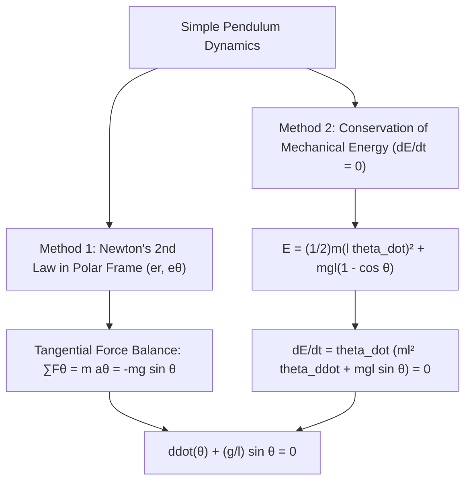

# ✏️ Problem 1.8: Simple Pendulum Equation of Motion

## 📄 Enunciado (Problem Statement)

Consider a simple pendulum consisting of a bob of mass $m$ at the end of a string of length $l$ and negligible mass, and denote by $\theta(t)$ the angle with respect to the vertical as a function of time $t$. Neglecting friction, apply Newton's second law to write a differential equation for $\theta(t)$.

---

## 📊 1. Identificación de Datos e Hipótesis (Phase 1)

### Physical Setup & Coordinate Geometry:
* **Pivot:** Fixed origin $O$ in an inertial reference frame.
* **Pendulum Bob:** Modeled as a point mass $m$ $[kg]$ located at distance $l$ from $O$.
* **String:** Massless, inextensible, perfectly flexible rod/cable of constant length $l$ $[m]$.
* **State variable (Dependent):** $\theta(t)$ $[rad]$, angle measured between the downward vertical and the string (convention: counterclockwise positive).
* **Independent variable:** Time $t$ $[s]$.
* **Gravitational field:** $\vec{g} = g \hat{j}$ directed downward with magnitude $g \approx 9.81\text{ m/s}^2$.

### Modeling Hypotheses:
* [x] **Planar motion:** Motion is strictly constrained to a 2D vertical plane.
* [x] **Inextensibility:** Radial distance from pivot to bob is strictly constant: $r(t) \equiv l$.
* [x] **Zero dissipation:** Air drag and pivot mechanical friction are neglected ($\vec{F}_{\text{diss}} = \vec{0}$).

---

## 🧠 2. Estrategia y Planteamiento Físico (Phase 2)

We present two independent, rigorous physical formulations:

1. **Method 1 (Direct Newtonian Projection):** Define polar unit vectors $(\hat{e}_r, \hat{e}_\theta)$ attached to the string. Resolve string tension $\vec{T}$ and gravity $\vec{F}_g = m\vec{g}$ along the tangential unit vector $\hat{e}_\theta$, where tension vanishes identically because it acts purely radially. Equate to mass times tangential acceleration $a_\theta = l \ddot{\theta}$.
2. **Method 2 (Energy Conservation):** Formulate total mechanical energy $E = E_k + E_p$ and differentiate with respect to time $\frac{dE}{dt} = 0$.

---

## 🔢 3. Resolución Matemática Paso a Paso (Phase 3)

### Method 1: Newton's Second Law along the Tangential Direction

#### Step 1: Kinematics in Polar Coordinates
The position vector of the pendulum bob relative to the pivot $O$ is:
$$ \vec{r}(t) = l \, \hat{e}_r(\theta) $$
where the radial and tangential unit vectors are defined as:
$$ \hat{e}_r = \sin\theta \, \hat{i} - \cos\theta \, \hat{j} $$
$$ \hat{e}_\theta = \cos\theta \, \hat{i} + \sin\theta \, \hat{j} $$

Differentiating the position vector using the chain rule ($\dot{\hat{e}}_r = \dot{\theta} \hat{e}_\theta$):
$$ \vec{v}(t) = \frac{d\vec{r}}{dt} = l \frac{d\hat{e}_r}{dt} = l \dot{\theta} \, \hat{e}_\theta \tag{1} $$
where $v_\theta = l \dot{\theta}$ represents the tangential speed along the circular arc $s = l\theta$.

Differentiating velocity $(1)$ with respect to time ($\dot{\hat{e}}_\theta = -\dot{\theta} \hat{e}_r$):
$$ \vec{a}(t) = \frac{d\vec{v}}{dt} = l \ddot{\theta} \, \hat{e}_\theta + l \dot{\theta} \dot{\hat{e}}_\theta = -l \dot{\theta}^2 \, \hat{e}_r + l \ddot{\theta} \, \hat{e}_\theta \tag{2} $$
The acceleration components are:
* Radial (centripetal) acceleration: $a_r = -l \dot{\theta}^2$.
* Tangential acceleration: $a_\theta = l \ddot{\theta}$.

#### Step 2: Free Body Diagram and Force Resolution
Two forces act on the bob:
1. **String Tension $\vec{T}$:** Acts along the string towards the pivot:
   $$ \vec{T} = -T \, \hat{e}_r $$
   where $T = \|\vec{T}\| > 0$. The tangential component is identically zero: $T_\theta = 0$.
2. **Gravity Force $\vec{F}_g$:** Acts vertically downward:
   $$ \vec{F}_g = -m g \, \hat{j} $$
   Projecting $-\hat{j}$ onto the polar basis:
   $$ -\hat{j} = \cos\theta \, \hat{e}_r - \sin\theta \, \hat{e}_\theta $$
   Thus:
   $$ \vec{F}_g = m g \cos\theta \, \hat{e}_r - m g \sin\theta \, \hat{e}_\theta \tag{3} $$

#### Step 3: Tangential Newton's Second Law
Applying $\sum F_\theta = m a_\theta$:
$$ -m g \sin\theta = m (l \ddot{\theta}) \tag{4} $$

Divide both sides by $m > 0$:
$$ -g \sin\theta = l \ddot{\theta} $$

Rearrange terms by moving all terms to one side:
$$ l \ddot{\theta} + g \sin\theta = 0 $$

Divide the entire equation by the string length $l > 0$:
$$ \mathbf{\ddot{\theta}(t) + \frac{g}{l} \sin\theta(t) = 0} \tag{5} $$

---

### Method 2: Validation via Conservation of Mechanical Energy

1. **Kinetic Energy ($E_k$):**
   $$ E_k = \frac{1}{2} m \|\vec{v}\|^2 = \frac{1}{2} m (l \dot{\theta})^2 = \frac{1}{2} m l^2 \dot{\theta}^2 $$
2. **Potential Energy ($E_p$):**
   Choosing the downward equilibrium position $\theta = 0$ as the reference datum ($E_p(0) = 0$). The elevation $h$ above the lowest point is:
   $$ h(\theta) = l - l \cos\theta = l(1 - \cos\theta) $$
   $$ E_p = m g h = m g l (1 - \cos\theta) $$
3. **Total Mechanical Energy ($E$):**
   $$ E(\theta, \dot{\theta}) = \frac{1}{2} m l^2 \dot{\theta}^2 + m g l (1 - \cos\theta) $$
4. **Time Derivative of Energy:**
   Because all forces doing work are conservative, $\frac{dE}{dt} = 0$:
   $$ \frac{dE}{dt} = \frac{d}{dt}\left[ \frac{1}{2} m l^2 (\dot{\theta})^2 \right] + \frac{d}{dt}\left[ m g l (1 - \cos\theta) \right] = 0 $$
   Applying the chain rule:
   $$ \frac{1}{2} m l^2 \cdot 2 \dot{\theta} \ddot{\theta} + m g l \sin\theta \dot{\theta} = 0 $$
   $$ m l^2 \dot{\theta} \ddot{\theta} + m g l \sin\theta \dot{\theta} = 0 $$
   Factoring out $m l^2 \dot{\theta}$:
   $$ m l^2 \dot{\theta} \left( \ddot{\theta} + \frac{g}{l} \sin\theta \right) = 0 \tag{6} $$
   For a dynamically swinging pendulum, $\dot{\theta}(t) \not\equiv 0$. Therefore, the bracketed term must vanish for all $t$:
   $$ \mathbf{\ddot{\theta} + \frac{g}{l} \sin\theta = 0} $$

---

## 🎯 4. Resultado Final y Análisis Físico (Phase 4)

### Final Equation of Motion:
$$ \mathbf{\frac{d^2\theta}{dt^2} + \frac{g}{l} \sin\theta = 0} $$

### Classification & Physical Discussion:
1. **Mathematical Classification:**
   * **Order:** 2 (highest derivative is $\ddot{\theta}$).
   * **Linearity:** **Nonlinear** because of the trigonometric function $\sin\theta$.
   * **Type:** Autonomous second-order ODE.
2. **Dimensional Analysis:**
   $$ \left[ \frac{d^2\theta}{dt^2} \right] = \frac{[\text{rad}]}{s^2} = s^{-2} $$
   $$ \left[ \frac{g}{l} \sin\theta \right] = \frac{m/s^2}{m} \cdot [1] = s^{-2} $$
   Terms are dimensionally identical.
3. **Small-Angle Linearization ($\theta \ll 1\text{ rad}$):**
   Using the Taylor expansion $\sin\theta = \theta - \frac{\theta^3}{6} + \mathcal{O}(\theta^5) \approx \theta$:
   $$ \ddot{\theta} + \omega_0^2 \theta = 0, \quad \text{where } \omega_0 = \sqrt{\frac{g}{l}} $$
   This recovers the **Simple Harmonic Oscillator (SHO)** with natural period $T_0 = \frac{2\pi}{\omega_0} = 2\pi \sqrt{\frac{l}{g}}$.
4. **Large-Amplitude Nonlinearity:**
   For finite amplitudes $\theta_0$, the true period $T$ increases with amplitude according to the complete elliptic integral of the first kind $K(k)$:
   $$ T = 4 \sqrt{\frac{l}{g}} K\left(\sin\frac{\theta_0}{2}\right) \approx T_0 \left( 1 + \frac{1}{16}\theta_0^2 + \dots \right) $$

---

## 🔗 Related Notes
* `[[04 - Advanced Maths/Concepto - Linearity and Order of Differential Equations|Linearity and Order of Differential Equations]]`
* `[[04 - Advanced Maths/Problema - Ch1-P1 Classification of Differential Equations|Problem 1.1: Equation (viii) Newton's Law in Potential]]`
* `[[03 - Engineering Mechanics/Mecanica de Estructuras MOC|Engineering Mechanics: Rotational Dynamics]]`
