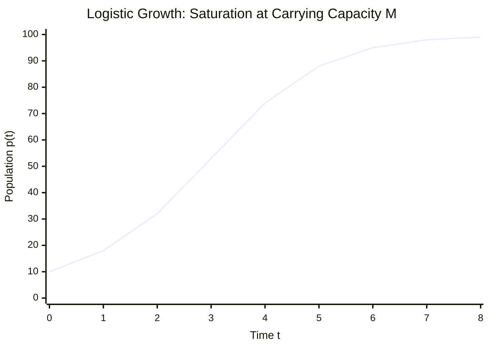

# ✏️ Problem 1.9: Logistic Population Growth Model

## 📄 Enunciado (Problem Statement)

A refinement over Malthus' population growth model discussed in Chapter 1 is provided by the logistic equation:
$$ \frac{dp}{dt} = kp \left( 1 - \frac{p}{M} \right) $$
where $p(t)$ is the population size at time $t$, $k$ is its growth rate (difference between birth rate and death rate), and $M$ is the maximum sustainable population (carrying capacity).

Solve the equation for a generic initial condition $p(t_0) = p_0$ and discuss the evolution of the population for $t \to \infty$, comparing with Malthus' ($M \to \infty$) prediction.

---

## 📊 1. Identificación de Datos e Hipótesis (Phase 1)

### Variables and Parameters:
* **Dependent variable:** Population $p(t) > 0$ $[N]$.
* **Independent variable:** Time $t \ge t_0$ $[T]$.
* **Parameters:**
  * Net intrinsic growth rate: $k = \beta - \delta > 0$ $[T^{-1}]$.
  * Carrying capacity: $M > 0$ $[N]$.
  * Initial state: $p(t_0) = p_0 > 0$ at initial time $t_0$.

### Hypotheses:
* [x] **Density-dependent limitation:** Environmental resistance increases proportionally with population density, reducing the effective growth rate linearly: $k_{\text{eff}}(p) = k\left(1 - \frac{p}{M}\right)$.
* [x] **Continuous differentiability:** $p \in C^1([t_0, \infty))$.
* [x] **Non-trivial initial state:** $p_0 > 0$. If $p_0 = M$, the solution is identically the steady state $p(t) \equiv M$.

---

## 🧠 2. Estrategia y Planteamiento Físico (Phase 2)

1. The logistic equation $\frac{dp}{dt} = \frac{k}{M} p(M - p)$ is a **first-order separable nonlinear ODE**.
2. Separate variables by moving all terms in $p$ to the left-hand side and all terms in $t$ to the right-hand side:
   $$ \frac{dp}{p(M - p)} = \frac{k}{M} dt $$
3. Perform a **partial fraction decomposition** on the rational algebraic fraction $\frac{1}{p(M - p)}$.
4. Integrate both sides from initial state $(t_0, p_0)$ to current state $(t, p(t))$, strictly retaining all intermediate signs.
5. Invert the logarithmic equation to isolate $p(t)$ as an explicit function of time.
6. Evaluate the long-term asymptotic limit $\lim_{t \to \infty} p(t)$ and the unbounded capacity limit $\lim_{M \to \infty} p(t)$, comparing with Malthus' law.

---

## 🔢 3. Resolución Matemática Paso a Paso (Phase 3)

### Step 1: Separation of Variables
Starting from:
$$ \frac{dp}{dt} = k p \left( 1 - \frac{p}{M} \right) = k p \left( \frac{M - p}{M} \right) = \frac{k}{M} p(M - p) $$

Assuming $p \neq 0$ and $p \neq M$, divide by $p(M - p)$ and multiply by $dt$:
$$ \frac{1}{p (M - p)} \, dp = \frac{k}{M} \, dt \tag{1} $$

---

### Step 2: Partial Fraction Decomposition
Express the rational integrand in terms of simple fractions:
$$ \frac{1}{p (M - p)} = \frac{A}{p} + \frac{B}{M - p} $$

Multiply both sides by the denominator $p(M - p)$:
$$ 1 = A(M - p) + B p $$

Determine constants $A$ and $B$:
* Substitute $p = 0$:
  $$ 1 = A(M - 0) + B(0) \implies 1 = A M \implies A = \frac{1}{M} $$
* Substitute $p = M$:
  $$ 1 = A(M - M) + B(M) \implies 1 = B M \implies B = \frac{1}{M} $$

Substitute $A$ and $B$ back:
$$ \frac{1}{p(M - p)} = \frac{1}{M} \left( \frac{1}{p} + \frac{1}{M - p} \right) $$

Substitute this decomposition into equation $(1)$:
$$ \frac{1}{M} \left( \frac{1}{p} + \frac{1}{M - p} \right) dp = \frac{k}{M} \, dt $$

Multiply both sides by $M$:
$$ \left( \frac{1}{p} + \frac{1}{M - p} \right) dp = k \, dt \tag{2} $$

---

### Step 3: Exact Definite Integration
Integrate equation $(2)$ from $t_0$ (where $p = p_0$) to $t$ (where $p = p(t)$):
$$ \int_{p_0}^p \left( \frac{1}{u} + \frac{1}{M - u} \right) du = \int_{t_0}^t k \, ds $$

Compute the antiderivatives:
$$ \int \frac{1}{u} \, du = \ln|u| $$
$$ \int \frac{1}{M - u} \, du = -\ln|M - u| $$

Applying the integration limits:
$$ \left[ \ln|u| - \ln|M - u| \right]_{p_0}^p = k [s]_{t_0}^t $$
$$ \left[ \ln\left| \frac{u}{M - u} \right| \right]_{p_0}^p = k(t - t_0) $$
$$ \ln\left| \frac{p}{M - p} \right| - \ln\left| \frac{p_0}{M - p_0} \right| = k(t - t_0) $$

Combine the logarithms on the left-hand side:
$$ \ln\left| \frac{p(M - p_0)}{p_0(M - p)} \right| = k(t - t_0) \tag{3} $$

---

### Step 4: Exponentiation and Algebraic Isolation of $p(t)$
Exponentiate both sides of $(3)$:
$$ \frac{p(M - p_0)}{(M - p) p_0} = e^{k(t - t_0)} $$

Multiply both sides by $(M - p) p_0$:
$$ p (M - p_0) = p_0 (M - p) e^{k(t - t_0)} $$
Expand the right-hand side:
$$ p (M - p_0) = M p_0 e^{k(t - t_0)} - p p_0 e^{k(t - t_0)} $$

Move all terms involving $p$ to the left-hand side:
$$ p (M - p_0) + p p_0 e^{k(t - t_0)} = M p_0 e^{k(t - t_0)} $$

Factor out $p$:
$$ p \left[ (M - p_0) + p_0 e^{k(t - t_0)} \right] = M p_0 e^{k(t - t_0)} $$

Divide by the bracketed expression:
$$ p(t) = \frac{M p_0 e^{k(t - t_0)}}{(M - p_0) + p_0 e^{k(t - t_0)}} \tag{4} $$

Divide both the numerator and the denominator by $e^{k(t - t_0)}$:
$$ \mathbf{p(t) = \frac{M p_0}{p_0 + (M - p_0) e^{-k(t - t_0)}}} \tag{5} $$

---

## 🎯 4. Resultado Final y Análisis Físico (Phase 4)

### Final Analytical Solution:
$$ \mathbf{p(t) = \frac{M p_0}{p_0 + (M - p_0) e^{-k(t - t_0)}}} $$

### Asymptotic Evolution as $t \to \infty$:
Since $k > 0$, as $t \to \infty$, the term $(t - t_0) \to +\infty$, which drives the exponential decay term to zero:
$$ \lim_{t \to \infty} e^{-k(t - t_0)} = 0 $$

Evaluating the limit:
$$ \lim_{t \to \infty} p(t) = \frac{M p_0}{p_0 + (M - p_0) \cdot 0} = \frac{M p_0}{p_0} = \mathbf{M} $$

* **Physical Interpretation:** Regardless of whether the initial population starts below the carrying capacity ($0 < p_0 < M$, sigmoidal growth) or above it ($p_0 > M$, monotonic die-off), the population asymptotically stabilizes at the **carrying capacity $M$**. The equilibrium state $p = M$ is globally asymptotically stable for all $p_0 > 0$.

---

### Comparison with Malthus' Prediction ($M \to \infty$):
Divide the numerator and denominator of $(5)$ by $M$:
$$ p(t) = \frac{p_0}{\frac{p_0}{M} + \left(1 - \frac{p_0}{M}\right) e^{-k(t - t_0)}} $$

Taking the mathematical limit as carrying capacity becomes infinite ($M \to \infty$):
$$ \lim_{M \to \infty} \frac{p_0}{M} = 0 $$
$$ \lim_{M \to \infty} p(t) = \frac{p_0}{0 + (1 - 0) e^{-k(t - t_0)}} = \frac{p_0}{e^{-k(t - t_0)}} = \mathbf{p_0 e^{k(t - t_0)}} $$

* **Comparison:** Malthus' model predicts unconstrained exponential growth without bound ($\lim_{t\to\infty} p_{\text{Malthus}} = +\infty$), corresponding physically to an infinite environment ($M \to \infty$). Verhulst's logistic equation contains Malthus' model as a special asymptotic limit, but reflects finite resources by bending the trajectory into a saturation asymptote at $p = M$.

---

## 🔗 Related Notes
* `[[04 - Advanced Maths/Concepto - Logistic Equation and Carrying Capacity|Logistic Equation and Carrying Capacity]]`
* `[[04 - Advanced Maths/Concepto - First-Order Physical Models|First-Order Physical Models]]`
* `[[04 - Advanced Maths/Problema - Ch1-P2 Malthusian Population Dynamics|Problem 1.2: Malthusian Population Dynamics]]`
