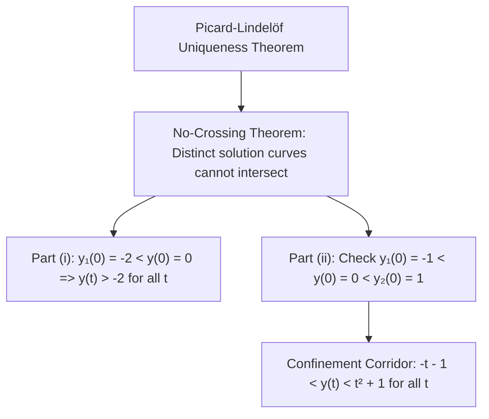

# ✏️ Problem 2.12: Trajectory Crossing and Uniqueness Bounds

## 📄 Enunciado (Problem Statement)

Consider $\frac{dy}{dt} = f(y, t)$, where $f$ satisfies the hypotheses of the existence and uniqueness theorem.

(i) $y_1(t) = -2$ for all $t$ is a solution, and we are studying a different solution for which $y(0) = 0$.  
(ii) $y_1(t) = -t - 1$ and $y_2(t) = t^2 + 1$ are solutions, and $y(0) = 0$.

Based on the uniqueness theorem, what can you conclude about the solutions in each case?

---

## 📊 1. Identificación de Datos e Hipótesis (Phase 1)

### Mathematical Setting:
* **Differential Equation:** $\frac{dy}{dt} = f(y, t)$.
* **Hypothesis on $f$:** $f$ and $\frac{\partial f}{\partial y}$ are continuous on $\mathbb{R}^2$, satisfying the conditions of the **Picard-Lindelöf Existence and Uniqueness Theorem**.
* **Known Solutions & Initial Conditions:**
  * **Part (i):** Known constant solution $y_1(t) \equiv -2$. Target solution $y(t)$ satisfies $y(0) = 0$.
  * **Part (ii):** Known solutions $y_1(t) = -t - 1$ and $y_2(t) = t^2 + 1$. Target solution $y(t)$ satisfies $y(0) = 0$.

---

## 🧠 2. Estrategia y Planteamiento Físico (Phase 2)

1. **The No-Crossing Principle:** Under Picard's theorem, through every point $(t^*, y^*)$ in the phase plane passes **one and only one** solution curve. Therefore, two distinct solution curves cannot intersect, touch, or cross each other.
2. In each part, compare the initial condition $y(0)$ with the values of the known solutions at $t = 0$.
3. Because solutions are continuous functions, an inequality established at $t = 0$ must persist for all $t$ in the common interval of existence.

---

## 🔢 3. Resolución Matemática Paso a Paso (Phase 3)

### The Fundamental No-Crossing Lemma
Let $u(t)$ and $v(t)$ be two solutions of $\frac{dy}{dt} = f(y, t)$ defined on an open interval $I$. If there exists a point $t_0 \in I$ such that $u(t_0) < v(t_0)$, then:
$$ u(t) < v(t) \quad \forall t \in I $$

*Proof by Contradiction:*
Suppose there exists $t_1 \in I$ such that $u(t_1) \ge v(t_1)$.
Define the difference function $\Delta(t) = v(t) - u(t)$. By hypothesis, $\Delta(t)$ is continuous on $I$, with $\Delta(t_0) = v(t_0) - u(t_0) > 0$ and $\Delta(t_1) = v(t_1) - u(t_1) \le 0$.
By the **Intermediate Value Theorem**, there must exist a point $t^* \in [t_0, t_1]$ (or $[t_1, t_0]$) such that:
$$ \Delta(t^*) = 0 \iff u(t^*) = v(t^*) \equiv y^* $$
Now consider the Initial Value Problem:
$$ \begin{cases} \dfrac{dy}{dt} = f(y, t) \\ y(t^*) = y^* \end{cases} $$
Both $u(t)$ and $v(t)$ satisfy this IVP. But by the Picard-Lindelöf Theorem, this IVP has a **strictly unique** local solution, which implies $u(t) \equiv v(t)$ everywhere on $I$. This contradicts our initial assumption that $u(t_0) < v(t_0)$.
Therefore, no such intersection point $t^*$ can exist, and $u(t) < v(t)$ for all $t \in I$. $\blacksquare$

---

### Part (i): Analysis with Barrier $y_1(t) = -2$
* We have a known solution $y_1(t) = -2$ for all $t \in \mathbb{R}$.
* We examine a distinct solution $y(t)$ with $y(0) = 0$.
* Compare at the initial time $t = 0$:
  $$ y(0) = 0 > -2 = y_1(0) $$
* Applying the No-Crossing Lemma with $u(t) = y_1(t)$ and $v(t) = y(t)$:
  $$ y(t) > y_1(t) \quad \forall t $$
  $$ \mathbf{y(t) > -2 \quad \forall t \in \text{Domain}(y)} \tag{1} $$

*Conclusion:* The solution $y(t)$ can never cross or reach the value $-2$. The line $y = -2$ acts as an impermeable lower barrier.

---

### Part (ii): Analysis with Barriers $y_1(t) = -t - 1$ and $y_2(t) = t^2 + 1$

#### Step 1: Verification of Non-Intersection of the Barrier Solutions
First check whether the barrier curves $y_1(t)$ and $y_2(t)$ intersect each other:
$$ y_2(t) - y_1(t) = (t^2 + 1) - (-t - 1) = t^2 + t + 2 $$
The discriminant of this quadratic is:
$$ \Delta = 1^2 - 4(1)(2) = 1 - 8 = -7 < 0 $$
Because the discriminant is negative and the leading coefficient is positive ($1 > 0$):
$$ y_2(t) - y_1(t) > 0 \iff y_1(t) < y_2(t) \quad \forall t \in \mathbb{R} $$
The two known solutions never intersect each other.

#### Step 2: Evaluation at Initial Time $t = 0$
Evaluate both barrier solutions at $t = 0$:
$$ y_1(0) = -0 - 1 = -1 $$
$$ y_2(0) = 0^2 + 1 = 1 $$

Compare with the target initial condition $y(0) = 0$:
$$ y_1(0) = -1 < y(0) = 0 < y_2(0) = 1 $$

#### Step 3: Application of the Confinement Lemma
Applying the No-Crossing Lemma to both boundaries simultaneously:
1. Since $y_1(0) < y(0)$, $y(t) > y_1(t)$ for all $t$.
2. Since $y(0) < y_2(0)$, $y(t) < y_2(t)$ for all $t$.

Combining the two strict inequalities:
$$ \mathbf{-t - 1 < y(t) < t^2 + 1 \quad \forall t \in \text{Domain}(y)} \tag{2} $$

---

## 🎯 4. Resultado Final y Análisis Físico (Phase 4)

### Final Conclusions:
* **(i) Lower Bound:**
  $$ \mathbf{y(t) > -2 \quad \forall t} $$
  The solution trajectory is strictly bounded from below by the constant solution $-2$.
* **(ii) Confinement Corridor:**
  $$ \mathbf{-t - 1 < y(t) < t^2 + 1 \quad \forall t} $$
  The solution trajectory is permanently trapped inside the region between the straight line $y = -t - 1$ and the parabola $y = t^2 + 1$.

### Physical & Qualitative Significance:
* **Barrier Method / Comparison Theorems:** In aerospace engineering (e.g., flight envelope protection, re-entry thermal bounds), differential equations are often too complex to solve in closed form. The No-Crossing Theorem allows engineers to prove that a spacecraft trajectory or temperature profile **remains safely bounded within a certified flight corridor** simply by constructing upper and lower analytical barrier solutions.

---

## 🔗 Related Notes
* `[[04 - Advanced Maths/Concepto - Analisis Cualitativo de EDOs Autonomas y Estabilidad|Autonomous Dynamics & No-Crossing]]`
* `[[04 - Advanced Maths/Concepto - Well-Posed Problems and Picard Theorem|Picard Uniqueness Theorem]]`
* `[[04 - Advanced Maths/Problema - Ch2-P13 Multi-Equilibria Autonomous Phase Line Dynamics|Problem 2.13: Equilibrium Confinement]]`
