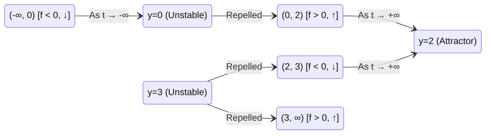

# ✏️ Problem 2.13: Multi-Equilibria Autonomous Phase Line Dynamics

## 📄 Enunciado (Problem Statement)

Consider the autonomous differential equation:
$$ \frac{dy}{dt} = y(y - 2)(y - 3) $$
In each of the following cases, what can you conclude based on the uniqueness theorem about the different solutions if:

(i) $y(0) = -1$  
(ii) $y(0) = 1$  
(iii) $y(0) = 2$  
(iv) $y(0) = 4$?

---

## 📊 1. Identificación de Datos e Hipótesis (Phase 1)

### Mathematical Structure:
* Autonomous ODE: $\frac{dy}{dt} = f(y)$ where:
  $$ f(y) = y(y - 2)(y - 3) = y(y^2 - 5y + 6) = y^3 - 5y^2 + 6y $$
* Regularity: $f(y)$ is a smooth cubic polynomial on $\mathbb{R}$. Both $f$ and $f'$ are continuous, so the **Picard-Lindelöf Existence and Uniqueness Theorem** holds unconditionally on all of $\mathbb{R}$.

### Equilibrium Solutions:
Equilibria satisfy $f(y) = 0$:
$$ y(y - 2)(y - 3) = 0 \implies \mathbf{y_1^* = 0, \quad y_2^* = 2, \quad y_3^* = 3} $$
By uniqueness, these three values define three eternal **constant solutions**:
$$ y(t) \equiv 0, \quad y(t) \equiv 2, \quad y(t) \equiv 3 \quad \forall t \in \mathbb{R} $$

---

## 🧠 2. Estrategia y Planteamiento Físico (Phase 2)

1. **Phase Line Partitioning:** The three equilibria partition the real phase line $\mathbb{R}$ into four mutually disjoint invariant intervals:
   $$ I_1 = (-\infty, 0), \quad I_2 = (0, 2), \quad I_3 = (2, 3), \quad I_4 = (3, \infty) $$
2. **The No-Crossing Barrier Property:** By the Picard-Lindelöf theorem, no trajectory can intersect any of the lines $y = 0$, $y = 2$, or $y = 3$. Therefore, **any solution starting in an interval remains trapped inside that interval for all time**.
3. **Sign Analysis of the Velocity Field $f(y)$:**
   * On $(-\infty, 0)$: $f(-1) = (-1)(-3)(-4) = -12 < 0 \implies \dot{y} < 0$ (decreasing).
   * On $(0, 2)$: $f(1) = (1)(-1)(-2) = +2 > 0 \implies \dot{y} > 0$ (increasing).
   * On $(2, 3)$: $f(2.5) = (2.5)(0.5)(-0.5) = -0.625 < 0 \implies \dot{y} < 0$ (decreasing).
   * On $(3, \infty)$: $f(4) = (4)(2)(1) = +8 > 0 \implies \dot{y} > 0$ (increasing).
4. **Analytical Stability Analysis ($f'(y^*)$):**
   $$ f'(y) = 3y^2 - 10y + 6 $$
   * $f'(0) = +6 > 0 \implies \mathbf{Unstable\ (Repellor)}$.
   * $f'(2) = 3(4) - 20 + 6 = -2 < 0 \implies \mathbf{Asymptotically\ Stable\ (Attractor)}$.
   * $f'(3) = 3(9) - 30 + 6 = +3 > 0 \implies \mathbf{Unstable\ (Repellor)}$.

---

## 🔢 3. Resolución Matemática Paso a Paso (Phase 3)

### Case (i): Initial Condition $y(0) = -1$
* **Interval Placement:** $y(0) = -1 \in I_1 = (-\infty, 0)$.
* **Confinement by Uniqueness:**
  The solution cannot cross the equilibrium barrier $y = 0$:
  $$ \mathbf{y(t) < 0 \quad \forall t \text{ in its domain}} $$
* **Monotonicity & Asymptotics:**
  Because $f(y) < 0$ for all $y \in (-\infty, 0)$, $\dot{y}(t) < 0$. The solution is **strictly monotonically decreasing**.
  * As $t$ increases forward in time, $y(t)$ decreases toward $-\infty$ (blowing up in finite time or diverging).
  * As $t \to -\infty$ (backwards in time), $y(t)$ increases and asymptotically approaches the unstable equilibrium $0$:
    $$ \lim_{t \to -\infty} y(t) = 0 $$

---

### Case (ii): Initial Condition $y(0) = 1$
* **Interval Placement:** $y(0) = 1 \in I_2 = (0, 2)$.
* **Confinement by Uniqueness:**
  The solution is bounded between the two neighboring equilibrium solutions $y = 0$ and $y = 2$:
  $$ \mathbf{0 < y(t) < 2 \quad \forall t \in (-\infty, \infty)} $$
* **Global Existence:** Because $y(t)$ is bounded inside a compact interval $[0, 2]$, it cannot blow up to infinity in finite time. Hence, the solution exists **globally for all $t \in \mathbb{R}$**.
* **Monotonicity & Asymptotics:**
  Because $f(y) > 0$ on $(0, 2)$, $\dot{y}(t) > 0$. The solution is **strictly monotonically increasing**.
  * As $t \to +\infty$: $\mathbf{\lim_{t \to +\infty} y(t) = 2}$ (attracted to the stable equilibrium $y = 2$).
  * As $t \to -\infty$: $\mathbf{\lim_{t \to -\infty} y(t) = 0}$ (originates from the unstable equilibrium $y = 0$).

---

### Case (iii): Initial Condition $y(0) = 2$
* **State Identification:** $y = 2$ is an exact root of the vector field: $f(2) = 2(0)(-1) = 0$.
* **Uniqueness Deduction:**
  The constant function $y(t) \equiv 2$ is a solution to $\frac{dy}{dt} = f(y)$ and satisfies $y(0) = 2$.
  By the Picard-Lindelöf Uniqueness Theorem, there is **only one** solution satisfying this initial condition.
  Therefore:
  $$ \mathbf{y(t) \equiv 2 \quad \forall t \in \mathbb{R}} $$
  The state remains permanently fixed at this stationary equilibrium.

---

### Case (iv): Initial Condition $y(0) = 4$
* **Interval Placement:** $y(0) = 4 \in I_4 = (3, \infty)$.
* **Confinement by Uniqueness:**
  The solution cannot cross the lower barrier $y = 3$:
  $$ \mathbf{y(t) > 3 \quad \forall t \text{ in its domain}} $$
* **Monotonicity & Asymptotics:**
  Because $f(y) > 0$ for all $y \in (3, \infty)$, $\dot{y}(t) > 0$. The solution is **strictly monotonically increasing**.
  * As $t$ increases forward in time, $y(t)$ grows rapidly and exhibits finite-time blow-up to $+\infty$ (since $f(y) \sim y^3$).
  * As $t \to -\infty$, $y(t)$ decreases backwards in time and asymptotically approaches the unstable equilibrium $3$:
    $$ \lim_{t \to -\infty} y(t) = 3 $$

---

## 🎯 4. Resultado Final y Análisis Físico (Phase 4)

### Master Classification of Trajectories:

| Initial Condition | Invariant Domain | Trajectory Behavior | Asymptote as $t \to +\infty$ | Asymptote as $t \to -\infty$ |
| :---: | :---: | :---: | :---: | :---: |
| **(i) $y(0) = -1$** | $y(t) < 0$ | Strictly decreasing | $\to -\infty$ (diverges) | $\mathbf{0}$ |
| **(ii) $y(0) = 1$** | $\mathbf{0 < y(t) < 2}$ | Strictly increasing (sigmoidal) | $\mathbf{2}$ (Attractor) | $\mathbf{0}$ (Repellor) |
| **(iii) $y(0) = 2$** | $y(t) \equiv 2$ | Stationary constant | $\mathbf{2}$ | $\mathbf{2}$ |
| **(iv) $y(0) = 4$** | $y(t) > 3$ | Strictly increasing | $\to +\infty$ (blow-up) | $\mathbf{3}$ |

---

## 🔗 Related Notes
* `[[04 - Advanced Maths/Concepto - Analisis Cualitativo de EDOs Autonomas y Estabilidad|Autonomous Qualitative Dynamics]]`
* `[[04 - Advanced Maths/Problema - Ch2-P12 Trajectory Crossing and Uniqueness Bounds|Problem 2.12: Trajectory Crossing Bounds]]`
* `[[04 - Advanced Maths/Problema - Ch2-P16 Pitchfork Phase Line and Stability Regimes|Problem 2.16: Pitchfork Stability Analysis]]`
