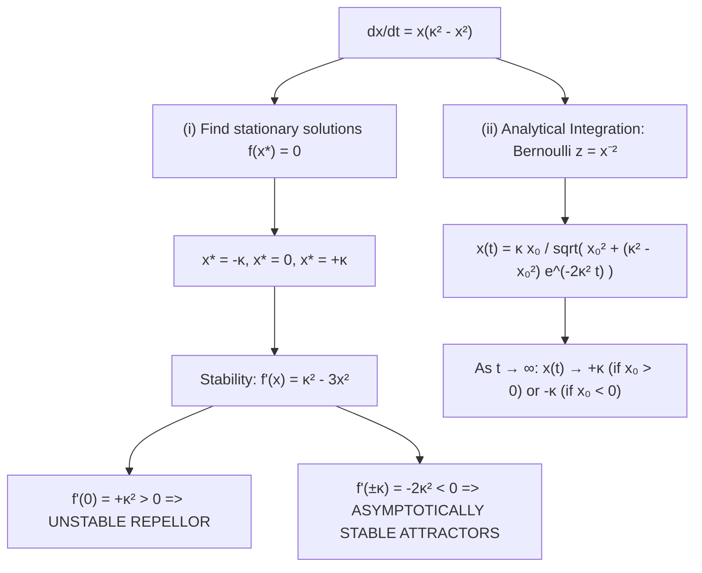
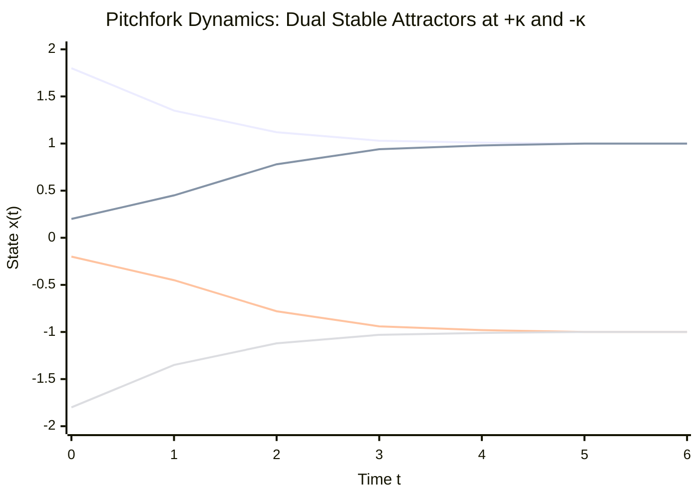

# ✏️ Problem 2.16: Pitchfork Phase Line and Stability Regimes

## 📄 Enunciado (Problem Statement)

Consider the autonomous equation:
$$ \frac{dx}{dt} = x(\kappa^2 - x^2) $$
with a general initial condition $x(0) = x_0$ and parameter $\kappa > 0$.

(i) Calculate the stationary solutions, which satisfy $\frac{dx}{dt} = 0$.  
(ii) Calculate and sketch the solutions for $t > 0$, discussing the different behaviors which can be obtained in terms of the relative values of $\kappa > 0$ and $x_0$, with the help of the uniqueness theorem.

---

## 📊 1. Identificación de Datos e Hipótesis (Phase 1)

### Mathematical Structure:
* **Autonomous Equation:** $\dot{x} = f(x)$, where $f(x) = x(\kappa^2 - x^2) = \kappa^2 x - x^3$.
* **Parameter:** $\kappa > 0$ (constant scale factor).
* **Initial State:** $x(0) = x_0 \in \mathbb{R}$.
* **Regularity:** $f(x)$ is a smooth odd polynomial of degree 3 ($f \in C^\infty(\mathbb{R})$).
  The Picard-Lindelöf Existence and Uniqueness Theorem applies globally across all of $\mathbb{R}$.

---

## 🧠 2. Estrategia y Planteamiento Físico (Phase 2)

1. **Part (i):** Factor $f(x)$ to obtain the roots $f(x^*) = 0$.
2. **Part (ii):**
   * Perform stability analysis by evaluating $f'(x^*)$.
   * Use the **No-Crossing Theorem** to partition the phase line into invariant regions.
   * Solve the equation analytically for general $x_0$ using the Bernoulli substitution $z = x^{-2}$ or partial fractions.
   * Classify trajectories into regimes and evaluate their asymptotic limits as $t \to \infty$.

---

## 🔢 3. Resolución Matemática Paso a Paso (Phase 3)

### Part (i): Calculation of Stationary Solutions
Stationary solutions satisfy $\frac{dx}{dt} = 0$:
$$ f(x) = x(\kappa^2 - x^2) = 0 $$
Factoring as a difference of squares:
$$ x(\kappa - x)(\kappa + x) = 0 $$

Since $\kappa > 0$, this yields exactly three distinct real roots:
$$ \mathbf{x_1^* = -\kappa, \quad x_2^* = 0, \quad x_3^* = +\kappa} \tag{1} $$

The corresponding constant solutions are:
$$ x(t) \equiv -\kappa, \quad x(t) \equiv 0, \quad x(t) \equiv +\kappa \quad \forall t \in \mathbb{R} $$

---

### Part (ii): Qualitative Dynamics, Analytical Solution, and Regimes

#### 1. Stability Analysis via Linearization
Compute the derivative of the vector field:
$$ f'(x) = \frac{d}{dx}\left( \kappa^2 x - x^3 \right) = \kappa^2 - 3x^2 \tag{2} $$

* **At $x = 0$:**
  $$ f'(0) = \kappa^2 - 0 = +\kappa^2 > 0 \implies \mathbf{Unstable\ Equilibrium\ (Repellor)} $$
* **At $x = \pm\kappa$:**
  $$ f'(\pm\kappa) = \kappa^2 - 3(\pm\kappa)^2 = \kappa^2 - 3\kappa^2 = -2\kappa^2 < 0 \implies \mathbf{Asymptotically\ Stable\ (Attractors)} $$

---

#### 2. Exact Analytical Integration
Equation $\frac{dx}{dt} = \kappa^2 x - x^3$ is a **Bernoulli equation** with $\alpha = 3$.
Divide by $x^3$ (for $x \neq 0$):
$$ x^{-3} \frac{dx}{dt} - \kappa^2 x^{-2} = -1 $$

Let $z(t) = [x(t)]^{-2}$. Then $\frac{dz}{dt} = -2 x^{-3} \frac{dx}{dt} \implies x^{-3} \frac{dx}{dt} = -\frac{1}{2} \frac{dz}{dt}$:
$$ -\frac{1}{2} \frac{dz}{dt} - \kappa^2 z = -1 \iff \mathbf{\frac{dz}{dt} + 2\kappa^2 z = 2} \tag{3} $$

This is a first-order linear ODE with constant coefficients:
* Integrating factor: $\mu(t) = e^{2\kappa^2 t}$.
* Total derivative: $\frac{d}{dt}[z e^{2\kappa^2 t}] = 2 e^{2\kappa^2 t}$.
* Integration:
  $$ z(t) e^{2\kappa^2 t} = \frac{2}{2\kappa^2} e^{2\kappa^2 t} + C = \frac{1}{\kappa^2} e^{2\kappa^2 t} + C $$
  $$ z(t) = \frac{1}{\kappa^2} + C e^{-2\kappa^2 t} $$

Apply initial condition $z(0) = \frac{1}{x_0^2}$:
$$ \frac{1}{x_0^2} = \frac{1}{\kappa^2} + C \implies C = \frac{1}{x_0^2} - \frac{1}{\kappa^2} = \frac{\kappa^2 - x_0^2}{\kappa^2 x_0^2} $$

Substitute $C$ back into $z(t)$:
$$ z(t) = \frac{1}{\kappa^2} + \frac{\kappa^2 - x_0^2}{\kappa^2 x_0^2} e^{-2\kappa^2 t} = \frac{x_0^2 + (\kappa^2 - x_0^2)e^{-2\kappa^2 t}}{\kappa^2 x_0^2} $$

Since $x(t) = \frac{\text{sgn}(x_0)}{\sqrt{z(t)}}$:
$$ \mathbf{x(t) = \frac{\kappa x_0}{\sqrt{x_0^2 + (\kappa^2 - x_0^2) e^{-2\kappa^2 t}}}} \tag{4} $$

---

#### 3. Trajectory Regimes & Uniqueness Confinement
By the No-Crossing Theorem, solutions cannot cross the barrier lines $x = -\kappa$, $x = 0$, and $x = +\kappa$. The behavior is classified into five distinct regimes:

1. **Regime 1 ($x_0 > \kappa$):**
   * $x_0^2 > \kappa^2 \implies \kappa^2 - x_0^2 < 0 \implies f(x) < 0$.
   * $\dot{x} < 0$: the solution is **strictly decreasing**.
   * It is bounded below by the barrier $x = \kappa$: $x(t) > \kappa$ for all $t \ge 0$.
   * As $t \to \infty$: $e^{-2\kappa^2 t} \to 0 \implies \mathbf{\lim_{t\to\infty} x(t) = +\kappa}$.
2. **Regime 2 ($0 < x_0 < \kappa$):**
   * $0 < x_0^2 < \kappa^2 \implies \kappa^2 - x_0^2 > 0 \implies f(x) > 0$.
   * $\dot{x} > 0$: the solution is **strictly increasing** (sigmoidal).
   * Trapped inside the corridor: $0 < x(t) < \kappa$ for all $t$.
   * As $t \to \infty$: $\mathbf{\lim_{t\to\infty} x(t) = +\kappa}$.
3. **Regime 3 ($x_0 = 0$):**
   * Stationary state: $\mathbf{x(t) \equiv 0}$ for all $t$.
4. **Regime 4 ($-\kappa < x_0 < 0$):**
   * $x_0 < 0$ and $x_0^2 < \kappa^2 \implies f(x) < 0$.
   * $\dot{x} < 0$: the solution is **strictly decreasing**.
   * Trapped inside the corridor: $-\kappa < x(t) < 0$ for all $t$.
   * As $t \to \infty$: $\mathbf{\lim_{t\to\infty} x(t) = -\kappa}$.
5. **Regime 5 ($x_0 < -\kappa$):**
   * $x_0 < 0$ and $x_0^2 > \kappa^2 \implies f(x) > 0$.
   * $\dot{x} > 0$: the solution is **strictly increasing**.
   * Bounded above by the barrier $x = -\kappa$: $x(t) < -\kappa$ for all $t \ge 0$.
   * As $t \to \infty$: $\mathbf{\lim_{t\to\infty} x(t) = -\kappa}$.

---

## 🎯 4. Resultado Final y Análisis Físico (Phase 4)

### Master Summary:
* **(i) Stationary Equilibria:**
  $$ \mathbf{x^* \in \{-\kappa, \, 0, \, +\kappa\}} $$
* **(ii) Analytical Solution:**
  $$ \mathbf{x(t) = \frac{\kappa x_0}{\sqrt{x_0^2 + (\kappa^2 - x_0^2) e^{-2\kappa^2 t}}}} $$
* **Bistable Asymptotic Attractors:**
  $$ \lim_{t \to \infty} x(t) = \begin{cases} +\kappa & \text{if } x_0 > 0 \\ 0 & \text{if } x_0 = 0 \\ -\kappa & \text{if } x_0 < 0 \end{cases} $$

### Aerospace & Aeroelastic Context:
This equation is the canonical normal form of a **supercritical pitchfork bifurcation**. In transonic aerodynamics, it models the divergence of a symmetric airfoil experiencing aerodynamic pitch instability: the neutral symmetric state ($x = 0$) becomes unstable, and the wing settles onto one of two stable non-zero trim angles ($+\kappa$ or $-\kappa$).

---

## 🔗 Related Notes
* `[[04 - Advanced Maths/Concepto - Analisis Cualitativo de EDOs Autonomas y Estabilidad|Autonomous Dynamics & Bifurcations]]`
* `[[04 - Advanced Maths/Problema - Ch2-P13 Multi-Equilibria Autonomous Phase Line Dynamics|Problem 2.13: Multi-Equilibria Phase Line]]`
