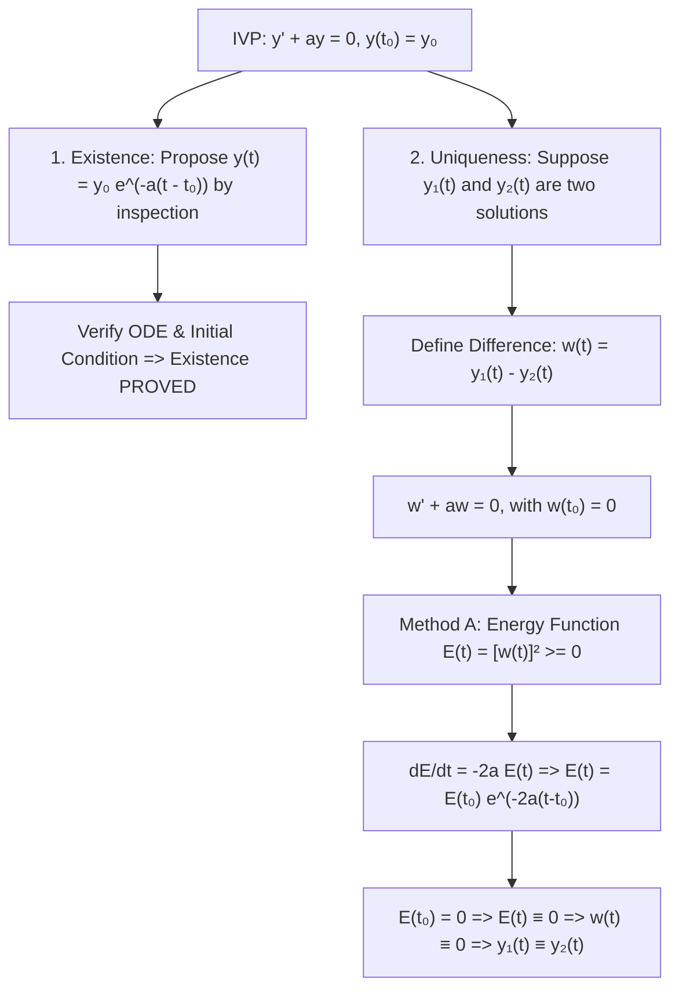

# ✏️ Problem 2.17: Direct Difference Method for Uniqueness

## 📄 Enunciado (Problem Statement)

Show existence and uniqueness for the initial value problem (IVP):
$$ \frac{dy}{dt} + ay = 0, \quad y(t_0) = y_0 $$
For existence, just find a solution by inspection. Then suppose that there are two different solutions and argue that they have to be the same by taking their difference.

---

## 📊 1. Identificación de Datos e Hipótesis (Phase 1)

### Mathematical Setting:
* **Differential Equation:** $y'(t) + a y(t) = 0$ (linear homogeneous with constant parameter $a \in \mathbb{R}$).
* **Initial Condition:** $y(t_0) = y_0 \in \mathbb{R}$.
* **Objective:**
  1. Prove **existence** by verifying an explicit candidate solution found by inspection.
  2. Prove **uniqueness** by analyzing the difference $w(t) = y_1(t) - y_2(t)$ between two arbitrary solutions without invoking the general Picard-Lindelöf theorem.

---

## 🧠 2. Estrategia y Planteamiento Físico (Phase 2)

1. **Existence by Inspection:** The exponential function $e^{-at}$ satisfies $\frac{d}{dt}(e^{-at}) = -a e^{-at}$. Scaling by $y_0$ and shifting time by $t_0$ yields the candidate $y(t) = y_0 e^{-a(t - t_0)}$.
2. **Uniqueness via the Difference Method:**
   * Assume two hypothetical solutions $y_1(t)$ and $y_2(t)$ exist for the same initial data.
   * Define the error/difference function $w(t) \equiv y_1(t) - y_2(t)$.
   * By linearity of the differential operator, $w(t)$ satisfies the identical homogeneous ODE with a **zero initial condition**: $w(t_0) = 0$.
   * Construct an energy functional $E(t) = [w(t)]^2$ (or apply an integrating factor to $w$) to prove that $w(t) \equiv 0$ for all $t$.
   * Conclude that $y_1(t) \equiv y_2(t)$, proving uniqueness.

---

## 🔢 3. Resolución Matemática Paso a Paso (Phase 3)

### Step 1: Proof of Existence by Inspection

#### Propose Candidate Solution:
Consider the trial function:
$$ y(t) = y_0 e^{-a(t - t_0)} \tag{1} $$

#### Verification of Initial Condition:
Evaluate equation $(1)$ at $t = t_0$:
$$ y(t_0) = y_0 e^{-a(t_0 - t_0)} = y_0 e^0 = y_0 \cdot 1 = y_0 \quad \checkmark $$

#### Verification of Differential Equation:
Differentiate $y(t)$ with respect to $t$ using the chain rule:
$$ \frac{dy}{dt} = \frac{d}{dt}\left[ y_0 e^{-a(t - t_0)} \right] = y_0 \left( -a e^{-a(t - t_0)} \right) = -a \left[ y_0 e^{-a(t - t_0)} \right] = -a y(t) $$
Substitute into the left-hand side of the ODE:
$$ \frac{dy}{dt} + a y(t) = -a y(t) + a y(t) \equiv 0 \quad \forall t \in \mathbb{R} \quad \checkmark $$
Because $y(t) = y_0 e^{-a(t - t_0)}$ is continuously differentiable and satisfies both the equation and the initial state, **existence is completely proved**. $\blacksquare$

---

### Step 2: Proof of Uniqueness via the Difference Method

#### Definition of the Error State:
Suppose there exist two solutions $y_1(t)$ and $y_2(t)$ satisfying the same IVP:
$$ \begin{cases} y_1'(t) + a y_1(t) = 0, & y_1(t_0) = y_0 \\ y_2'(t) + a y_2(t) = 0, & y_2(t_0) = y_0 \end{cases} \tag{2} $$

Define their difference:
$$ w(t) \equiv y_1(t) - y_2(t) \tag{3} $$

#### Initial State of the Difference:
$$ w(t_0) = y_1(t_0) - y_2(t_0) = y_0 - y_0 = 0 \tag{4} $$

#### Governing ODE for the Difference:
Differentiate $w(t)$:
$$ w'(t) = y_1'(t) - y_2'(t) $$
From $(2)$, substitute $y_1' = -a y_1$ and $y_2' = -a y_2$:
$$ w'(t) = -a y_1(t) - (-a y_2(t)) = -a \left[ y_1(t) - y_2(t) \right] = -a w(t) $$
Rearranging:
$$ \mathbf{w'(t) + a w(t) = 0} \tag{5} $$

We now show that $w(t) \equiv 0$ using two independent mathematical techniques:

---

#### Approach A: The Energy / Lyapunov Functional Method
Define the scalar "energy" of the error:
$$ E(t) \equiv [w(t)]^2 \ge 0 \tag{6} $$
$E(t)$ is non-negative and vanishes if and only if $w(t) = 0$.

Differentiate $E(t)$ with respect to time using the chain rule:
$$ \frac{dE}{dt} = \frac{d}{dt}\left[ w(t)^2 \right] = 2 w(t) w'(t) $$
Substitute $w'(t) = -a w(t)$ from equation $(5)$:
$$ \frac{dE}{dt} = 2 w(t) \left[ -a w(t) \right] = -2a [w(t)]^2 = -2a E(t) \tag{7} $$

Equation $(7)$ is a standard first-order linear ODE for $E(t)$:
$$ \frac{dE}{dt} + 2a E(t) = 0 \implies E(t) = E(t_0) e^{-2a(t - t_0)} \tag{8} $$

Evaluate at the initial time $t = t_0$:
From $(4)$, $w(t_0) = 0$, so:
$$ E(t_0) = [w(t_0)]^2 = 0^2 = 0 $$

Substitute $E(t_0) = 0$ into equation $(8)$:
$$ E(t) = 0 \cdot e^{-2a(t - t_0)} \equiv 0 \quad \forall t \in \mathbb{R} \tag{9} $$

Since $E(t) = [w(t)]^2 \equiv 0$, the square of a real number is zero if and only if the number itself is zero:
$$ w(t) \equiv 0 \quad \forall t \in \mathbb{R} \tag{10} $$

From the definition of $w(t) = y_1(t) - y_2(t)$:
$$ y_1(t) - y_2(t) = 0 \implies \mathbf{y_1(t) \equiv y_2(t) \quad \forall t \in \mathbb{R}} $$
Therefore, the two solutions must be identical, proving **uniqueness**. $\blacksquare$

---

#### Approach B: Direct Integrating Factor Transformation
Multiply equation $(5)$ by the integrating factor $e^{a(t - t_0)}$:
$$ e^{a(t - t_0)} w'(t) + a e^{a(t - t_0)} w(t) = 0 $$
$$ \frac{d}{dt} \left[ w(t) e^{a(t - t_0)} \right] = 0 $$
By the Mean Value Theorem:
$$ w(t) e^{a(t - t_0)} = C $$
At $t = t_0$:
$$ C = w(t_0) e^0 = 0 \cdot 1 = 0 $$
Thus:
$$ w(t) e^{a(t - t_0)} = 0 $$
Since $e^{a(t - t_0)} > 0$ never vanishes, divide by $e^{a(t - t_0)}$:
$$ w(t) \equiv 0 \implies \mathbf{y_1(t) \equiv y_2(t)} \quad \blacksquare $$

---

## 🎯 4. Resultado Final y Análisis Físico (Phase 4)

### Master Summary:
1. **Existence:** Verified by direct inspection:
   $$ \mathbf{y(t) = y_0 e^{-a(t - t_0)}} $$
2. **Uniqueness:** Proved via the difference function $w = y_1 - y_2$:
   $$ w' + aw = 0, \quad w(t_0) = 0 \implies [w(t)]^2 = 0 \implies \mathbf{y_1(t) \equiv y_2(t)} $$

### Aerospace & Mechanical Significance (The Energy Method):
The direct difference and energy method illustrated here ($\frac{d}{dt} [w^2] = -2a w^2$) is the 1D prototype of the **Energy Method in Continuum Mechanics and Partial Differential Equations (PDEs)**. In fluid mechanics and aeroelastic wing flutter, uniqueness of the Navier-Stokes velocity field or beam deflection is proven not by Picard iteration, but by demonstrating that the $L^2$-energy norm of the perturbation $\int_\Omega \|\vec{u}_1 - \vec{u}_2\|^2 d\Omega$ dissipates to zero.

---

## 🔗 Related Notes
* `[[04 - Advanced Maths/Concepto - Well-Posed Problems and Picard Theorem|Picard Uniqueness Theory]]`
* `[[04 - Advanced Maths/Problema - Ch2-P10 Uniqueness via Integrating Transformation|Problem 2.10: Integrating Transformation Uniqueness]]`
