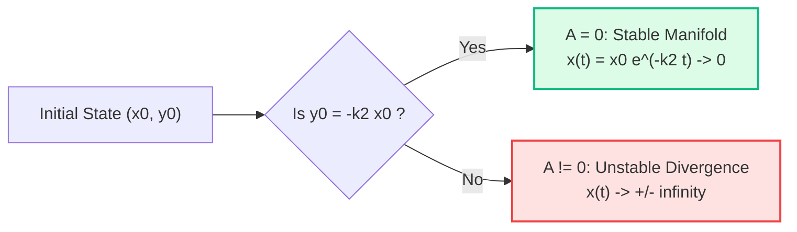

# ✏️ Problem 3.5: Saddle Invariant Manifold and Asymptotic Decay

## 📄 Enunciado (Problem Statement)

If the roots of the auxiliary equation are $k_1 > 0$ and $-k_2 < 0$ (with $k_2 > 0$), then the general solution is:
$$ x(t) = A e^{k_1 t} + B e^{-k_2 t} $$
For most choices of initial conditions $x(0) = x_0, \; \dot{x}(0) = y_0$, we will have $x(t) \to \pm\infty$ as $t \to \infty$. However, there are some special initial conditions for which $x(t) \to 0$ as $t \to \infty$.  
Find the relationship between $x_0$ and $y_0$ that ensures this.

---

## 📊 1. Identificación de Datos e Hipótesis (Phase 1)

### Mathematical Parameters:
- Characteristic roots of a second-order linear ODE:
  $$ r_1 = k_1 > 0 \quad (\text{unstable real root}) $$
  $$ r_2 = -k_2 < 0 \quad (\text{stable real root, with } k_2 > 0) $$
- General solution: $x(t) = A e^{k_1 t} + B e^{-k_2 t}$.
- Initial Cauchy state at $t = 0$:
  $$ x(0) = x_0, \qquad \dot{x}(0) = y_0 $$
- Asymptotic decay objective:
  $$ \lim_{t \to \infty} x(t) = 0 $$

---

## 🧠 2. Estrategia y Planteamiento Físico-Geométrico (Phase 2)

### Plan:
1. **Differentiate the solution:** Obtain $\dot{x}(t)$ in terms of $A$, $B$, $k_1$, and $k_2$.
2. **Formulate the algebraic system:** Express the initial conditions $x(0) = x_0$ and $\dot{x}(0) = y_0$ as a $2 \times 2$ linear system for the unknown amplitudes $(A, B)$.
3. **Solve for $A$ and $B$:** Invert the linear system explicitly.
4. **Analyze the asymptotic behavior as $t \to \infty$:**
   Since $k_1 > 0$, $e^{k_1 t} \to +\infty$.
   Since $k_2 > 0$, $e^{-k_2 t} \to 0$.
   Therefore, $x(t) \to 0$ if and only if the coefficient of the exploding exponential vanishes identically: $A = 0$.
5. **Phase-Space Interpretation:** Connect $A = 0$ to the stable eigenspace of a saddle equilibrium in dynamical systems.

---

## 🔢 3. Resolución Matemática Paso a Paso (Phase 3)

### Step 1: Differentiation of the General Trajectory
Given:
$$ x(t) = A e^{k_1 t} + B e^{-k_2 t} \tag{1} $$
Differentiating with respect to time $t$:
$$ \dot{x}(t) = \frac{d}{dt}\left( A e^{k_1 t} + B e^{-k_2 t} \right) = k_1 A e^{k_1 t} - k_2 B e^{-k_2 t} \tag{2} $$

---

### Step 2: Evaluation at $t = 0$ and Linear System
Setting $t = 0$ in equations (1) and (2):
$$ x(0) = A + B = x_0 \tag{3a} $$
$$ \dot{x}(0) = k_1 A - k_2 B = y_0 \tag{3b} $$
In matrix-vector form:
$$ \begin{pmatrix} 1 & 1 \\ k_1 & -k_2 \end{pmatrix} \begin{pmatrix} A \\ B \end{pmatrix} = \begin{pmatrix} x_0 \\ y_0 \end{pmatrix} $$
The determinant of the coefficient matrix is:
$$ \det = 1 \cdot (-k_2) - 1 \cdot k_1 = -(k_1 + k_2) $$
Since $k_1 > 0$ and $k_2 > 0$, $k_1 + k_2 > 0$, so $\det \neq 0$ and the system has a unique solution.

---

### Step 3: Analytical Resolution for $A$ and $B$
Multiplying equation (3a) by $k_2$:
$$ k_2 A + k_2 B = k_2 x_0 $$
Adding this to equation (3b):
$$ (k_2 A + k_2 B) + (k_1 A - k_2 B) = k_2 x_0 + y_0 $$
$$ (k_1 + k_2) A = y_0 + k_2 x_0 $$
$$ A = \frac{y_0 + k_2 x_0}{k_1 + k_2} \tag{4} $$

Similarly, multiplying (3a) by $k_1$ and subtracting (3b):
$$ (k_1 A + k_1 B) - (k_1 A - k_2 B) = k_1 x_0 - y_0 $$
$$ (k_1 + k_2) B = k_1 x_0 - y_0 $$
$$ B = \frac{k_1 x_0 - y_0}{k_1 + k_2} \tag{5} $$

---

### Step 4: Imposition of the Asymptotic Limit $x(t) \to 0$
Consider the limit of $x(t)$ as $t \to +\infty$:
$$ \lim_{t \to \infty} x(t) = \lim_{t \to \infty} \left[ A e^{k_1 t} + B e^{-k_2 t} \right] $$
Because $-k_2 < 0$:
$$ \lim_{t \to \infty} B e^{-k_2 t} = 0 \quad \text{for any finite constant } B $$
However, because $k_1 > 0$:
$$ \lim_{t \to \infty} e^{k_1 t} = +\infty $$
Thus:
- If $A > 0 \implies x(t) \to +\infty$.
- If $A < 0 \implies x(t) \to -\infty$.
- If and only if $A = 0$:
  $$ x(t) = B e^{-k_2 t} \implies \lim_{t \to \infty} x(t) = 0 $$

Setting $A = 0$ in equation (4):
$$ \frac{y_0 + k_2 x_0}{k_1 + k_2} = 0 \implies y_0 + k_2 x_0 = 0 $$
$$ \mathbf{y_0 = -k_2 x_0} \tag{6} $$

---

## 🎯 4. Resultado Final y Análisis Físico (Phase 4)

### Master Condition:
$$ \boxed{y_0 = -k_2 x_0 \iff \dot{x}(0) = -k_2 x(0)} $$

Under this initial condition, the amplitude of the unstable mode is strictly zero ($A = 0$), and the amplitude of the stable mode simplifies to:
$$ B = \frac{k_1 x_0 - (-k_2 x_0)}{k_1 + k_2} = \frac{(k_1 + k_2)x_0}{k_1 + k_2} = x_0 $$
The resulting trajectory is a pure exponential decay:
$$ \mathbf{x(t) = x_0 e^{-k_2 t}} $$

### Dynamical Systems & Aerospace Flight Dynamics:
- The phase plane $(x, \dot{x})$ has an equilibrium at the origin $(0, 0)$, which is a **saddle point** (one positive and one negative eigenvalue).
- The line $\dot{x} = -k_2 x$ is the **stable invariant manifold** (separatrix). Any state originating on this line asymptotically approaches the trim equilibrium.
- Any perturbation off this line ($y_0 \neq -k_2 x_0$), no matter how minuscule, activates the unstable mode $e^{k_1 t}$, driving the system into catastrophic divergence (e.g. aerodynamic divergence or orbital escape from an unstable Lagrange point like $L_1$ or $L_2$).

---

## 🔗 Related Notes
* `[[04 - Advanced Maths/Concepto - Ecuaciones Homogeneas con Coeficientes Constantes y Ecuacion Caracteristica|Ecuación Característica]]`
* `[[04 - Advanced Maths/Problema - Ch3-P4 Second Order Homogeneous Linear ODEs with IVPs|Problem 3.4: Homogeneous Linear ODEs]]`
* `[[04 - Advanced Maths/Problema - Ch3-P9 Falling Chain from Table and Hyperbolic Motion|Problem 3.9: Falling Chain Hyperbolic Instability]]`
* `[[04 - Advanced Maths/Matematicas Avanzadas MOC|⬅️ Central Advanced Maths MOC]]`
