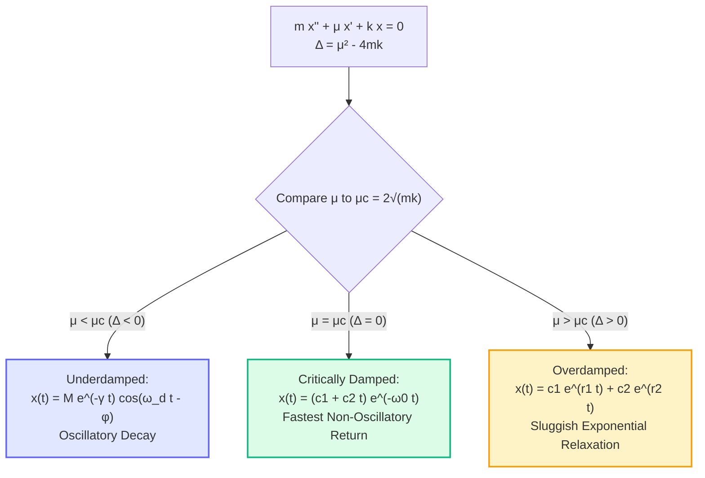

# ✏️ Problem 3.8: Damped Harmonic Oscillator Regimes

## 📄 Enunciado (Problem Statement)

Consider the equation:
$$ m\ddot{x} + \mu\dot{x} + kx = 0 $$
for the deviation $x(t)$ of a point particle with mass $m$ from its equilibrium position, subject to an elastic force (with elastic constant $k$) and a drag force (with damping parameter $\mu$).  
Discuss how the form of the solutions changes, depending on the value of the damping $\mu$ relative to the so-called critical damping $\mu_c = 2\sqrt{mk}$.

---

## 📊 1. Identificación de Datos e Hipótesis (Phase 1)

### Physical Parameters:
- Mass: $m > 0$ [$\text{kg}$]
- Damping parameter: $\mu \ge 0$ [$\text{N}\cdot\text{s/m}$ or $\text{kg/s}$]
- Elastic stiffness constant: $k > 0$ [$\text{N/m}$]
- Dependent variable: $x(t)$ [$\text{m}$], displacement from stable equilibrium.
- Normalization parameters:
  * Undamped natural frequency: $\omega_0 = \sqrt{\frac{k}{m}}$
  * Damping ratio: $\zeta = \frac{\mu}{2\sqrt{mk}} = \frac{\mu}{\mu_c}$
  * Damping coefficient: $\gamma = \frac{\mu}{2m} = \zeta\omega_0$
  * Standard normalized form: $\ddot{x} + 2\gamma\dot{x} + \omega_0^2 x = 0$

---

## 🧠 2. Estrategia y Planteamiento Físico-Matemático (Phase 2)

### Plan:
1. **Characteristic Equation:**
   Substitute $x(t) = e^{rt}$ into $m\ddot{x} + \mu\dot{x} + kx = 0$:
   $$ P(r) = m r^2 + \mu r + k = 0 $$
2. **Discriminant Analysis:**
   $$ \Delta = \mu^2 - 4mk $$
   Notice that $\Delta = 0 \iff \mu^2 = 4mk \iff \mu = 2\sqrt{mk} \equiv \mu_c$.
   Therefore, the sign of the discriminant is governed strictly by the ratio $\mu / \mu_c$:
   - $\mu < \mu_c \iff \Delta < 0$
   - $\mu = \mu_c \iff \Delta = 0$
   - $\mu > \mu_c \iff \Delta > 0$
3. **Analyze Each of the Three Dynamic Regimes:**
   - Underdamped (Subamortiguado): Complex conjugate roots, pseudoperiodic decaying oscillation.
   - Critically Damped (Amortiguamiento Crítico): Repeated negative real root, most rapid non-oscillatory return.
   - Overdamped (Sobreamortiguado): Two distinct negative real roots, sluggish two-mode exponential return.

---

## 🔢 3. Resolución Matemática Paso a Paso (Phase 3)

### Step 1: Root Derivation of the Auxiliary Equation
The quadratic formula yields:
$$ r_{1,2} = \frac{-\mu \pm \sqrt{\mu^2 - 4mk}}{2m} = -\frac{\mu}{2m} \pm \frac{\sqrt{\mu^2 - \mu_c^2}}{2m} \tag{1} $$
Let $\gamma = \frac{\mu}{2m}$ and $\omega_0 = \sqrt{\frac{k}{m}}$. Then $\mu_c = 2m\omega_0$.

---

### Step 2: Regime 1 — Underdamped Motion ($\mu < \mu_c = 2\sqrt{mk}$)

When $\mu < \mu_c$, the discriminant is strictly negative:
$$ \Delta = \mu^2 - 4mk < 0 $$
Factoring $-1 = i^2$ from the square root:
$$ \sqrt{\mu^2 - 4mk} = \sqrt{-(4mk - \mu^2)} = i \sqrt{4mk - \mu^2} $$
The characteristic roots are complex conjugates with strictly negative real part:
$$ r_{1,2} = -\gamma \pm i \omega_d \tag{2} $$
where the **damped natural frequency** (pseudofrequency) is:
$$ \mathbf{\omega_d = \frac{\sqrt{4mk - \mu^2}}{2m} = \sqrt{\omega_0^2 - \gamma^2} = \omega_0\sqrt{1 - \zeta^2}} \tag{3} $$
The general real solution is:
$$ x(t) = e^{-\gamma t}\left( c_1 \cos(\omega_d t) + c_2 \sin(\omega_d t) \right) $$
Applying the amplitude-phase transformation (Problem 3.6):
$$ \mathbf{x(t) = M e^{-\gamma t} \cos(\omega_d t - \phi)} \tag{4} $$

#### Dynamic Characteristics:
- Oscillatory behavior modulated by an exponentially decaying envelope $\pm M e^{-\gamma t}$.
- The trajectory crosses the equilibrium $x = 0$ infinitely many times at regular intervals $\Delta t = \frac{\pi}{\omega_d}$.
- The pseudoperiod is $T_d = \frac{2\pi}{\omega_d} = \frac{2\pi}{\sqrt{\omega_0^2 - \gamma^2}} > T_0$. Damping lowers the frequency and lengthens the period.

---

### Step 3: Regime 2 — Critically Damped Motion ($\mu = \mu_c = 2\sqrt{mk}$)

When $\mu = \mu_c$, the discriminant vanishes:
$$ \Delta = \mu_c^2 - 4mk = 0 $$
The characteristic equation has a single repeated real root of multiplicity 2:
$$ r_1 = r_2 = -\frac{\mu_c}{2m} = -\frac{2\sqrt{mk}}{2m} = -\sqrt{\frac{k}{m}} = -\omega_0 = -\gamma \tag{5} $$
By d'Alembert reduction of order (or secular term from double roots), the fundamental set is $\{e^{-\omega_0 t}, t e^{-\omega_0 t}\}$.
The general solution is:
$$ \mathbf{x(t) = (c_1 + c_2 t) e^{-\omega_0 t}} \tag{6} $$

#### Dynamic Characteristics:
- Strictly non-oscillatory.
- Can cross the equilibrium position at most **once** (at time $t^* = -c_1/c_2$, if $t^* > 0$).
- **Optimal engineering response:** Provides the fastest possible return to equilibrium without oscillating or overshooting. Widely utilized in aircraft landing gear shock absorbers (oleo struts) and galvanometer meters.

---

### Step 4: Regime 3 — Overdamped Motion ($\mu > \mu_c = 2\sqrt{mk}$)

When $\mu > \mu_c$, the discriminant is strictly positive:
$$ \Delta = \mu^2 - 4mk > 0 $$
The square root $\sqrt{\mu^2 - 4mk}$ is a real number strictly less than $\mu$ (since $4mk > 0$):
$$ \sqrt{\mu^2 - 4mk} < \sqrt{\mu^2} = \mu $$
Consequently, both roots are **distinct, real, and strictly negative**:
$$ r_1 = -\gamma + \sqrt{\gamma^2 - \omega_0^2} < 0 $$
$$ r_2 = -\gamma - \sqrt{\gamma^2 - \omega_0^2} < 0 $$
with $r_2 < r_1 < 0$.
The general solution is the superposition of two decaying exponential modes:
$$ \mathbf{x(t) = c_1 e^{r_1 t} + c_2 e^{r_2 t}} \tag{7} $$

#### Dynamic Characteristics:
- Pure exponential relaxation with no oscillations.
- Crosses zero at most once.
- For large $t$, the fast mode $e^{r_2 t}$ vanishes very quickly, leaving the motion dominated by the slow decay rate $|r_1| = \gamma - \sqrt{\gamma^2 - \omega_0^2}$.
- The system returns to equilibrium sluggishly because excessive friction resists the spring's restoring force.

---

## 🎯 4. Resultado Final y Síntesis Comparativa (Phase 4)

### Master Regime Classification Table:

| Regime | Condition on Damping | Discriminant $\Delta$ | Auxiliary Roots $r_{1,2}$ | Mathematical Form of $x(t)$ | Physical Behavior |
| :--- | :---: | :---: | :---: | :--- | :--- |
| **Underdamped** | $\mu < 2\sqrt{mk}$ | $\Delta < 0$ | $-\gamma \pm i\omega_d$ | $\mathbf{M e^{-\gamma t}\cos(\omega_d t - \phi)}$ | Decaying oscillations, infinite zero crossings |
| **Critically Damped** | $\mu = 2\sqrt{mk}$ | $\Delta = 0$ | $-\omega_0$ (mult. 2) | $\mathbf{(c_1 + c_2 t)e^{-\omega_0 t}}$ | Fastest monotonic decay, at most 1 zero crossing |
| **Overdamped** | $\mu > 2\sqrt{mk}$ | $\Delta > 0$ | $r_2 < r_1 < 0$ | $\mathbf{c_1 e^{r_1 t} + c_2 e^{r_2 t}}$ | Sluggish non-oscillatory return, no oscillations |

---

## 🔗 Related Notes
* `[[04 - Advanced Maths/Concepto - Ecuaciones Homogeneas con Coeficientes Constantes y Ecuacion Caracteristica|Ecuaciones Homogéneas con Coeficientes Constantes]]`
* `[[04 - Advanced Maths/Problema - Ch3-P6 Amplitude-Phase Transformation for Oscillations|Problem 3.6: Amplitude-Phase Transformation]]`
* `[[04 - Advanced Maths/Problema - Ch3-P7 Simple Pendulum Energy and Small Oscillations|Problem 3.7: Simple Pendulum]]`
* `[[04 - Advanced Maths/Problema - Ch3-P10 Parachutist Linear Drag and Terminal Velocity|Problem 3.10: Linear Drag Dynamics]]`
* `[[04 - Advanced Maths/Matematicas Avanzadas MOC|⬅️ Central Advanced Maths MOC]]`
