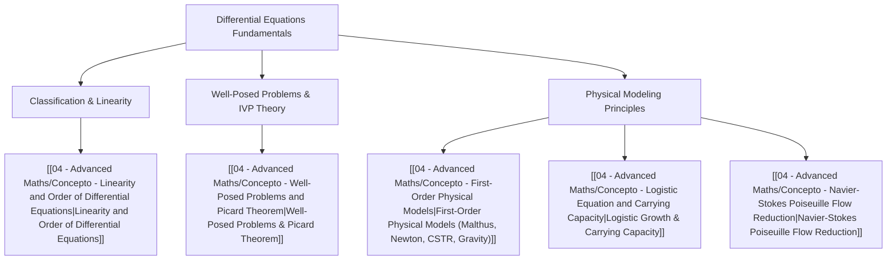

# 📘 Tema 1: Introduction, Modeling and Classification of ODEs

> **Key takeaway in one sentence:** Chapter 1 establishes the mathematical language of ordinary differential equations (ODEs)—formalizing their classification (order, linearity, dimensionality), examining the fundamental conditions for well-posed Initial Value Problems (Picard-Lindelöf existence and uniqueness), and developing canonical first-order physical models governing population dynamics, thermal transfer, fluid mixing, and viscous fluid transport.

---

## 🎯 1. Learning Objectives & Scope

Upon completing this unit, students will be able to:
1. **Classify differential equations:** Rigorously determine whether an equation is an Ordinary Differential Equation (ODE) or a Partial Differential Equation (PDE), identify its order, distinguish dependent from independent variables, and apply the canonical test for linearity:
   $$ a_n(x) y^{(n)}(x) + \dots + a_1(x) y'(x) + a_0(x) y(x) = b(x) $$
2. **Formulate physical balance laws:** Translate conservation principles (conservation of mass, momentum, thermal energy, and isotope decay) into well-defined first-order differential equations.
3. **Assess the well-posedness of Initial Value Problems (IVPs):** Understand Hadamard's definition of well-posedness (existence, uniqueness, and continuous dependence on initial data) and apply Picard's existence and uniqueness theorem along with the local Lipschitz condition.
4. **Identify failure modes of uniqueness and global existence:** Differentiate between non-uniqueness (e.g., $y' = y^{1/3}$) and finite-time blow-up (e.g., $y' = y^2$).
5. **Solve separable nonlinear equations:** Master separation of variables and partial fraction decompositions, particularly in the Verhulst logistic model.
6. **Bridge mathematics and aerospace continuum mechanics:** Derive the reduced form of the Navier-Stokes equations for axisymmetric Poiseuille flow, applying physical boundary conditions (centerline regularity and boundary no-slip).

---

## 🧭 2. Conceptual Architecture

The theoretical foundation of Chapter 1 is structured across five core concept modules:

### Detailed Concept Modules:
1. `[[04 - Advanced Maths/Concepto - Linearity and Order of Differential Equations|Concept 1: Linearity and Order of Differential Equations]]`  
   The rigorous criteria established by the UC3M Department of Mathematics. Examination of the coefficients $a_i(x)$, superposition principle for homogeneous linear ODEs, and typical nonlinear pitfalls (powers of derivatives, transcendental dependencies, cross-products).
2. `[[04 - Advanced Maths/Concepto - Well-Posed Problems and Picard Theorem|Concept 2: Well-Posed Problems and Picard-Lindelöf Theorem]]`  
   Formal statement of Picard's theorem for $y' = f(x, y)$, the role of continuity and the Lipschitz bound $|\partial f / \partial y| \le L$, failure of uniqueness when $\partial f / \partial y$ diverges, and nonlinear finite-time blow-up.
3. `[[04 - Advanced Maths/Concepto - First-Order Physical Models|Concept 3: First-Order Physical Models]]`  
   Unified treatment of conservation laws: exponential Malthusian population growth, radioactive decay of nuclear materials, Newton's empirical law of cooling, mass balance in Continuous Stirred-Tank Reactors (CSTR), and kinematic free fall under uniform gravity.
4. `[[04 - Advanced Maths/Concepto - Logistic Equation and Carrying Capacity|Concept 4: Logistic Equation and Carrying Capacity]]`  
   The Verhulst model $\frac{dp}{dt} = kp\left(1 - \frac{p}{M}\right)$, non-dimensionalization, solution via partial fractions, phase-line stability analysis (unstable equilibrium $p=0$, stable carrying capacity $p=M$), and the infinite capacity limit $M \to \infty$.
5. `[[04 - Advanced Maths/Concepto - Navier-Stokes Poiseuille Flow Reduction|Concept 5: Navier-Stokes Poiseuille Flow Reduction]]`  
   Derivation from the full incompressible Navier-Stokes momentum equations in cylindrical coordinates $(r, \theta, z)$ under steady, unidirectional, axisymmetric laminar flow, reducing to $\frac{1}{r} \frac{d}{dr}\left(r \frac{dV}{dr}\right) = -P$. Integration, mathematical singularity vs. physical regularity at the centerline $r=0$, and wall adhesion $V(a)=0$.

---

## 📝 3. Solved Problem Collection (ProblemsCh1.pdf)

Every exercise from the official course problem sheet is completely solved following the rigorous 4-Phase Engineering Standard (Identification, Physical Strategy, Step-by-Step Resolution with Zero Algebraic Jumps, and Critical Asymptotic Analysis):

| Problem | Title | Primary Topic | Key Formula / Result |
| :--- | :--- | :--- | :--- |
| **`[[04 - Advanced Maths/Problema - Ch1-P1 Classification of Differential Equations|Problem 1.1]]`** | Classification of ODEs/PDEs | Linearity, order, variables | Bessel (Lin 2nd ODE), Burgers (Nonlin 2nd PDE), Duffing (Nonlin 2nd ODE), etc. |
| **`[[04 - Advanced Maths/Problema - Ch1-P2 Malthusian Population Dynamics|Problem 1.2]]`** | Malthusian Population Dynamics | Separable 1st-order ODE | $x(t) = x_0 e^{kt}$, doubling time $t_d = \frac{\ln 2}{k}$ |
| **`[[04 - Advanced Maths/Problema - Ch1-P3 Plutonium 239 Radioactive Decay|Problem 1.3]]`** | Plutonium-239 Radioactive Decay | Half-life & exponential decay | $k = \frac{\ln 2}{24{,}000} \approx 2.888 \times 10^{-5}\text{ yr}^{-1}$ |
| **`[[04 - Advanced Maths/Problema - Ch1-P4 Newton Law of Cooling Modeling|Problem 1.4]]`** | Newton's Law of Cooling Modeling | Thermal rate balance | $\frac{dT}{dt} = -k(T - T_A(t))$, parameters: $k, T(0)$ |
| **`[[04 - Advanced Maths/Problema - Ch1-P5 Forensic Time of Death Estimation|Problem 1.5]]`** | Forensic Time of Death Estimation | Thermal back-calculation | $k = \ln(1.4) \approx 0.3365\text{ h}^{-1}$, $t_d \approx -2.457\text{ h} \implies 12:33\text{ pm}$ |
| **`[[04 - Advanced Maths/Problema - Ch1-P6 Saline Mixing Tank Dynamics|Problem 1.6]]`** | Saline Mixing Tank Dynamics | CSTR transient mass balance | Pure washout: $x(t) = e^{-t/100}$; with salt inlet: $x(t) = 100s + (1 - 100s)e^{-t/100}$ |
| **`[[04 - Advanced Maths/Problema - Ch1-P7 Free Fall Motion under Gravity|Problem 1.7]]`** | Free Fall Motion under Gravity | 2nd-order kinematic ODE | $y(t) = y_0 - \frac{1}{2}gt^2$, successive integrations |
| **`[[04 - Advanced Maths/Problema - Ch1-P8 Simple Pendulum Equation of Motion|Problem 1.8]]`** | Simple Pendulum Equation of Motion | Angular momentum & energy | $\ddot{\theta} + \frac{g}{l}\sin\theta = 0$, derivation via Newton II and energy |
| **`[[04 - Advanced Maths/Problema - Ch1-P9 Logistic Population Growth Model|Problem 1.9]]`** | Logistic Population Growth Model | Partial fractions & asymptotic limits | $p(t) = \frac{M p_0}{p_0 + (M - p_0)e^{-k(t-t_0)}}$, $\lim_{t\to\infty}p(t) = M$, $\lim_{M\to\infty}p(t) = p_0 e^{k(t-t_0)}$ |
| **`[[04 - Advanced Maths/Problema - Ch1-P10 Laminar Viscous Poiseuille Flow|Problem 1.10]]`** | Laminar Viscous Poiseuille Flow | Boundary value ODE reduction | $V(r) = \frac{P}{4}(a^2 - r^2)$, centerline regularity $c=0$, no-slip wall $V(a)=0$ |

---

## 🔬 4. Interdisciplinary Aerospace Applications

* **Aerodynamics and Fluid Mechanics:** The exact reduction performed in Problem 1.10 and Concept 5 is the foundation of internal pipe flows (Hagen-Poiseuille law) and wall shear stress calculations ($\tau_w = -\mu \left.\frac{dV}{dr}\right|_{r=a} = \frac{\mu P a}{2}$) covered in `[[01 - Fluid Mechanics/Mecanica de Fluidos MOC|Fluid Mechanics]]`.
* **Flight Dynamics and Structural Vibrations:** The Duffing oscillator analyzed in Problem 1.1(iii) models geometric nonlinearities in aircraft wing flutter, while the pendulum equation in Problem 1.8 represents large-amplitude pitch oscillations without small-angle approximations, studied in `[[03 - Engineering Mechanics/Mecanica de Estructuras MOC|Engineering Mechanics]]`.

---

## ⬅️ Navigation
* **Upward Navigation:** `[[04 - Advanced Maths/Matematicas Avanzadas MOC|⬅️ Advanced Mathematics MOC]]`
* **Root Index:** `[[00 - Indice Central/Indice Maestro|⬅️ Central Master Index]]`
