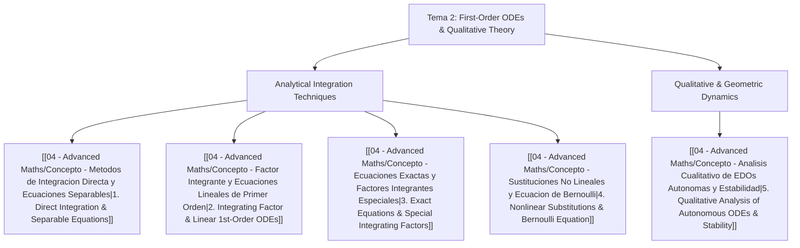

# 📘 Tema 2: First-Order ODEs and Qualitative Dynamics

> **Key takeaway in one sentence:** Tema 2 masters the complete taxonomy of first-order differential equations—uniting exact analytical integration techniques (direct integration, separable forms, integrating factors, exact differentials, and Bernoulli/nonlinear reductions) with the powerful qualitative theory of autonomous dynamical systems (Picard uniqueness, trajectory non-crossing theorems, phase line flows, and linear stability of equilibria).

---

## 🎯 1. Learning Objectives & Scope

Upon completing this unit, students will be able to:
1. **Solve first-order ODEs analytically:**
   * Directly integrate functions of the independent variable $y' = f(x)$.
   * Separate variables in nonlinear equations $y' = g(x) h(y)$ and handle non-elementary integrals (e.g., Gaussian integrals $\int e^{-s^2} ds$) and finite-time blow-ups.
   * Apply integrating factors $\mu(t) = \exp\left(\int p(t) dt\right)$ to solve non-homogeneous linear equations $x' + p(t)x = q(t)$ and compute long-time asymptotic limits ($t \to \infty$).
   * Identify exact differential equations $M(x, y) dx + N(x, y) dy = 0$ via the Euler-Cauchy compatibility condition $\frac{\partial M}{\partial y} = \frac{\partial N}{\partial x}$, reconstruct potential functions $F(x, y) = C$, and calculate integrating factors $\mu(x)$ for non-exact equations.
   * Execute nonlinear coordinate transformations, notably reducing the general Bernoulli equation $y' = a(x)y + b(x)y^\alpha$ into a linear equation using $z = y^{1-\alpha}$.
2. **Master the qualitative theory of ODEs:**
   * Apply the **Picard-Lindelöf Existence and Uniqueness Theorem** and test local Lipschitz continuity via bounded partial derivatives $\left|\frac{\partial f}{\partial y}\right| \le L$.
   * Exploit the **No-Crossing Theorem** (geometric consequence of uniqueness): solutions to smooth ODEs cannot intersect in the $(t, y)$ plane, establishing strict upper and lower bounds on unknown trajectories.
   * Understand failure modes: non-Lipschitz branch points (e.g., $y' = 3y^{2/3}$ at $y=0$) and domain singularities (e.g., $y' = \frac{2y+1}{t}$ at $t=0$).
   * Perform **1D phase line analysis** for autonomous equations $x' = f(x)$: find stationary points $f(x^*) = 0$, evaluate analytical stability via the sign of $f'(x^*)$, and sketch global flow trajectories.
   * Prove solution uniqueness and stability independently of Picard's theorem using energy/difference functions ($E(t) = (y_1 - y_2)^2$).

---

## 🧭 2. Conceptual Architecture

The theoretical foundation of Tema 2 is structured across five core concept modules:

### Core Concept Modules:
1. `[[04 - Advanced Maths/Concepto - Metodos de Integracion Directa y Ecuaciones Separables|Concept 1: Metodos de Integracion Directa y Ecuaciones Separables]]`  
   Direct antiderivatives, Leibniz notation justification, chain rule for separable equations $H'(x)x' = g(t)$, asymptotic integrals with Gaussian error functions, and finite-time blow-up thresholds.
2. `[[04 - Advanced Maths/Concepto - Factor Integrante y Ecuaciones Lineales de Primer Orden|Concept 2: Factor Integrante y Ecuaciones Lineales de Primer Orden]]`  
   Standard form $x' + p(t)x = q(t)$, rigorous derivation of integrating factor $\mu(t) = \exp(\int p(t)dt)$, general solution, and steady-state asymptotic limits as $t \to \infty$.
3. `[[04 - Advanced Maths/Concepto - Ecuaciones Exactas y Factores Integrantes Especiales|Concept 3: Ecuaciones Exactas y Factores Integrantes Especiales]]`  
   Differential forms $M(x, y) dx + N(x, y) dy = 0$, necessary and sufficient condition $\frac{\partial M}{\partial y} = \frac{\partial N}{\partial x}$ via Schwarz's theorem on mixed partials, potential surface construction, and finding integrating factors $\mu(x)$ or $\mu(y)$.
4. `[[04 - Advanced Maths/Concepto - Sustituciones No Lineales y Ecuacion de Bernoulli|Concept 4: Sustituciones No Lineales y Ecuacion de Bernoulli]]`  
   Bernoulli's transformation $z = y^{1-\alpha}$, homogeneous equations $u = y/x$, and algebraic reductions of nonlinear derivatives into solvable linear forms.
5. `[[04 - Advanced Maths/Concepto - Analisis Cualitativo de EDOs Autonomas y Estabilidad|Concept 5: Analisis Cualitativo de EDOs Autonomas y Estabilidad]]`  
   Autonomous equations $x' = f(x)$, equilibria $f(x^*) = 0$, linear stability criterion $f'(x^*)$, phase line vector fields, Picard-Lindelöf geometric trajectory confinement, and bifurcations.

---

## 📝 3. Solved Problem Collection (ProblemsCh2.pdf — 17 Problems)

Every problem from Sheet 2 is developed in 4 exhaustive phases with zero omitted algebraic steps:

| Problem | Title | Key Method / Theoretical Core | Key Result / Formula |
| :--- | :--- | :--- | :--- |
| **`[[04 - Advanced Maths/Problema - Ch2-P1 Direct Integration General Solutions|Problem 2.1]]`** | Direct Integration General Solutions | 5 antiderivative calculations ($e^{3x}-x$, $1/x$, $x e^{x^2}$, algebraic fractions) | $y(x) = \frac{1}{3}e^{3x}-\frac{x^2}{2}+C$, $y = \ln|x|+C$, $y = \frac{1}{2}e^{x^2}+C$, etc. |
| **`[[04 - Advanced Maths/Problema - Ch2-P2 Separable ODEs and Asymptotic Integrals|Problem 2.2]]`** | Separable ODEs & Asymptotic Integrals | Separation of variables, Gaussian integral, finite-time blow-up | Gaussian threshold: blow-up if $y(0) > \frac{2}{\sqrt{\pi}}$ |
| **`[[04 - Advanced Maths/Problema - Ch2-P3 Integrating Factor Method and Asymptotics|Problem 2.3]]`** | Integrating Factor Method & Asymptotics | 8 linear ODEs solved with $\mu(t)$, hyperbolic functions, cotangent | Part (viii): $x(t) \to \frac{b}{a}$ as $t \to \infty$ |
| **`[[04 - Advanced Maths/Problema - Ch2-P4 Exact Differential Equations|Problem 2.4]]`** | Exact Differential Equations | 4 exact ODEs, potential reconstruction $F(x, y) = C$ | Closed-form algebraic solutions for all 4 equations |
| **`[[04 - Advanced Maths/Problema - Ch2-P5 Integrating Factor for Non-Exact Equations|Problem 2.5]]`** | Integrating Factor for Non-Exact Equations | Finding $\mu(x) = x$ via $\frac{1}{N}(M_y - N_x) = \frac{1}{x}$ | Exact potential $x^3 y + \frac{1}{2} x^2 y^2 = C$ |
| **`[[04 - Advanced Maths/Problema - Ch2-P6 Exactness of Separated Differential Forms|Problem 2.6]]`** | Exactness of Separated Differential Forms | Proof that $f(x) + g(y)y' = 0$ is always exact; 2 applications | $V(x) + y^2 = C$; $\ln y - a y + 2\ln x - bx = C$ |
| **`[[04 - Advanced Maths/Problema - Ch2-P7 Nonlinear Change of Variables|Problem 2.7]]`** | Nonlinear Change of Variables | Substitution $z = y^2$ for $y' = y + x/y$, $y(0)=1$ | $y(x) = \sqrt{\frac{3}{2}e^{2x} - x - \frac{1}{2}}$ |
| **`[[04 - Advanced Maths/Problema - Ch2-P8 General Bernoulli Equation Reduction|Problem 2.8]]`** | General Bernoulli Equation Reduction | General reduction $z = y^{1-\alpha}$; study of $\alpha = 0, 1$ | $z' + (1-\alpha)a(x)z = (1-\alpha)b(x)$ |
| **`[[04 - Advanced Maths/Problema - Ch2-P9 Solution Uniqueness and Lipschitz Analysis|Problem 2.9]]`** | Solution Uniqueness & Lipschitz Analysis | Testing Lipschitz continuity at $x=0$ for 5 powers of $x$ | Non-unique: $x^{1/3}, x^{1/2}(1+x)^2$; Unique: $x(1-x^2), x^3, (1+x)^{3/2}$ |
| **`[[04 - Advanced Maths/Problema - Ch2-P10 Uniqueness via Integrating Transformation|Problem 2.10]]`** | Uniqueness via Integrating Transformation | Energy transform $z(t) = y(t)\exp(\int p)$ without Picard | $z'(t) \equiv 0 \implies y(t) = y_0 \exp(-\int p)$, trivial if $y_0=0$ |
| **`[[04 - Advanced Maths/Problema - Ch2-P11 Invariance of Solution Ratios in Linear ODEs|Problem 2.11]]`** | Invariance of Solution Ratios in Linear ODEs | Quotient rule on $\frac{d}{dt}\left(\frac{y_1}{y_2}\right) = 0$ | Proves linear solutions are constant scalar multiples |
| **`[[04 - Advanced Maths/Problema - Ch2-P12 Trajectory Crossing and Uniqueness Bounds|Problem 2.12]]`** | Trajectory Crossing and Uniqueness Bounds | No-crossing theorem bounds: barrier solutions | (i) $y(t) > -2$; (ii) $-t-1 < y(t) < t^2+1$ $\forall t$ |
| **`[[04 - Advanced Maths/Problema - Ch2-P13 Multi-Equilibria Autonomous Phase Line Dynamics|Problem 2.13]]`** | Autonomous Phase Line Dynamics | Equilibrium barriers for $y' = y(y-2)(y-3)$ | Trajectory confinement across 4 intervals |
| **`[[04 - Advanced Maths/Problema - Ch2-P14 Non-Lipschitz Branching Pathology in Picard Theorem|Problem 2.14]]`** | Non-Lipschitz Branching Pathology | Dual solutions $y_1=t^3, y_2=0$ for $y' = 3y^{2/3}$ | $\partial f/\partial y \to \infty$ violates Lipschitz at $y=0$ |
| **`[[04 - Advanced Maths/Problema - Ch2-P15 Singular ODE and Domain of Definition|Problem 2.15]]`** | Singular ODE and Domain of Definition | $y' = \frac{2y+1}{t}$, multiple solutions at $t=0$ | Domain singularity: $f$ undefined at $t=0$, Picard intact |
| **`[[04 - Advanced Maths/Problema - Ch2-P16 Pitchfork Phase Line and Stability Regimes|Problem 2.16]]`** | Pitchfork Phase Line & Stability Regimes | $\dot{x} = x(\kappa^2 - x^2)$; 3 equilibria $0, \pm\kappa$ | $x=0$ unstable; $x=\pm\kappa$ asymptotically stable attractors |
| **`[[04 - Advanced Maths/Problema - Ch2-P17 Direct Difference Method for Uniqueness|Problem 2.17]]`** | Direct Difference Method for Uniqueness | Inspection solution + difference $w = y_1 - y_2$ energy | $w(t) \equiv 0 \implies y_1(t) = y_2(t)$, unconditional uniqueness |

---

## 🔗 Interdisciplinary Aerospace Connections
* **Aerospace Propulsion & Combustion:** The Gaussian integral and blow-up threshold analyzed in Problem 2.2 model thermal runaway in adiabatic chemical reactors and rocket engine pre-burners.
* **Flight Mechanics & Aerodynamic Stability:** The autonomous phase line dynamics and pitchfork bifurcation studied in Problem 2.16 govern roll-coupling stability and angle-of-attack trim states in transonic flight.

---

## ⬅️ Navigation
* **Upward Navigation:** `[[04 - Advanced Maths/Matematicas Avanzadas MOC|⬅️ Advanced Mathematics MOC]]`
* **Previous Unit:** `[[04 - Advanced Maths/Tema 1 - Introduction, Modeling and Classification of ODEs|Tema 1: Introduction, Modeling and Classification]]`
* **Root Index:** `[[00 - Indice Central/Indice Maestro|⬅️ Central Master Index]]`
