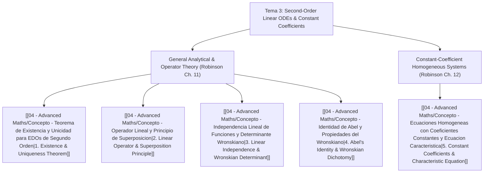

# 📘 Tema 3: Second-Order Linear ODEs: General Theory and Constant Coefficients

> **Key takeaway in one sentence:** Tema 3 establishes the rigorous analytical and algebraic foundation of second-order linear differential equations—demonstrating that their solution space is an exact 2-dimensional vector space spanned by any two linearly independent solutions whose Wronskian never vanishes, and providing complete closed-form general solutions for constant-coefficient systems via the characteristic equation across distinct real, critically repeated, and complex oscillatory damping regimes.

---

## 🎯 1. Learning Objectives & Theoretical Scope

Grounded in **Chapters 11 and 12 of Robinson (Book ODE's)** and the syllabus delivered in the **September 22nd class session**, upon completing this unit students will master:

1. **Analytical Foundations of Second-Order Linear ODEs:**
   * Formulate equations in general $a_2(t)x'' + a_1(t)x' + a_0(t)x = g(t)$ and normalized standard form $x'' + p(t)x' + q(t)x = f(t)$.
   * Understand the physical necessity of prescribing two initial conditions ($x(t_0) = x_0$ and $x'(t_0) = y_0$) based on Newton's Second Law for mechanical oscillators ($m \ddot{x} + c \dot{x} + k x = F(t)$).
   * Apply **Theorem 11.1 (Existence and Uniqueness)**, understanding that linear ODE solutions exist globally across the entire interval of continuity $I$ without finite-time blow-up.
2. **Linear Operator and Algebraic Vector Space Structure:**
   * Define the linear differential operator $L[x] \equiv x'' + p(t)x' + q(t)x$ mapping $C^2(I) \to C^0(I)$.
   * Prove the **Superposition Principle** for homogeneous equations ($L[c_1 x_1 + c_2 x_2] = 0$) and establish that the solution space is the vector subspace $\ker(L) \subset C^2(I)$.
   * Structure the general non-homogeneous solution as the affine sum of the complementary homogeneous solution and a particular solution ($x = x_h + x_p$).
3. **Linear Independence and Wronskian Theory:**
   * Formulate the algebraic condition for initial value solvability, defining the **Wronskian determinant** $W[x_1, x_2](t) = x_1 x_2' - x_2 x_1'$.
   * Prove that two solutions are linearly independent on $I$ if and only if $W[x_1, x_2](t) \neq 0$.
   * Construct canonical basis solutions to rigorously prove that $\dim(\ker(L)) = 2$.
4. **Abel's Identity and Reduction of Order:**
   * Derive **Abel's Theorem** $\frac{dW}{dt} = -p(t)W(t) \implies W(t) = W(t_0)\exp\left(-\int_{t_0}^t p(s)ds\right)$.
   * Establish the **Dichotomy Principle**: the Wronskian of solutions is either never zero or identically zero on $I$.
   * Apply d'Alembert's reduction of order formula to construct a second linearly independent solution.
5. **Constant-Coefficient Homogeneous ODEs ($a x'' + b x' + c x = 0$):**
   * Substitute the exponential ansatz $x(t) = e^{kt}$ to derive the characteristic equation $a k^2 + b k + c = 0$.
   * Classify and solve the three fundamental cases governed by the discriminant $\Delta = b^2 - 4ac$:
     - Distinct real roots ($\Delta > 0$): $x(t) = c_1 e^{k_1 t} + c_2 e^{k_2 t}$.
     - Repeated real root ($\Delta = 0$): $x(t) = (c_1 + c_2 t) e^{kt}$, proving the validity of the second solution $t e^{kt}$.
     - Complex conjugate roots ($\Delta < 0, k = \rho \pm i\omega$): Apply Euler's formula to derive real oscillatory solutions $x(t) = e^{\rho t}(A \cos\omega t + B \sin\omega t)$ and the polar amplitude-phase form $M e^{\rho t}\cos(\omega t - \phi)$.

---

## 🧭 2. Conceptual Architecture

The theoretical structure of Tema 3 is organized across five modular concept notes:

### Core Concept Modules:
1. `[[04 - Advanced Maths/Concepto - Teorema de Existencia y Unicidad para EDOs de Segundo Orden|Concept 1: Teorema de Existencia y Unicidad para EDOs de Segundo Orden]]`  
   Canonical forms (general vs. normalized), Newton's second law physical motivation, formulation of the 2nd-order IVP with two initial conditions, statement of Robinson's Theorem 11.1, absence of finite-time blow-up in linear ODEs, and reduction to a $2 \times 2$ first-order system.
2. `[[04 - Advanced Maths/Concepto - Operador Lineal y Principio de Superposicion|Concept 2: Operador Lineal y Principio de Superposición]]`  
   Differential operator $L[x] = x'' + p(t)x' + q(t)x$, proof of operator linearity on $C^2(I)$, the Superposition Principle for homogeneous equations, algebraic structure of the solution space as $\ker(L)$, and decomposition of the non-homogeneous general solution ($x = x_h + x_p$).
3. `[[04 - Advanced Maths/Concepto - Independencia Lineal de Funciones y Determinante Wronskiano|Concept 3: Independencia Lineal de Funciones y Determinante Wronskiano]]`  
   Definition of linear independence on an interval $I$, algebraic system for matching initial conditions, definition and properties of the Wronskian determinant $W[x_1, x_2](t)$, definition of fundamental solution sets, and the constructive proof that $\dim(\ker(L)) = 2$.
4. `[[04 - Advanced Maths/Concepto - Identidad de Abel y Propiedades del Wronskiano|Concept 4: Identidad de Abel y Propiedades del Wronskiano]]`  
   Rigorous derivation of Abel's differential equation $\frac{dW}{dt} = -p(t)W(t)$, derivation of Abel's identity $W(t) = W(t_0)\exp(-\int p ds)$, the Dichotomy Principle (solutions' Wronskian is either non-zero everywhere or identically zero), and d'Alembert's reduction of order formula.
5. `[[04 - Advanced Maths/Concepto - Ecuaciones Homogeneas con Coeficientes Constantes y Ecuacion Caracteristica|Concept 5: Ecuaciones Homogéneas con Coeficientes Constantes y Ecuación Característica]]`  
   Canonical equation $a x'' + b x' + c x = 0$, the exponential ansatz $x(t) = e^{kt}$, deduction of the characteristic polynomial $a k^2 + b k + c = 0$, exhaustive treatment of the three discriminant regimes ($\Delta > 0, \Delta = 0, \Delta < 0$), proof of the second solution $t e^{kt}$ for repeated roots, Euler's formula derivation of real oscillatory solutions, and amplitude-phase polar representation.

---

## 📊 3. Comprehensive Summary: The Three Characteristic Regimes

For the constant-coefficient equation $a x'' + b x' + c x = 0$ ($a \neq 0$) with characteristic roots $k = \frac{-b \pm \sqrt{\Delta}}{2a}$ and discriminant $\Delta = b^2 - 4ac$:

| Regime | Discriminant | Root Structure | Fundamental Solution Set $\{x_1, x_2\}$ | General Solution $x(t)$ | Wronskian $W[x_1, x_2](t)$ |
| :--- | :--- | :--- | :--- | :--- | :--- |
| **Case 1: Distinct Real** | $\Delta > 0$ | $k_1 \neq k_2 \in \mathbb{R}$ | $\{e^{k_1 t}, e^{k_2 t}\}$ | $x(t) = c_1 e^{k_1 t} + c_2 e^{k_2 t}$ | $(k_2 - k_1) e^{(k_1+k_2)t} \neq 0$ |
| **Case 2: Repeated Real** | $\Delta = 0$ | $k = -\frac{b}{2a}$ (mult. 2) | $\{e^{kt}, t e^{kt}\}$ | $x(t) = (c_1 + c_2 t) e^{kt}$ | $e^{2kt} \neq 0$ |
| **Case 3: Complex Conjugate** | $\Delta < 0$ | $k = \rho \pm i \omega \quad (\omega > 0)$ | $\{e^{\rho t}\cos\omega t, e^{\rho t}\sin\omega t\}$ | $x(t) = e^{\rho t}(A \cos\omega t + B \sin\omega t)$ | $\omega e^{2\rho t} \neq 0$ |

---

## ✈️ 4. Aerospace Engineering Physical Connections

Second-order linear ODEs model essential dynamic phenomena across aerospace structures and flight mechanics:
* **Landing Gear Shock Absorbers (Oleo-Pneumatic Struts):** Aircraft landing gear suspension systems are designed to operate at **critical damping ($\Delta = 0$)** or slightly overdamped conditions ($\Delta > 0$) to dissipate vertical impact energy in the shortest possible time without causing rebound oscillations.
* **Aeroelastic Wing Flutter & Gust Response:** Flexible aircraft wings behave as damped harmonic oscillators under aerodynamic loading. When unsteady aerodynamic forces reduce effective damping ($b \to 0$ or $b < 0$), the system transitions from stable underdamped decay ($\Delta < 0, \rho < 0$) to explosive, destructive aeroelastic flutter ($\rho > 0$).
* **Spacecraft Attitude Control & Reaction Wheels:** Pitch, roll, and yaw attitude maneuvers of satellites are governed by second-order torque balance equations ($I \ddot{\theta} + c \dot{\theta} + k \theta = T_c(t)$), where closed-loop feedback gains are tuned to achieve targeted damping ratios and natural frequencies.

---

## ⬅️ Navigation & Syllabus Map
* **Upward Navigation:** `[[04 - Advanced Maths/Matematicas Avanzadas MOC|⬅️ Advanced Mathematics MOC]]`
* **Previous Unit:** `[[04 - Advanced Maths/Tema 2 - First-Order ODEs and Qualitative Dynamics|Tema 2: First-Order ODEs and Qualitative Dynamics]]`
* **Central Master Index:** `[[00 - Indice Central/Indice Maestro|⬅️ Central Master Index]]`
