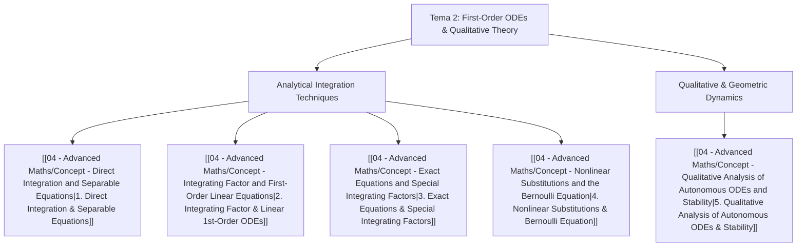

# 📘 Tema 2: First-Order ODEs and Qualitative Dynamics

> **Key takeaway in one sentence:** Tema 2 masters the complete taxonomy of first-order differential equations—uniting exact analytical integration techniques (direct integration, separable forms, integrating factors, exact differentials, and Bernoulli/nonlinear reductions) with the powerful qualitative theory of autonomous dynamical systems (Picard uniqueness, trajectory non-crossing theorems, phase line flows, and linear stability of equilibria).

---

## 🎯 1. Learning Objectives & Scope

Upon completing this unit, students will be able to:
1. **Solve first-order ODEs analytically:**
   * Directly integrate functions of the independent variable $y' = f(x)$.
   * Separate variables in nonlinear equations $y' = g(x) h(y)$ and handle non-elementary integrals (e.g., Gaussian integrals $\int e^{-s^2} ds$) and finite-time blow-ups.
   * Apply integrating factors $\mu(t) = \exp\left(\int p(t) dt\right)$ to solve non-homogeneous linear equations $x' + p(t)x = q(t)$ and compute long-time asymptotic limits ($t \to \infty$).
   * Identify exact differential equations $M(x, y) dx + N(x, y) dy = 0$ via the Euler-Cauchy compatibility condition $\frac{\partial M}{\partial y} = \frac{\partial N}{\partial x}$, reconstruct potential functions $F(x, y) = C$, and calculate integrating factors $\mu(x)$ for non-exact equations.
   * Execute nonlinear coordinate transformations, notably reducing the general Bernoulli equation $y' = a(x)y + b(x)y^\alpha$ into a linear equation using $z = y^{1-\alpha}$.
2. **Master the qualitative theory of ODEs:**
   * Apply the **Picard-Lindelöf Existence and Uniqueness Theorem** and test local Lipschitz continuity via bounded partial derivatives $\left|\frac{\partial f}{\partial y}\right| \le L$.
   * Exploit the **No-Crossing Theorem** (geometric consequence of uniqueness): solutions to smooth ODEs cannot intersect in the $(t, y)$ plane, establishing strict upper and lower bounds on unknown trajectories.
   * Understand failure modes: non-Lipschitz branch points (e.g., $y' = 3y^{2/3}$ at $y=0$) and domain singularities (e.g., $y' = \frac{2y+1}{t}$ at $t=0$).
   * Perform **1D phase line analysis** for autonomous equations $x' = f(x)$: find stationary points $f(x^*) = 0$, evaluate analytical stability via the sign of $f'(x^*)$, and sketch global flow trajectories.
   * Prove solution uniqueness and stability independently of Picard's theorem using energy/difference functions ($E(t) = (y_1 - y_2)^2$).

---

## 🧭 2. Conceptual Architecture

The theoretical foundation of Tema 2 is structured across five core concept modules:

### Core Concept Modules:
1. [[04 - Advanced Maths/Concept - Direct Integration and Separable Equations|Concept 1: Metodos de Integracion Directa y Ecuaciones Separables]]  
   Direct antiderivatives, Leibniz notation justification, chain rule for separable equations $H'(x)x' = g(t)$, asymptotic integrals with Gaussian error functions, and finite-time blow-up thresholds.
2. [[04 - Advanced Maths/Concept - Integrating Factor and First-Order Linear Equations|Concept 2: Factor Integrante y Ecuaciones Lineales de Primer Orden]]  
   Standard form $x' + p(t)x = q(t)$, rigorous derivation of integrating factor $\mu(t) = \exp(\int p(t)dt)$, general solution, and steady-state asymptotic limits as $t \to \infty$.
3. [[04 - Advanced Maths/Concept - Exact Equations and Special Integrating Factors|Concept 3: Ecuaciones Exactas y Factores Integrantes Especiales]]  
   Differential forms $M(x, y) dx + N(x, y) dy = 0$, necessary and sufficient condition $\frac{\partial M}{\partial y} = \frac{\partial N}{\partial x}$ via Schwarz's theorem on mixed partials, potential surface construction, and finding integrating factors $\mu(x)$ or $\mu(y)$.
4. [[04 - Advanced Maths/Concept - Nonlinear Substitutions and the Bernoulli Equation|Concept 4: Sustituciones No Lineales y Ecuacion de Bernoulli]]  
   Bernoulli's transformation $z = y^{1-\alpha}$, homogeneous equations $u = y/x$, and algebraic reductions of nonlinear derivatives into solvable linear forms.
5. [[04 - Advanced Maths/Concept - Qualitative Analysis of Autonomous ODEs and Stability|Concept 5: Analisis Cualitativo de EDOs Autonomas y Estabilidad]]  
   Autonomous equations $x' = f(x)$, equilibria $f(x^*) = 0$, linear stability criterion $f'(x^*)$, phase line vector fields, Picard-Lindelöf geometric trajectory confinement, and bifurcations.

---

## 📝 3. Solved Problem Collection (ProblemsCh2.pdf — 17 Problems)

Every problem from Sheet 2 is developed in 4 exhaustive phases with zero omitted algebraic steps:

| Problem | Title | Key Method / Theoretical Core | Key Result / Formula |
| :--- | :--- | :--- | :--- |
| **[[04 - Advanced Maths/Problem - Ch2-P1 Direct Integration General Solutions|Problem 2.1]]** | Direct Integration General Solutions | 5 antiderivative calculations ($e^{3x}-x$, $1/x$, $x e^{x^2}$, algebraic fractions) | $y(x) = \frac{1}{3}e^{3x}-\frac{x^2}{2}+C$, $y = \ln|x|+C$, $y = \frac{1}{2}e^{x^2}+C$, etc. |
| **[[04 - Advanced Maths/Problem - Ch2-P2 Separable ODEs and Asymptotic Integrals|Problem 2.2]]** | Separable ODEs & Asymptotic Integrals | Separation of variables, Gaussian integral, finite-time blow-up | Gaussian threshold: blow-up if $y(0) > \frac{2}{\sqrt{\pi}}$ |
| **[[04 - Advanced Maths/Problem - Ch2-P3 Integrating Factor Method and Asymptotics|Problem 2.3]]** | Integrating Factor Method & Asymptotics | 8 linear ODEs solved with $\mu(t)$, hyperbolic functions, cotangent | Part (viii): $x(t) \to \frac{b}{a}$ as $t \to \infty$ |
| **[[04 - Advanced Maths/Problem - Ch2-P4 Exact Differential Equations|Problem 2.4]]** | Exact Differential Equations | 4 exact ODEs, potential reconstruction $F(x, y) = C$ | Closed-form algebraic solutions for all 4 equations |
| **[[04 - Advanced Maths/Problem - Ch2-P5 Integrating Factor for Non-Exact Equations|Problem 2.5]]** | Integrating Factor for Non-Exact Equations | Finding $\mu(x) = x$ via $\frac{1}{N}(M_y - N_x) = \frac{1}{x}$ | Exact potential $x^3 y + \frac{1}{2} x^2 y^2 = C$ |
| **[[04 - Advanced Maths/Problem - Ch2-P6 Exactness of Separated Differential Forms|Problem 2.6]]** | Exactness of Separated Differential Forms | Proof that $f(x) + g(y)y' = 0$ is always exact; 2 applications | $V(x) + y^2 = C$; $\ln y - a y + 2\ln x - bx = C$ |
| **[[04 - Advanced Maths/Problem - Ch2-P7 Nonlinear Change of Variables|Problem 2.7]]** | Nonlinear Change of Variables | Substitution $z = y^2$ for $y' = y + x/y$, $y(0)=1$ | $y(x) = \sqrt{\frac{3}{2}e^{2x} - x - \frac{1}{2}}$ |
| **[[04 - Advanced Maths/Problem - Ch2-P8 General Bernoulli Equation Reduction|Problem 2.8]]** | General Bernoulli Equation Reduction | General reduction $z = y^{1-\alpha}$; study of $\alpha = 0, 1$ | $z' + (1-\alpha)a(x)z = (1-\alpha)b(x)$ |
| **[[04 - Advanced Maths/Problem - Ch2-P9 Solution Uniqueness and Lipschitz Analysis|Problem 2.9]]** | Solution Uniqueness & Lipschitz Analysis | Testing Lipschitz continuity at $x=0$ for 5 powers of $x$ | Non-unique: $x^{1/3}, x^{1/2}(1+x)^2$; Unique: $x(1-x^2), x^3, (1+x)^{3/2}$ |
| **[[04 - Advanced Maths/Problem - Ch2-P10 Uniqueness via Integrating Transformation|Problem 2.10]]** | Uniqueness via Integrating Transformation | Energy transform $z(t) = y(t)\exp(\int p)$ without Picard | $z'(t) \equiv 0 \implies y(t) = y_0 \exp(-\int p)$, trivial if $y_0=0$ |
| **[[04 - Advanced Maths/Problem - Ch2-P11 Invariance of Solution Ratios in Linear ODEs|Problem 2.11]]** | Invariance of Solution Ratios in Linear ODEs | Quotient rule on $\frac{d}{dt}\left(\frac{y_1}{y_2}\right) = 0$ | Proves linear solutions are constant scalar multiples |
| **[[04 - Advanced Maths/Problem - Ch2-P12 Trajectory Crossing and Uniqueness Bounds|Problem 2.12]]** | Trajectory Crossing and Uniqueness Bounds | No-crossing theorem bounds: barrier solutions | (i) $y(t) > -2$; (ii) $-t-1 < y(t) < t^2+1$ $\forall t$ |
| **[[04 - Advanced Maths/Problem - Ch2-P13 Multi-Equilibria Autonomous Phase Line Dynamics|Problem 2.13]]** | Autonomous Phase Line Dynamics | Equilibrium barriers for $y' = y(y-2)(y-3)$ | Trajectory confinement across 4 intervals |
| **[[04 - Advanced Maths/Problem - Ch2-P14 Non-Lipschitz Branching Pathology in Picard Theorem|Problem 2.14]]** | Non-Lipschitz Branching Pathology | Dual solutions $y_1=t^3, y_2=0$ for $y' = 3y^{2/3}$ | $\partial f/\partial y \to \infty$ violates Lipschitz at $y=0$ |
| **[[04 - Advanced Maths/Problem - Ch2-P15 Singular ODE and Domain of Definition|Problem 2.15]]** | Singular ODE and Domain of Definition | $y' = \frac{2y+1}{t}$, multiple solutions at $t=0$ | Domain singularity: $f$ undefined at $t=0$, Picard intact |
| **[[04 - Advanced Maths/Problem - Ch2-P16 Pitchfork Phase Line and Stability Regimes|Problem 2.16]]** | Pitchfork Phase Line & Stability Regimes | $\dot{x} = x(\kappa^2 - x^2)$; 3 equilibria $0, \pm\kappa$ | $x=0$ unstable; $x=\pm\kappa$ asymptotically stable attractors |
| **[[04 - Advanced Maths/Problem - Ch2-P17 Direct Difference Method for Uniqueness|Problem 2.17]]** | Direct Difference Method for Uniqueness | Inspection solution + difference $w = y_1 - y_2$ energy | $w(t) \equiv 0 \implies y_1(t) = y_2(t)$, unconditional uniqueness |

---

## 🧪 4. Worked Examples, One per Method (verified)

Examples B to F come from the official notes (Book ODE's, J.C. Robinson; the printed page is cited, the PDF page is printed page plus 16). Example A is an **illustrative example**. Every closed form was checked with sympy (residual 0 in the ODE and the initial datum) and with an RK4 integration in pure Python.

### Example A (illustrative example) — Separable: $y' = x\,e^{-y}$, $y(0)=0$
Here $g(x)=x$, $h(y)=e^{-y}>0$, so there are no equilibria and the division is legitimate. Multiply by $e^{y}$ and use the chain rule $\frac{d}{dx}e^{y(x)} = e^{y(x)}\,y'(x)$:
$$ \frac{d}{dx}\left[e^{y(x)}\right] = x \;\Longrightarrow\; \int_{0}^{y(x)} e^{u}\,du = \int_0^x s\,ds \;\Longrightarrow\; \left[e^{u}\right]_{0}^{y(x)} = \left[\frac{s^2}{2}\right]_0^x $$
$$ e^{y} - 1 = \frac{x^2}{2} \;\Longrightarrow\; \boxed{y(x) = \ln\left(1 + \frac{x^2}{2}\right)}, \quad x \in \mathbb{R}\ \text{(the argument is at least 1).} $$

### Example B — Linear, integrating factor: $x' + 3x = t$, $x(0) = 8/9$ (Book, Example 9.1, p. 78)
With $p(t)=3$: $\mu(t) = \exp\left(\int_0^t 3\,ds\right) = e^{3t}$, $\mu(0)=1$. By the product rule $\frac{d}{dt}\left[x e^{3t}\right] = e^{3t}x' + 3e^{3t}x = t e^{3t}$. Integrate over $[0,t]$ (Barrow), with $\int s e^{3s}ds = \frac{s e^{3s}}{3} - \frac{e^{3s}}{9}$ (by parts, $u=s$, $dv = e^{3s}ds$):
$$ x(t)e^{3t} - x(0) = \left[\frac{s e^{3s}}{3} - \frac{e^{3s}}{9}\right]_{0}^{t} = \frac{t e^{3t}}{3} - \frac{e^{3t}}{9} + \frac{1}{9} $$
Using $x(0)=\frac{8}{9}$: $x e^{3t} = \frac{t e^{3t}}{3} - \frac{e^{3t}}{9} + 1$, so $\boxed{x(t) = e^{-3t} + \frac{t}{3} - \frac{1}{9}}$, global on $\mathbb{R}$ (the coefficients are continuous). The term $e^{-3t}$ is the transient and $\frac{t}{3}-\frac{1}{9}$ the forced response.

### Example C — Exact: $\left(x^3 + \frac{y}{x}\right) + \left(y^2 + \ln x\right)y' = 0$, $x>0$ (Book, Example 10.1, p. 91)
$M = x^3 + \frac{y}{x}$, $N = y^2 + \ln x$. **Exactness check:** $\frac{\partial M}{\partial y} = \frac{1}{x} = \frac{\partial N}{\partial x}$ on the simply connected domain $x>0$. **Potential:** $F = \int M\,dx = \frac{x^4}{4} + y\ln x + C(y)$; then $F_y = \ln x + C'(y) = N = y^2 + \ln x \Rightarrow C'(y)=y^2 \Rightarrow C(y) = \frac{y^3}{3}$. Solution (implicit; it cannot be solved for $y$):
$$ \boxed{F(x,y) = \frac{x^4}{4} + y\ln x + \frac{y^3}{3} = c} $$
Check: $dF = \left(x^3 + \frac{y}{x}\right)dx + \left(\ln x + y^2\right)dy$. With $y(1)=1$: $c = \frac14 + 0 + \frac13 = \frac{7}{12}$.

### Example D — Bernoulli: $y' - 6xy = 2xy^2$, $y(0) = \frac12$ (Book, Example 10.4, p. 96, with an added initial datum)
Here $\alpha = 2$, $a=6x$, $b=2x$. The equilibrium $y\equiv 0$ is lost on dividing by $y^2$ and must be listed apart. Divide by $y^2$ and set $u = y^{1-\alpha} = y^{-1}$, so by the chain rule $u' = -y^{-2}y'$:
$$ y^{-2}y' - 6x\,y^{-1} = 2x \;\Longrightarrow\; -u' - 6xu = 2x \;\Longrightarrow\; u' + 6x\,u = -2x, \quad u(0)=2. $$
Integrating factor $\mu(x) = \exp\left(\int_0^x 6s\,ds\right) = e^{3x^2}$, so $\frac{d}{dx}\left[u e^{3x^2}\right] = -2x e^{3x^2}$. Barrow with $w = 3s^2$, $dw = 6s\,ds$ (so $2s\,ds = \frac{dw}{3}$, limits $0 \to 3x^2$):
$$ u e^{3x^2} - 2 = -\frac13\int_0^{3x^2} e^{w}\,dw = -\frac13\left(e^{3x^2} - 1\right) \;\Longrightarrow\; u = \frac{7}{3}e^{-3x^2} - \frac13 $$
$$ \boxed{y(x) = \frac{3}{7e^{-3x^2} - 1}} $$
The denominator vanishes at $e^{-3x^2} = \frac17$, i.e. $x_* = \pm\sqrt{\frac{\ln 7}{3}} \approx \pm 0.805$, so the maximal interval is $(-x_*, x_*)$.

### Example E — Autonomous phase line: $p' = kp\left(1 - \frac pM\right)$, $k, M > 0$ (Book, Section 7.5.1, p. 51)
Equilibria: $f(p)=0 \iff p = 0$ or $p = M$. Sign of $f$: $f<0$ on $(-\infty,0)$, $f>0$ on $(0,M)$, $f<0$ on $(M,\infty)$. Since $p$ increases where $f>0$ and decreases where $f<0$: the flow leaves $0$ on both sides (unstable) and enters $M$ from both sides (stable). Analytic confirmation: $f'(p) = k - \frac{2kp}{M}$, $f'(0) = k > 0$ (unstable), $f'(M) = -k < 0$ (stable). If $f'(p^*)=0$ the test is inconclusive and the sign of $f$ decides (for $x' = x^2$ the origin is semistable).

### Example F — Finite-time blow-up: $x' = x^2$, $x(0) = x_0 > 0$ (Book, Example 8.1, p. 60; Section 6.3, pp. 41-42)
$f = x^2$ and $f_x = 2x$ are continuous, so a unique local solution exists. Separate and apply Barrow:
$$ \int_{x_0}^{x(t)} \frac{du}{u^2} = \int_0^t ds \;\Longrightarrow\; -\frac{1}{x(t)} + \frac{1}{x_0} = t \;\Longrightarrow\; \boxed{x(t) = \frac{1}{x_0^{-1} - t}} $$
The denominator vanishes at $T = x_0^{-1}$; equivalently $T = \int_{x_0}^{\infty} \frac{du}{u^2} = \frac{1}{x_0}$ (time to reach infinity). For $t\to T^-$, $x\to +\infty$. For $t \to -\infty$, $x \to 0^+$, so the **maximal interval of existence** is $(-\infty, x_0^{-1})$. For $x_0<0$ it is $(x_0^{-1}, +\infty)$ and only $x_0 = 0$ gives a solution on all of $\mathbb{R}$.

**Verification record (one line per example):** sympy residual 0 and RK4 (2000 steps) vs closed form: A $y(2)=1.0986122887$ vs $\ln 3$; B $x(2)$ differs by $1.5\times10^{-14}$; C $F(1.5, y_{RK4})=0.58333333$ vs $c=7/12$; D $y(0.5)=1.30063487$ vs $1.30063487$; E $p(20)=2.0000000$ from $p_0=0.5$ and $p_0=3$ ($k=1$, $M=2$); F $x(0.49)=100.0000$ vs $1/(0.5-0.49)=100$ ($x_0=2$).

---

## 🔗 Interdisciplinary Aerospace Connections
* **Aerospace Propulsion & Combustion:** The Gaussian integral and blow-up threshold analyzed in Problem 2.2 model thermal runaway in adiabatic chemical reactors and rocket engine pre-burners.
* **Flight Mechanics & Aerodynamic Stability:** The autonomous phase line dynamics and pitchfork bifurcation studied in Problem 2.16 govern roll-coupling stability and angle-of-attack trim states in transonic flight.

---

## ⬅️ Navigation
* **Upward Navigation:** [[04 - Advanced Maths/Advanced Maths MOC|⬅️ Advanced Mathematics MOC]]
* **Previous Unit:** [[04 - Advanced Maths/Topic 1 - Introduction, Modeling and Classification of ODEs|Tema 1: Introduction, Modeling and Classification]]
* **Root Index:** [[00 - Indice Central/Master Index|⬅️ Central Master Index]]
